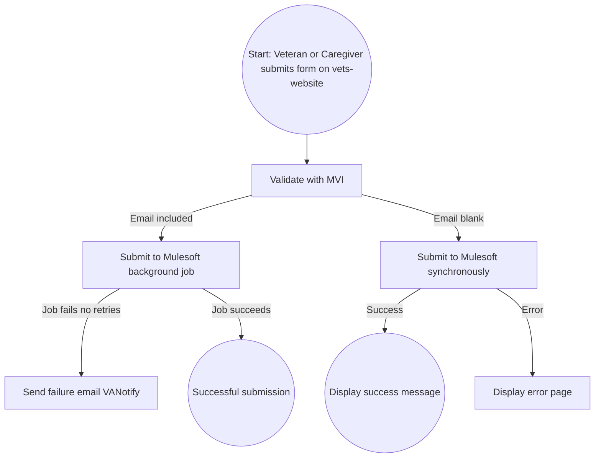

```mermaid
flowchart TD
    A((Start: Veteran or Caregiver submits form on vets-website)) --> B[Validate with MVI]
    B -->|Email included| E[Submit to Mulesoft background job]
    E -->|Job fails no retries| F[Send failure email VANotify]
    E -->|Job succeeds| G((Successful submission))
    B -->|Email blank| H[Submit to Mulesoft synchronously]
    H -->|Success| I((Display success message))
    H -->|Error| J[Display error page]
```
