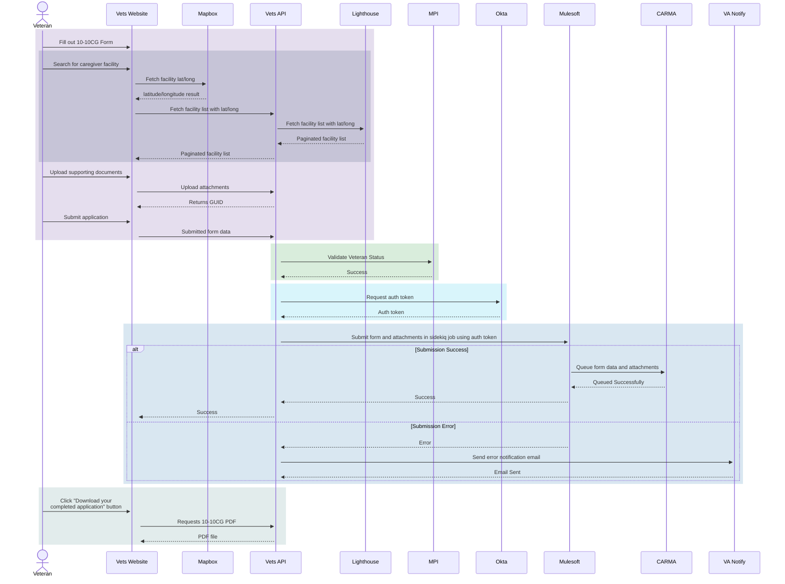

```mermaid
sequenceDiagram
  actor Veteran as Veteran

  participant vets-website as Vets Website
  participant mapbox as Mapbox
  participant vets-api as Vets API
  participant lighthouse as Lighthouse
  participant mpi as MPI

  participant Okta
  participant mulesoft as Mulesoft
  participant carma as CARMA
  participant vanotify as VA Notify

  %% Form Filling Section - Purple with transparency
  rect rgba(84, 39, 143, 0.15)
  Veteran ->>+ vets-website: Fill out 10-10CG Form

  %% Facility Search Section - Dark Blue with transparency
  rect rgba(22, 46, 81, 0.15)
    Veteran ->>+ vets-website: Search for caregiver facility
    vets-website ->>+ mapbox: Fetch facility lat/long
    mapbox -->> vets-website: latitude/longitude result
    vets-website ->>+ vets-api: Fetch facility list with lat/long
    vets-api ->>+ lighthouse: Fetch facility list with lat/long
    lighthouse -->> vets-api: Paginated facility list
    vets-api -->> vets-website: Paginated facility list
  end

  Veteran ->>+ vets-website: Upload supporting documents
  vets-website ->>+ vets-api: Upload attachments
  vets-api -->> vets-website: Returns GUID
  Veteran ->>+ vets-website: Submit application
  vets-website ->>+ vets-api: Submitted form data
  end

  %% MPI Validation Section - Green with transparency
  rect rgba(0, 136, 23, 0.15)
  vets-api ->>+ mpi: Validate Veteran Status
  mpi -->> vets-api: Success
  end

  %% Okta Auth Section - Light Blue with transparency
  rect rgba(0, 189, 227, 0.15)
  vets-api ->>+ Okta: Request auth token
  Okta -->> vets-api: Auth token
  end

  %% Mulesoft Submission Section - Deep Blue with transparency
  rect rgba(0, 94, 162, 0.15)
  vets-api ->>+ mulesoft: Submit form and attachments in sidekiq job using auth token
  alt Submission Success
    mulesoft ->>+ carma: Queue form data and attachments
    carma -->> mulesoft: Queued Successfully
    mulesoft -->> vets-api: Success
    vets-api -->> vets-website: Success
  else Submission Error
    mulesoft -->> vets-api: Error
    vets-api ->>+ vanotify: Send error notification email
    vanotify -->> vets-api: Email Sent
  end
  end

  %% PDF Download Section - Teal with transparency
  rect rgba(64, 128, 126, 0.15)
  Veteran ->>+ vets-website: Click "Download your <br> completed application" button
  vets-website ->>+ vets-api: Requests 10-10CG PDF
  vets-api -->> vets-website: PDF file
  end

```
