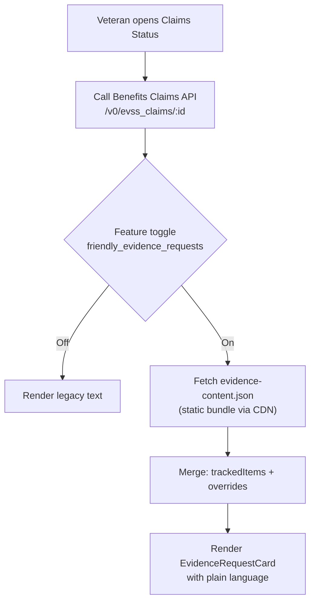
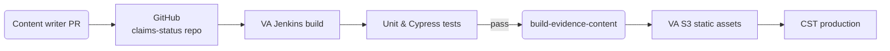

# How the **Improved Evidence Request** text is applied in the Claims Status Tool (CST)

> **Who is this for?**
> *Designers, product managers & engineers* can drill into the **Technical deep dive** and the inline **file‑path call‑outs** to see *where* the changes live in the code base and *how* the data flows through the system.

---

## 1. Plain‑language explanation

| Before                                                                                                               | After                                                                                                                                                                                                                                                     |
| -------------------------------------------------------------------------------------------------------------------- | --------------------------------------------------------------------------------------------------------------------------------------------------------------------------------------------------------------------------------------------------------- |
| Evidence requests were taken verbatim from printed VA letters. They were long, legal‑sounding and sometimes unclear. | CST now substitutes those blocks with **plain‑language “friendly evidence requests.”** They spell out exactly *what* the Veteran needs to send, *when* it is due and *how* to do it, using headings, bullets, and links that work in both web and mobile. |

**What Veterans see**

* A concise “What we need from you” header
* Bullet‑point list of acceptable documents (e.g., “Completed VA Form 21‑4142 – Authorization to Release Medical Information”)
* A clearly‑stated due date (“Please upload or mail the documents by **May 4, 2025**”).
* Contextual links (“Download VA Form 21‑4142 (PDF)”)
* The same content in the VAHB mobile app – no surprises across channels

**Why it matters**

* *Faster claims*: clearer instructions mean fewer back‑and‑forth cycles.
* *Less frustration*: plain language reduces cognitive load.
* *Better analytics*: we can now track response rates **per evidence‑request type** instead of one aggregate number.

---

## 2. Technical deep dive

### 2.1  High‑level architecture



* **Benefits Claims API** returns each *tracked item* (status = `NEEDED_FROM_CLAIMANT`) with legacy `displayName` & `description`.
* **`evidence‑content.json`** (built from `utils/evidenceDictionary.jsx` and shipped as a static asset) provides keyed overrides:

  ```js
  {
    "VA_FORM_21_4142": {
      "title": "Authorization to Release Medical Information (VA Form 21‑4142)",
      "overview": "We need your permission to get records from private doctors.",
      "steps": [
        "Download the form",
        "Sign and date every page",
        "Upload the completed form or mail it to the address below"
      ],
      "deadlineHelp": "If we don't receive this by the due date your claim will be delayed."
    },
    ...
  }
  ```

### 2.2  File‑level implementation guide

| Layer                 | Key files / elements                                                                                                    | What happens there                                                                                                                       |
| --------------------- | ----------------------------------------------------------------------------------------------------------------------- | ---------------------------------------------------------------------------------------------------------------------------------------- |
| **Content source**    | `utils/evidenceDictionary.jsx`                                                                                          | Product writers add/edit JSON objects keyed by `documentType` or `trackedItemTypeId`.                                                    |
| **Build**             | `script/build‑evidence‑content.js`<br>(Node script invoked by CI)                                                       | Converts the JSX/JSON map → `src/site/assets/evidence‑content.json`.<br>Hashes the file for cache‑busting and uploads to VA’s S3 bucket. |
| **Feature toggle**    | `tests/e2e/fixtures/mocks/lighthouse/feature-toggle-cst-friendly-evidence-requests.json`                                | LaunchDarkly flag **`friendly_evidence_requests`**; rollout can be %‑based.                                                              |
| **API serialization** | `utils/serializeClaim.js`                                                                                               | Combines `trackedItems` and supporting documents, normalises dates, **adds `documentType`**, and drops into Redux.                       |
| **Content merge**     | `selectors/getEvidenceContent.js`                                                                                       | Looks up `evidenceContent[trackedItem.documentType]` and returns `{ ...trackedItem, ...override }`.                                      |
| **UI**                | `components/claim-files-tab/FilesNeeded.jsx`<br>`components/claim-document-request-pages/Default5103EvidenceNotice.jsx` | Renders `<EvidenceRequestCard>` using merged object. Falls back to legacy fields if no override is found.                                |
| **Analytics**         | `utils/datadog-rum/useBrowserMonitoring.js`                                                                             | Emits `event: 'cst-evidence-request-view'` with `override_used: true/false` for Datadog & GA.                                            |

### 2.3  Sequence of a page load (detailed)


### 2.4  Update & deployment workflow



* A content‑only change (e.g. editing wording for VA Form 21‑4142) **does not require a full backend deployment**—only a static‑asset upload, so updates can be shipped daily.
* **Versioning:** each JSON bundle is SHA‑hashed; the frontend requests `/evidence-content.<hash>.json`, ensuring Veterans never receive a stale mixture of old/new copy.

### 2.5  Fallback & error handling

| Scenario                               | What the code does                                                                                   |
| -------------------------------------- | ---------------------------------------------------------------------------------------------------- |
| **CDN request fails** (offline or 5xx) | Logs Datadog error `cst-evidence-content-load-failed`; renders legacy `displayName` & `description`. |
| **No override for a tracked item**     | Safe fallback to legacy fields.                                                                      |
| **New tracked item type introduced**   | Appears immediately using legacy text; content writers can add override in next cycle.               |

---

## 3. How to extend or maintain

1. **Add a new evidence request**
   *Append a new keyed object in* `utils/evidenceDictionary.jsx`, *run tests, open PR.*
2. **Change copy**
   *Edit the string, ensure reading level ≤ 8th grade, run `npm run lint:content`.*
3. **See response analytics**
   Metrics surface in **Domo dashboard → CST / Evidence Requests** (filter by `documentType`).
4. **Turn feature off**
   Flip LaunchDarkly toggle – no redeploy required.

---

## 4. Take‑aways

* **Plain language + digital‑first design** unlock faster claim cycles.
* The implementation is **additive**, not disruptive—if anything fails, CST falls back to the proven legacy copy.
* Content teams can iterate copy on a daily cadence without engineering intervention.
* Analytics now let OCTO‑DE focus improvement efforts on the lowest‑performing evidence request types.
