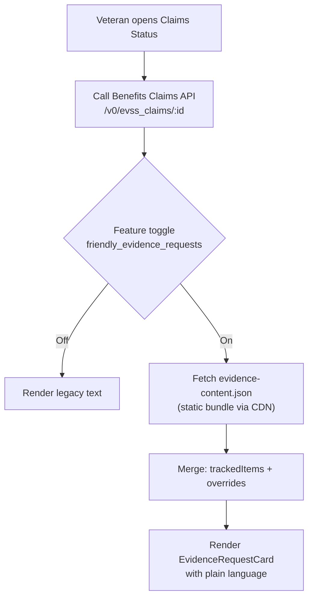
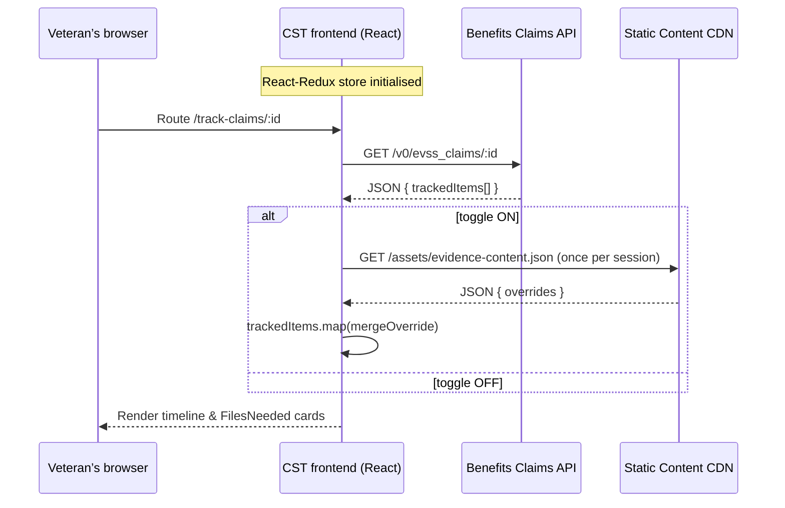
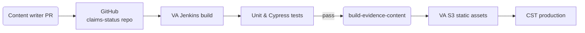

# 🚨 The contents of this file are inaccurate!!
For the most up to date information see this [analysis](va.gov-team/products/claim-appeal-status/evidence-requests-improvements/evidence-dictionary-current-state.md) of the current state of evidence requests as of 1/16/2026.

# How the **Improved Evidence Request** text is applied in the Claims Status Tool (CST)

> **Who is this for?**
> Veterans, designers, product managers, and engineers who want to understand **why** the new “friendly evidence requests” matter and **how** they’re delivered in CST.

---

## 1 – What changed (plain language)

| Before (legacy copy)                                                                                       | After (friendly copy)                                                                                                                                                                                                      |
| ---------------------------------------------------------------------------------------------------------- | -------------------------------------------------------------------------------------------------------------------------------------------------------------------------------------------------------------------------- |
| Evidence requests were taken verbatim from printed VA letters—long, legal‑sounding, and sometimes unclear. | CST now substitutes those blocks with **plain‑language evidence requests.** They state *what* you need to send, *when* it’s due, and *how* to send it, using headings, bullets, and links that work in web **and** mobile. |

**What Veterans see**

* “What we need from you” header
* Bullet list of acceptable documents (e.g., “Completed VA Form 21‑4142”)
* Clear due date (“Please upload or mail the documents by **May 4, 2025**”)
* Contextual links (“Download VA Form 21‑4142 (PDF)”)
* Identical copy in the VAHB mobile app—no surprises across channels

**Why it matters**

* **Faster claims** – fewer back‑and‑forth cycles
* **Less frustration** – reduced cognitive load
* **Better analytics** – response rates tracked per evidence‑request type

---

## 2 – Evidence requests already improved

These tracked‑item labels now ship with friendly copy drawn from **`utils/evidenceDictionary.jsx`**. Anything not on this list still shows the legacy text.

| Tracked‑item label (API `displayName`) | What the Veteran is asked to do (summary)                                              | Action needed? |
| -------------------------------------- | -------------------------------------------------------------------------------------- | -------------- |
| `21‑4142/21‑4142a`                     | Complete & sign VA Form 21‑4142 so VA can request non‑VA medical records               | **Yes**        |
| `Employment info needed`               | Give VA Form 21‑4192 to your last employer so they can send employment details         | **Yes**        |
| `EFT ‑ Treasury Mandate Notification`  | Add or update direct‑deposit info in your VA.gov profile (or by phone/mail)            | **Yes**        |
| `RV1 ‑ Reserve Records Request`        | VA asked your reserve unit for service/medical records – you’ll be contacted if needed | Usually **No** |
| `DBQ AUDIO Hearing Loss & Tinnitus`    | Exam will be scheduled by the examiner’s office                                        | **No**         |
| `DBQ PSYCH Mental Disorders`           | Exam will be scheduled by the examiner’s office                                        | **No**         |
| `Proof of service (DD214, etc.)`       | VA is requesting your DD‑214s; you may upload them or order copies yourself            | *Optional*     |

> **How this list is built**
> Writers add or edit objects in **`utils/evidenceDictionary.jsx`**; the CI script compiles them into **`evidence‑content.json`**. When the **`friendly_evidence_requests`** LaunchDarkly toggle is **on**, CST merges those overrides with the raw *tracked items* returned by the API.

---

## 3 – Technical deep dive

### 3.1  High‑level architecture



* The API returns each *tracked item* whose `status` is **`NEEDED_FROM_YOU`** or **`NEEDED_FROM_OTHERS`** with legacy `displayName` and `description` .
* `evidence‑content.json` (generated from `utils/evidenceDictionary.jsx`) supplies `longDescription`, `nextSteps`, and flags like `noActionNeeded` .

```js
{
  "21-4142/21-4142a": {
    longDescription: "<p>For your benefits claim …</p>",
    nextSteps: "<p>Use VA Form 21‑4142 …</p>"
  },
  …
}
```

### 3.2  File‑level implementation guide

| Layer                 | Key files / elements                                      | What happens there                                                                                |
| --------------------- | --------------------------------------------------------- | ------------------------------------------------------------------------------------------------- |
| **Content source**    | `utils/evidenceDictionary.jsx`                            | Writers add/edit objects keyed by `displayName`.                                                  |
| **Build**             | `script/build-evidence-content.js` (CI step)              | Emits `src/site/assets/evidence-content.json`, SHA‑hashed and uploaded to S3.                     |
| **Feature toggle**    | `feature-toggle-cst-friendly-evidence-requests.json`      | LaunchDarkly flag `friendly_evidence_requests`; supports % roll‑out.                              |
| **API serialization** | `utils/serializeClaim.js`                                 | Normalises dates and appends `documentType` before dispatching to Redux.                          |
| **Content merge**     | `selectors/getEvidenceContent.js`                         | Returns `{ …trackedItem, …override }` when an override exists.                                    |
| **UI**                | `FilesNeeded.jsx`, `FilesOptional.jsx`, `DefaultPage.jsx` | Render `<EvidenceRequestCard>` or detailed request page, using friendly fields when toggle is on. |
| **Analytics**         | `utils/datadog-rum/useBrowserMonitoring.js`               | Logs `cst-evidence-request-view` with `override_used` for Datadog & GA.                           |

### 3.3  Sequence of a page load



### 3.4  Update & deployment workflow



* **Content‑only edits** need no backend deploy—just a new static bundle.
* SHA‑hashed filenames prevent stale mixes of old/new copy.

### 3.5  Fallback & error handling

| Scenario                    | Behaviour                                                          |
| --------------------------- | ------------------------------------------------------------------ |
| CDN request fails (offline) | Logs `cst-evidence-content-load-failed`; renders legacy text.      |
| No override for item        | Falls back to legacy copy.                                         |
| New tracked‑item label      | Shows legacy copy until writers add an override and CI repackages. |

---

## 4 – How to extend or maintain

1. **Add a new evidence request** – append an object in `utils/evidenceDictionary.jsx`, run tests, open PR.
2. **Change copy** – edit strings (aim ≤ 8th‑grade reading level) and run `npm run lint:content`.
3. **View analytics** – Domo → *CST / Evidence Requests* (filter by `documentType`).
4. **Toggle rollback** – flip the LaunchDarkly flag; no redeploy needed.

---

## 5 – Key take‑aways

* **Plain language + digital‑first design** → faster claim cycles and happier Veterans.
* Implementation is **additive**—if anything fails, CST automatically reverts to legacy text.
* Content teams can ship copy updates daily without engineering help.
* Per‑type analytics show OCTO‑DE where to focus next.
