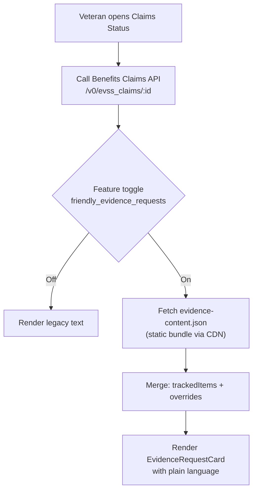
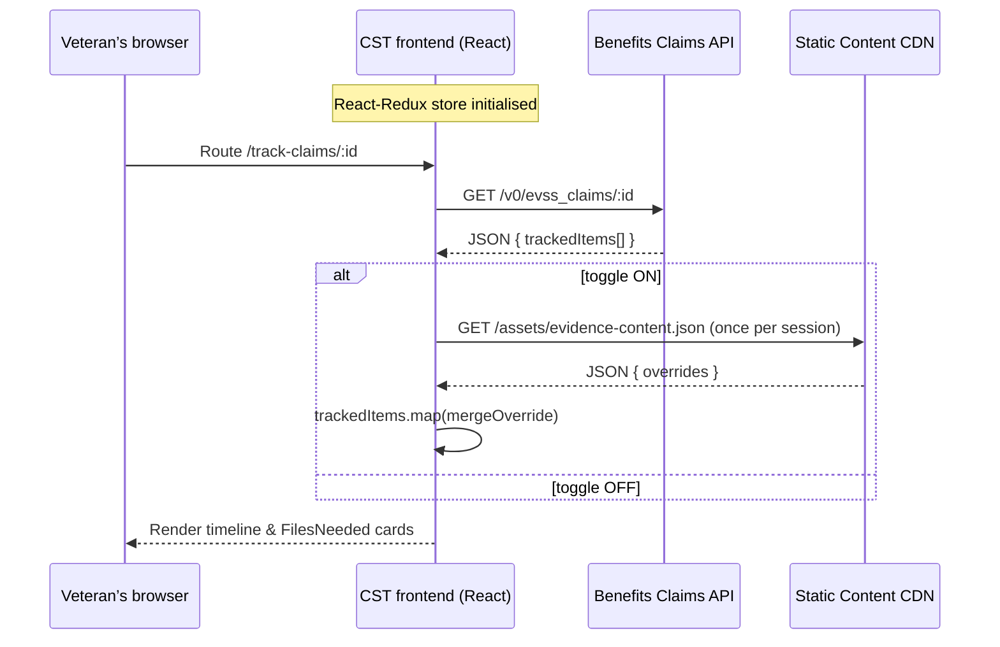
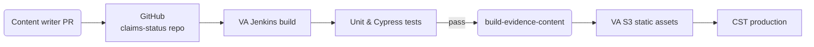

# How the **Improved Evidence Request** text is applied in the Claims Status Tool (CST)

> **Who is this for?**
> Veterans, designers, product managers, and engineers who want to understand **why** the new “friendly evidence requests” matter and **how** they’re delivered in CST.

---

## 1 – What changed (plain-language)

| Before (legacy copy)                                                                                       | After (friendly copy)                                                                                                                                                                                                      |
| ---------------------------------------------------------------------------------------------------------- | -------------------------------------------------------------------------------------------------------------------------------------------------------------------------------------------------------------------------- |
| Evidence requests were taken verbatim from printed VA letters—long, legal-sounding, and sometimes unclear. | CST now substitutes those blocks with **plain-language evidence requests.** They state *what* you need to send, *when* it’s due, and *how* to send it, using headings, bullets, and links that work in web **and** mobile. |

**What Veterans see**

* “What we need from you” header
* Bullet list of acceptable documents (e.g., “Completed VA Form 21-4142”)
* Clear due date (“Please upload or mail the documents by **May 4, 2025**”)
* Contextual links (“Download VA Form 21-4142 (PDF)”)
* Identical copy in the VAHB mobile app—no surprises across channels

**Why it matters**

* **Faster claims** – fewer back-and-forth cycles
* **Less frustration** – reduced cognitive load
* **Better analytics** – response rates tracked per evidence-request type

---

## 2 – Evidence requests already improved

Below are the evidence-request types that currently use friendly copy. Everything else still falls back to the legacy text until it’s added to `evidenceDictionary.jsx`.

| API key / tracked-item label          | Friendly title (what Veterans see)           | What the Veteran is asked to do                                                                   | Action needed? |
| ------------------------------------- | -------------------------------------------- | ------------------------------------------------------------------------------------------------- | -------------- |
| `21-4142/21-4142a`                    | Authorization to Release Medical Information | Complete & sign VA Form 21-4142 (online or PDF) so VA can request records from non-VA providers   | **Yes**        |
| `Employment info needed`              | Employer Information Request                 | Give VA Form 21-4192 to your most recent employer so they can mail your employment details to VA  | **Yes**        |
| `EFT - Treasury Mandate Notification` | Direct Deposit Information Needed            | Add or update your bank info in your VA.gov profile (or by phone/mail) so VA can pay benefits     | **Yes**        |
| `RV1 - Reserve Records Request`       | Reserve Service / Medical Records            | VA has asked your reserve unit for records; you’ll only be contacted if more is needed            | Usually **No** |
| `DBQ AUDIO Hearing Loss and Tinnitus` | Hearing Disability Exam Scheduled            | The examiner will call you to schedule; no further steps now                                      | **No**         |
| `DBQ PSYCH Mental Disorders`          | Mental-Health Exam Scheduled                 | The examiner will call you to schedule; no further steps now                                      | **No**         |
| `Proof of service (DD214, etc.)`      | Separation Papers Needed                     | VA is requesting your DD-214s; you may upload or request them yourself from the National Archives | *Optional*     |

> **Source of truth**
> These entries live in **`utils/evidenceDictionary.jsx`**. During build, they’re compiled into `evidence-content.json`. When the **`friendly_evidence_requests`** toggle is **on**, CST swaps the legacy text for the friendly version listed above.

---

## 3 – Technical deep dive

### 3.1  High-level architecture



* **Benefits Claims API** returns each *tracked item* (`NEEDED_FROM_CLAIMANT`) with legacy `displayName` & `description`.
* **`evidence-content.json`** (built from `utils/evidenceDictionary.jsx`) provides keyed overrides:

```js
{
  "21-4142/21-4142a": {
    title: "Authorization to Release Medical Information (VA Form 21-4142)",
    overview: "We need your permission to get records from private doctors.",
    steps: [ "Download the form", "Sign and date every page", "Upload the completed form or mail it" ],
    deadlineHelp: "If we don't receive this by the due date your claim will be delayed."
  },
  // …
}
```

### 3.2  File-level implementation guide

| Layer                 | Key files / elements                                 | What happens there                                                                         |
| --------------------- | ---------------------------------------------------- | ------------------------------------------------------------------------------------------ |
| **Content source**    | `utils/evidenceDictionary.jsx`                       | Product writers add/edit objects keyed by `documentType` or `trackedItemTypeId`.           |
| **Build**             | `script/build-evidence-content.js` (CI step)         | Converts the dictionary → `src/site/assets/evidence-content.json`; hashes & uploads to S3. |
| **Feature toggle**    | `feature-toggle-cst-friendly-evidence-requests.json` | LaunchDarkly flag `friendly_evidence_requests`; rollout can be %-based.                    |
| **API serialization** | `utils/serializeClaim.js`                            | Normalises dates, **adds `documentType`**, and injects into Redux.                         |
| **Content merge**     | `selectors/getEvidenceContent.js`                    | Returns `{ ...trackedItem, ...override }` if an override exists.                           |
| **UI**                | `FilesNeeded.jsx`, `Default5103EvidenceNotice.jsx`   | Renders `<EvidenceRequestCard>`; falls back to legacy if no override.                      |
| **Analytics**         | `useBrowserMonitoring.js`                            | Emits `cst-evidence-request-view` with `override_used` flag for Datadog & GA.              |

### 3.3  Sequence of a page load



### 3.4  Update & deployment workflow



* Content-only changes **don’t require a backend deploy**—just a new static asset.
* Each JSON bundle is SHA-hashed, so Veterans never get a mixed old/new state.

### 3.5  Fallback & error handling

| Scenario              | Behaviour                                                     |
| --------------------- | ------------------------------------------------------------- |
| CDN request fails     | Logs `cst-evidence-content-load-failed`; renders legacy text. |
| No override for item  | Falls back to legacy copy.                                    |
| New tracked-item type | Appears with legacy copy until an override is added.          |

---

## 4 – How to extend or maintain

1. **Add a new evidence request** – append an object in `utils/evidenceDictionary.jsx`, run tests, open PR.
2. **Change copy** – edit the strings (8th-grade reading level), then `npm run lint:content`.
3. **View analytics** – Domo → **CST / Evidence Requests** (filter by `documentType`).
4. **Toggle rollback** – Flip the LaunchDarkly flag; no redeploy needed.

---

## 5 – Key take-aways

* **Plain language + digital-first design** = faster claims and happier Veterans.
* Implementation is **additive**—if anything fails, CST reverts to legacy text.
* Content teams can iterate daily without engineering help.
* Per-type analytics guide OCTO-DE to the next evidence requests to improve.
