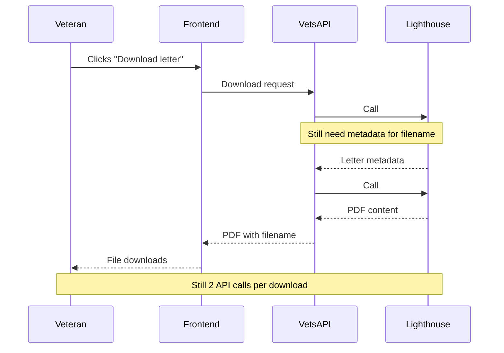
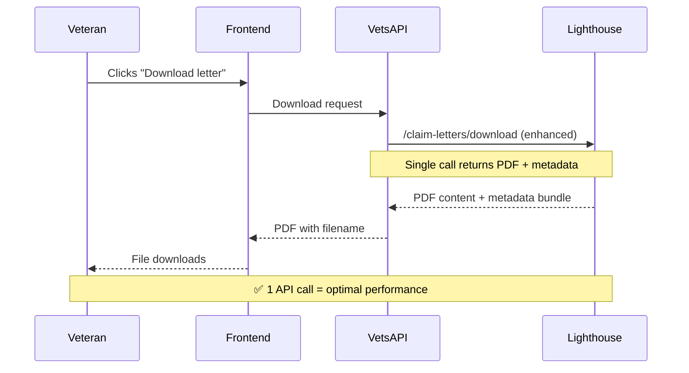

# CST Lighthouse Migration: Implementation Options

## Issue Summary

**GitHub Issue**: [#109199 - Migrate from VBMS to Lighthouse for CST claim letter downloads](https://github.com/department-of-veterans-affairs/va.gov-team/issues/109199)

**Goal**: Migrate Claim Status Tool (CST) from legacy VBMS to new Lighthouse API endpoints for claim letter list and download functionality.

## Current Problem: Inefficient Download Pattern

When a Veteran clicks "Download letter", the current system makes **2 separate API calls**:

👉 [See Current Problem Diagram](#current-problem-diagram)

### User Impact

This inefficient pattern directly affects Veterans' experience:

- **⏱️ Longer wait times**: Each download requires two sequential API roundtrips before the PDF starts downloading
- **🔄 Higher failure rates**: More API calls = more opportunities for network timeouts or service errors
- **📱 Poor mobile experience**: Veterans on slower connections experience more noticeable delays

### Performance Impact

**System Load**: Every download generates 2x the expected API traffic, creating unnecessary load on systems.

---
### Performance Metrics 
(with staging data, 16 letters)
- Single lighthouse API call: `688.38 milliseconds`
- Double lighthouse API call: `2985.46 milliseconds`
 
The double call approach is taking about **4.3x longer** than the single call (2985ms vs 688ms)

---

## Implementation Options

### Option 1: Simple Migration (Keep Current Pattern)

**Approach**: Replace VBMS calls with Lighthouse calls but maintain the same 2-call pattern.

👉 [See Option 1 Diagram](#option-1-diagram)

**Pros:**
- ✅ Lowest development effort
- ✅ Direct API replacement
- ✅ Faster timeline to completion

**Cons:**
- ❌ Maintains inefficient pattern (50% slower downloads)
- ❌ No performance improvement for Veterans
- ❌ Higher API load on Lighthouse
 
**LOE**: Low

---

### Option 2: Wait for Optimized Endpoint

**Approach**: Wait for Lighthouse team to bundle metadata with download endpoint (~2 sprints).

👉 [See Option 2 Diagram](#option-2-diagram)

**Pros:**
- ✅ Optimal performance (1 API call per download)
- ✅ Cleanest implementation
- ✅ No complex caching logic needed
- ✅ Best long-term solution

**Cons:**
- ❌ Delayed migration timeline
- ❌ Dependency on Lighthouse team delivery
- ❌ Continues using legacy VBMS during wait

**Timeline**: 4-6 weeks (including 2 sprint wait)  
**LOE**: Low (after Lighthouse enhancement)

## Recommendation Matrix

| Factor | Option 1: Simple | Option 2: Wait |
|--------|------------------|----------------|
| **Performance** | Poor (2 calls) | Excellent (1 call) |
| **Development Effort** | Low | Low |
| **Timeline** | 1-2 weeks | 4-6 weeks |
| **Technical Risk** | Low | Low |
| **Long-term Value** | Low | High |

---

## Diagrams

### Current Problem Diagram

### Option 1 Diagram

### Option 2 Diagram

