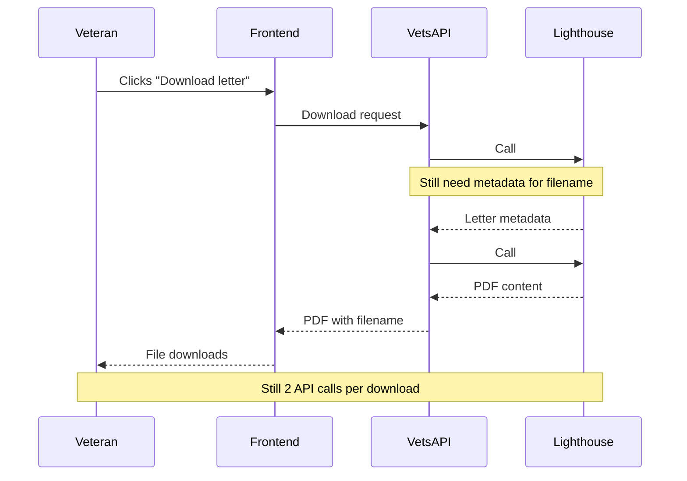
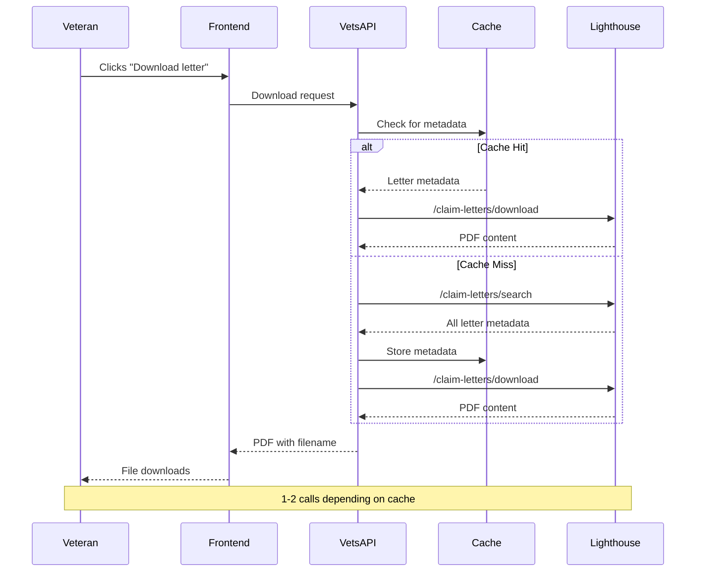
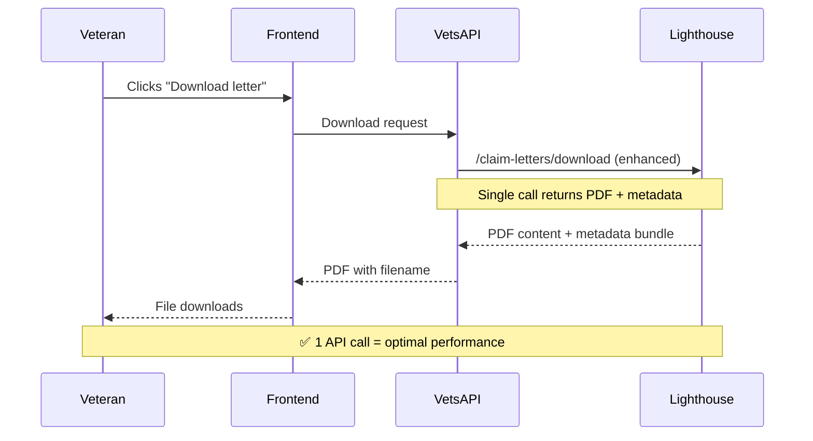

# CST Lighthouse Migration: Implementation Options

## Issue Summary

**GitHub Issue**: [#109199 - Migrate from VBMS to Lighthouse for CST claim letter downloads](https://github.com/department-of-veterans-affairs/va.gov-team/issues/109199)

**Goal**: Migrate Claim Status Tool (CST) from legacy VBMS to new Lighthouse API endpoints for claim letter list and download functionality.

## Current Problem: Inefficient Download Pattern

When a Veteran clicks "Download letter", the current system makes **2 separate API calls**:

## Implementation Options

### Option 1: Simple Migration (Keep Current Pattern)

**Approach**: Replace VBMS calls with Lighthouse calls but maintain the same 2-call pattern.

**Pros:**
- ✅ Lowest development effort
- ✅ Direct API replacement
- ✅ Faster timeline to completion

**Cons:**
- ❌ Maintains inefficient pattern (50% slower downloads)
- ❌ No performance improvement for Veterans
- ❌ Higher API load on Lighthouse
 
**LOE**: Low

---

### Option 2: Interim Optimization (Cache Metadata)

**Approach**: Implement caching in `ClaimLetterDownloader` to avoid redundant metadata calls.

**Pros:**
- ✅ Reduces API calls for subsequent downloads
- ✅ Performance improvement for Veterans
- ✅ Works with current Lighthouse endpoints

**Cons:**
- ❌ High development effort (caching logic, invalidation, storage)
- ❌ Added complexity and potential bugs
- ❌ Still some downloads require 2 calls (cache misses)

**LOE**: High

---

### Option 3: Wait for Optimized Endpoint

**Approach**: Wait for Lighthouse team to bundle metadata with download endpoint (~2 sprints).

**Pros:**
- ✅ Optimal performance (1 API call per download)
- ✅ Cleanest implementation
- ✅ No complex caching logic needed
- ✅ Best long-term solution

**Cons:**
- ❌ Delayed migration timeline
- ❌ Dependency on Lighthouse team delivery
- ❌ Continues using legacy VBMS during wait

**Timeline**: 4-6 weeks (including 2 sprint wait)  
**LOE**: Low (after Lighthouse enhancement)

## Recommendation Matrix

| Factor | Option 1: Simple | Option 2: Cache | Option 3: Wait |
|--------|------------------|-----------------|----------------|
| **Performance** | Poor (2 calls) | Good (1-2 calls) | Excellent (1 call) |
| **Development Effort** | Low | High | Low |
| **Timeline** | 1-2 weeks | 3-4 weeks | 4-6 weeks |
| **Technical Risk** | Low | Medium | Low |
| **Long-term Value** | Low | Medium | High |
