# Claim Letter Download Flow Analysis

## Overview
This document analyzes the current claim letter download functionality in the VA Claims Status Tool (CST), identifying inefficiencies in the API interaction patterns between the frontend and backend systems.

### Quick Visual Summary: The Inefficiency Problem

```mermaid
graph TD
    A["User visits Claim Letters page"] --> B["Frontend calls /v0/claim_letters"]
    B --> C["Backend calls VBMS API #1:<br/>FindDocumentVersionReference"]
    C --> D["Returns list of letters to user"]
    
    D --> E["User clicks Download button"]
    E --> F["Frontend calls /v0/claim_letters/123"]
    F --> G["Backend calls VBMS API #2:<br/>FindDocumentVersionReference<br/>🔄 REDUNDANT!"]
    G --> H["Backend calls VBMS API #3:<br/>GetDocumentContent"]
    H --> I["PDF downloads to user"]
    
    style G fill:#ffcccc
    style C fill:#cceeff
    style H fill:#cceeff
```



**Problem:** The red box shows where we make the same API call twice! 

## User Experience

**What the user sees:**
1. User navigates to "Your Claim Letters" page
2. User sees a list of available claim letters with dates and types
3. User clicks "Download [Date] letter" button
4. PDF file downloads to their device

**User expectation:** Simple, fast download process

## Current System Architecture

### Frontend Components

```
src/applications/claims-status/
├── containers/YourClaimLetters/index.jsx     (Main container - fetches letter list)
├── components/claim-letters/
│   └── ClaimLetterListItem.jsx               (Individual letter download buttons)
└── actions/index.js                          (API calls - getClaimLetters function)
```

### Backend Components

```
lib/claim_letters/
└── claim_letter_downloader.rb                (Ruby class handling VBMS interactions)
```

## Current Flow Diagrams

### 1. Page Load: Fetching Letter List


### 2. Letter Download: The Inefficient Pattern ⚠️

```mermaid
sequenceDiagram
    participant User
    participant Frontend as Frontend<br/>(ClaimLetterListItem)
    participant VetsAPI as vets-api<br/>(ClaimLetterDownloader)
    participant VBMS as VBMS<br/>(Document System)

    User->>Frontend: Clicks "Download letter" button
    Frontend->>VetsAPI: GET /v0/claim_letters/{id}?document_type={type}
    
    Note over VetsAPI: get_letter_details() called
    VetsAPI->>VBMS: 🔄 FindDocumentVersionReference(file_number)
    Note over VetsAPI: REDUNDANT CALL #1 - Already have this data!
    VBMS-->>VetsAPI: Returns SAME document list as before
    
    Note over VetsAPI: Finds specific document from list
    VetsAPI->>VBMS: 🔄 GetDocumentContent(document_id)  
    Note over VetsAPI: REDUNDANT CALL #2 - Could bundle with metadata
    VBMS-->>VetsAPI: Returns PDF content
    
    VetsAPI-->>Frontend: PDF file content
    Frontend-->>User: Browser downloads PDF file
```



## The Problem: Download Button Inefficiency

### Current Inefficiency

When a user clicks the download button, **vets-api makes 2 separate VBMS calls**:

1. **Call 1**: `FindDocumentVersionReference` → Get letter metadata (filename, dates, etc.)
2. **Call 2**: `GetDocumentContent` → Download actual PDF content  

This happens because vets-api needs metadata (like `receivedAt` date) to generate proper filenames and provide user feedback, but this metadata isn't bundled with the download endpoint.

### Code Evidence

**Backend inefficiency in `claim_letter_downloader.rb`:**

```ruby
def get_letter(document_id)
  letter_details = get_letter_details(document_id)  # Calls get_letters AGAIN!
  # ... then makes separate call for content
  req = VBMS::Requests::GetDocumentContent.new(document_id)
  res = @client.send_request(req)
end

def get_letter_details(document_id)
  letters = get_letters  # 🔄 REDUNDANT API CALL!
  letters.find { |d| d[:document_id] == document_id }
end
```

## Proposed Solution: Optimized Flow

### New Benefits Documents API Approach

The solution involves using new Benefits Documents API endpoints:
- `/claim-letters/download` 
- `/claim-letters/search`

**Key requirements:**
- **Bundled metadata**: Include letter metadata (receivedAt, docType, etc.) with download response
- **Single API call**: Eliminate the need for separate metadata lookup

### Optimized Download Flow

```mermaid
sequenceDiagram
    participant User
    participant Frontend as Frontend<br/>(ClaimLetterListItem)
    participant VetsAPI as vets-api<br/>(New Endpoint)
    participant BenefitsAPI as Benefits Documents API
    participant VBMS as VBMS<br/>(Document System)

    User->>Frontend: Clicks "Download letter" button
    Frontend->>VetsAPI: GET /v0/claim-letters/download/{id}
    
    Note over VetsAPI: Single optimized call
    VetsAPI->>BenefitsAPI: Download with bundled metadata
    BenefitsAPI->>VBMS: ✅ Single call with content + metadata
    VBMS-->>BenefitsAPI: Returns PDF + metadata bundle
    BenefitsAPI-->>VetsAPI: PDF content + metadata
    
    VetsAPI-->>Frontend: PDF file with proper headers
    Frontend-->>User: Browser downloads PDF file
    
    Note over User,VBMS: 🎯 Reduced from 2 calls to 1 call!
```



## Impact Analysis

### Current State Problems

| Issue | Impact |
|-------|---------|
| **Redundant API calls** | Slower download times |
| **Multiple VBMS requests** | Increased server load |
| **Inefficient metadata lookup** | Unnecessary network overhead |
| **Poor scalability** | System degrades with more users |

### Benefits of Optimization

| Improvement | Benefit |
|-------------|---------|
| **Single API call** | 50% fewer VBMS requests per download |
| **Bundled metadata** | Faster response times |
| **Reduced server load** | Better performance under load |
| **Better user experience** | Quicker downloads |

## Technical Details

### Frontend API Call Pattern

**Current pattern:**
```javascript
// 1. Page load - YourClaimLetters/index.jsx
const letters = await getClaimLetters(); // Calls /v0/claim_letters

// 2. Download - ClaimLetterListItem.jsx  
const downloadUrl = getDownloadUrl(letter.documentId, letter.docType);
// Constructs: /v0/claim_letters/{id}?document_type={type}
```

### Backend Inefficiency Root Cause

The `get_letter_details` method unnecessarily fetches the entire document list again just to find metadata for one document:

```ruby
def get_letter_details(document_id)
  letters = get_letters  # 🔄 Already have this data from page load!
  letters.find { |d| d[:document_id] == document_id }
end
```

## Recommendations

### Immediate Fixes

1. **Cache letter metadata** in `ClaimLetterDownloader` to avoid redundant `get_letters` calls
2. **Pass metadata with download requests** instead of re-fetching from VBMS

### Long-term Optimization  

1. **Implement Benefits Documents API endpoints** as Aurora suggested
2. **Bundle document content with metadata** in single API call
3. **Add proper caching headers** for better browser performance


## Summary

### 🔍 **What We Found**
- **File Location**: [`lib/claim_letters/claim_letter_downloader.rb`](https://github.com/department-of-veterans-affairs/vets-api/blob/master/lib/claim_letters/claim_letter_downloader.rb)
- **Problem**: Triple API call pattern for every download
- **Root Cause**: `get_letter_details()` method unnecessarily re-fetches letter list

### 🎯 **Impact**
- **Current**: 2 VBMS API calls per download
- **Optimized**: 1 VBMS API call per download  
- **Improvement**: 50% reduction in API calls

### ✅ **Next Steps**
1. Implement caching in `ClaimLetterDownloader` class
2. Adopt Benefits Documents API endpoints
3. Bundle metadata with download responses
4. Measure performance improvements

This document provides the technical foundation for optimizing the claim letter download process. 
