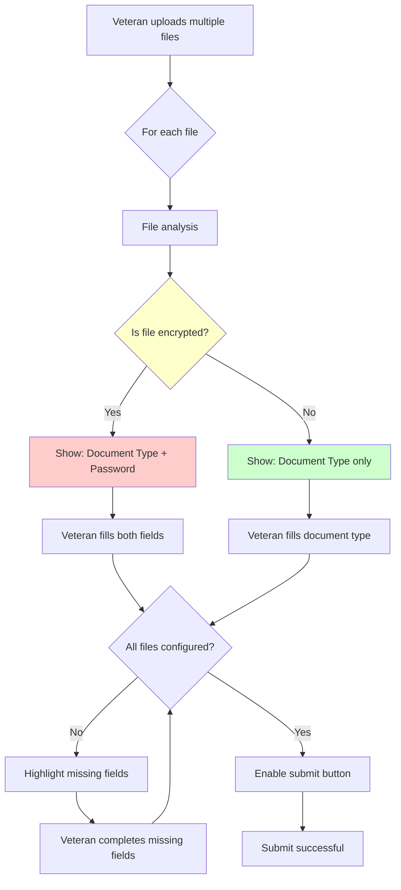
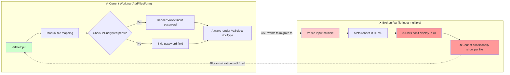

# va-file-input-multiple Conditional Slots Bug

**Bug Report**: https://github.com/department-of-veterans-affairs/vets-design-system-documentation/issues/3785  
**Related Implementation**: https://github.com/department-of-veterans-affairs/va.gov-team/issues/87835

## Executive Summary

CST cannot upgrade to `va-file-input-multiple` due to **bug #3785** - conditional slots don't work. This blocks CST from updating to the v3 component.

## The Bug: What's Broken

### Current Problem
- **Slots render in HTML** but don't display in the component UI
- **Cannot conditionally show different slots per file** 
- **`slotFieldIndexes` prop doesn't work** for per-file conditional rendering

### What "Slots" Are
**Slots** = customizable content areas where developers insert additional form fields for each uploaded file.

```jsx
<va-file-input-multiple>
  <div slot="additionalFormInputs">
    <va-select label="Document Type" />        // Always needed
    <va-text-input label="Password" />         // Only if encrypted
  </div>
</va-file-input-multiple>
```

## Current Working Implementation

**CST's AddFilesForm.jsx already works correctly:**

```jsx
{this.props.files.map(({ file, docType, isEncrypted, password }, index) => (
  <div key={index}>
    {/* CONDITIONAL PASSWORD - only for encrypted files */}
    {isEncrypted && (
      <VaTextInput label="PDF password" required />
    )}
    
    {/* DOCUMENT TYPE - always required */}
    <VaSelect label="What type of document is this?" required />
  </div>
))}
```

**Key Point**: CST has a working solution but cannot migrate to the new component because slots are broken.

## User Journey & Conditional Requirements

### Real User Scenarios

**Typical veteran upload session:**
```
File 1: medical-record.pdf (encrypted) → Needs: Document Type + Password
File 2: photo-id.jpg (not encrypted)  → Needs: Document Type only  
File 3: statement.pdf (encrypted)     → Needs: Document Type + Password
```

**Without conditional slots**: Veterans see password fields for ALL files (confusing)
**With conditional slots**: Veterans see password fields only where needed (clear)

## Technical Requirements for Fix

### What CST Needs
**Per-file conditional slot configuration:**

```javascript
// Each file can have different slot visibility
files.forEach((file, index) => {
  showSlot(index, 'documentType', true);           // Always
  showSlot(index, 'password', file.isEncrypted);   // Conditional
});
```

### Success Criteria
When fixed, this should work:
```jsx
<va-file-input-multiple>
  <div slot="additionalFormInputs">
    <va-select label="Document type" />
    {isEncrypted && <va-text-input label="PDF password" />}
  </div>
</va-file-input-multiple>
```

## Visual Flow Diagrams

### File Upload Flow & Conditional Logic



### Current vs New Component Comparison



---

*Core issue: Veterans need different upload fields for different files, but the component currently shows the same fields for all files or none.* 
