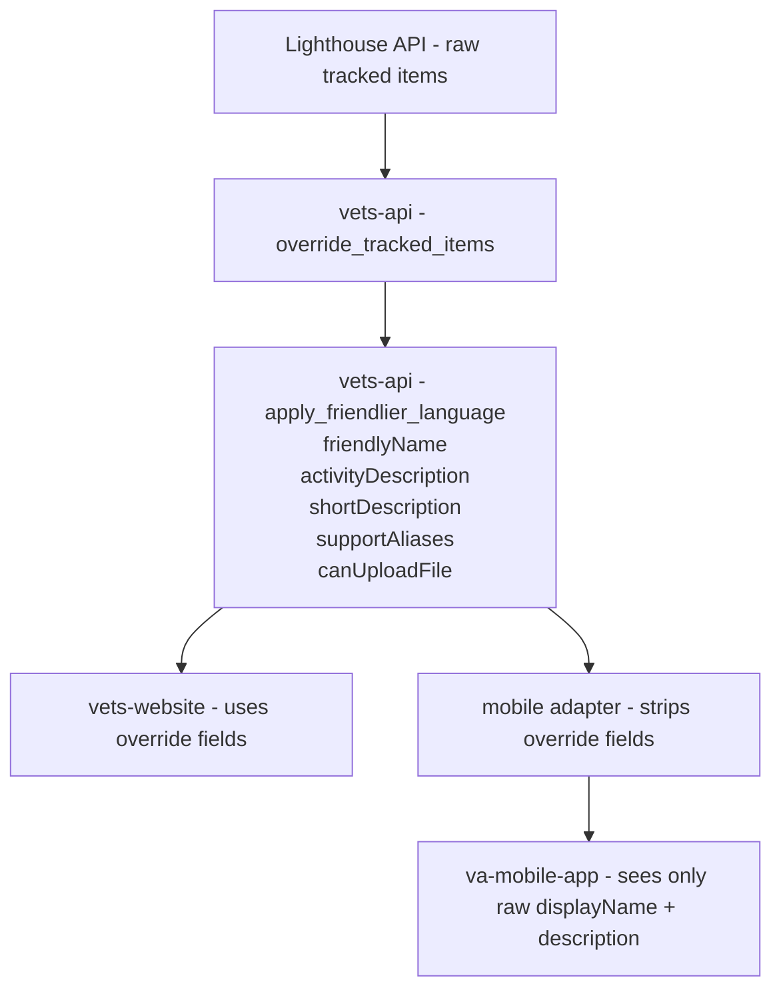

# 🧵 Spike: Evidence-Request Override Content (Web → Mobile Abridged Variant)

## 1. Summary

VA.gov's evidence-request experience uses override mappings defined in vets-api to transform raw tracked items from the Lighthouse Benefits Claims API into human-readable messages. The mobile app will need to display a trimmed-down / abridged version of this content.

This spike investigates:

- How override content is currently implemented  
- How evidence-request content flows through the VA.gov architecture  
- What is static vs dynamic  
- What would need to change to support mobile-friendly abridged content  

## 2. Current Architecture (Web Evidence Requests)

Evidence-request content flows like this:

### Lighthouse Benefits Claims API

Returns raw tracked items with fields such as `displayName`, `description`, `status`, and `uploadsAllowed`.

### vets-api

Applies two layers of transformation:

1. **override_tracked_items** fixes known incorrect statuses from Lighthouse.  
2. **apply_friendlier_language** enhances each tracked item by adding:

   **Text content overrides:**
   - `friendlyName`
   - `activityDescription`
   - `shortDescription`
   - `supportAliases`

   **Behavior override:**
   - `canUploadFile` (boolean - overrides Lighthouse's `uploadsAllowed`)

All override content comes from `lib/lighthouse/benefits_claims/constants.rb`.

## 🔄 Current System Flow Diagram



## vets-website (React)

Renders evidence-request UI using fields provided by vets-api.

**Components that consume override fields:**
- `FilesNeeded.jsx`
- `RecentActivity.jsx`
- `FilesOptional.jsx`
- `DefaultPage.jsx`

**Fallback pattern:**

```javascript
item.shortDescription || item.activityDescription || truncateDescription(item.description)
```

## va-mobile-app (React Native)

Currently **does not** consume override fields.

**Mobile adapter (lighthouse_individual_claims.rb):**

- Transforms tracked items into `eventsTimeline`
- ❌ Does NOT include:
  - `friendlyName`
  - `shortDescription`
  - `activityDescription`
  - `supportAliases`
  - `canUploadFile`

Mobile sees only:

```
displayName (raw)
description (raw)
uploadsAllowed (raw/incorrect)
```

---

## content-build

Not involved — evidence requests are **entirely dynamic**.

## 🔎 Key Point

**All evidence-request text is controlled by vets-api override mappings**, not CMS.

## 3. Proposed Architecture (Add Mobile Abridged Variants)

To support VA mobile:

1. Add mobile-specific content fields (e.g., `mobileDescription`) into `constants.rb`.  
2. Enhance `apply_friendlier_language` to populate mobile-friendly text.  
3. Expose these new fields in existing vets-api responses.  
4. Mobile app consumes these shorter variants.  
5. Web continues using full-length fields.

## 4. Override Behavior (Current Implementation)

### A. override_tracked_items  
Corrects incorrect statuses from BGS/Lighthouse.

Examples:
- `"PMR Pending"` → `"NEEDED_FROM_OTHERS"`
- `"Proof of service (DD214, etc.)"` → `"NEEDED_FROM_OTHERS"`
- `"NG1 - National Guard Records Request"` → `"NEEDED_FROM_OTHERS"`

### B. apply_friendlier_language  
Adds fields from mapping constants:

- `friendlyName`
- `activityDescription`
- `shortDescription`
- `supportAliases`
- `canUploadFile`

### C. Suppressed Evidence Requests  
Some are removed entirely via `SUPPRESSED_EVIDENCE_REQUESTS` under feature flag control.

## 4.5 Mobile Adapter Gap (Current Problem)

Mobile adapter currently strips all override fields.

**Existing (incorrect) behavior:**

```ruby
description: tracked_item['description'],
display_name: tracked_item['displayName'],
uploads_allowed: tracked_item['uploadsAllowed'],
# ❌ Missing override fields
```

**Fix:**

```ruby
friendly_name: tracked_item['friendlyName'],
activity_description: tracked_item['activityDescription'],
short_description: tracked_item['shortDescription'],
support_aliases: tracked_item['supportAliases'],
uploads_allowed: tracked_item['canUploadFile'] || tracked_item['uploadsAllowed'],
```

## 5. Override Mappings: Before & After Examples

### Example 1 — Authorization to Disclose Information (21-4142/21-4142a)

**Before:**

```json
{
  "displayName": "21-4142/21-4142a",
  "description": null,
  "uploadsAllowed": true
}
```

**After:**

```json
{
  "friendlyName": "Authorization to disclose information",
  "activityDescription": "We need your permission...",
  "shortDescription": "We need your permission...",
  "supportAliases": ["21-4142/21-4142a"],
  "canUploadFile": true
}
```

---

### Example 2 — Employment Information (21-4192)

Before: `"uploadsAllowed": false`  
After: `"canUploadFile": true`

---

### Example 3 — Direct Deposit Information

Before: `uploadsAllowed: true`  
After: `canUploadFile: false`

---

### Example 4 — Proof of Service (DD214)

Adds:
- friendlyName
- activityDescription
- shortDescription
- canUploadFile

---

### Example 5 — Buddy Statements

Preserves raw Lighthouse description but adds:
- friendlyName  
- shortDescription  

---

### Example 6 — Sleep Apnea Exam  
Adds exam scheduling text.

---

### Example 7 — PTSD Stressor Details  
Adds:
- friendlyName  
- activityDescription  
- supportAliases  

---

### Example — Unmapped Item  
("Documents relating to disability needed")

Override fields all `null` → UI must use Lighthouse text.

## 6. Findings (Spike Questions Answered)

### 1. How is override content implemented?

- Fully in vets-api
- In `constants.rb`
- Not CMS-driven

### 2. What is dynamic vs static?

Dynamic:
- Titles
- Descriptions
- Upload behavior
- Status corrections

Static:
- Page headings
- Section labels  
- Boilerplate instructions

### 3. What changes are needed for mobile?

**Phase 1**:  
Pass through existing override fields to mobile.

**Phase 2**:  
Add `mobileDescription` override variants and consume them.

## 7. Recommendations

### ✅ Add mobile-specific override fields  
- E.g., `mobileDescription`

### ✅ Centralize override logic in vets-api

### ✅ Provide fallback chain  
- `mobileDescription → shortDescription → activityDescription → description`

### ✅ Maintain consistent override patterns
