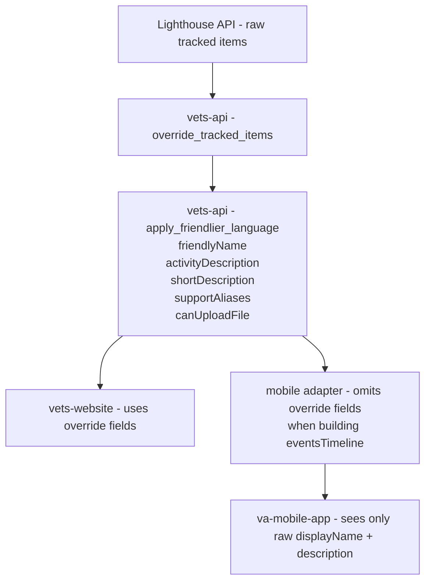

# 🧵 Spike: Evidence-Request Override Content (Web → Mobile Abridged Variant)

## 1. Summary

VA.gov's evidence-request experience uses override mappings defined in vets-api to transform raw tracked items from the Lighthouse Benefits Claims API into human-readable messages. The mobile app will need to display a trimmed-down / abridged version of this content.

This spike investigates:

- How override content is currently implemented  
- How evidence-request content flows through the VA.gov architecture  
- What is static vs dynamic  
- What would need to change to support mobile-friendly abridged content  

## 2. Current Architecture (Web Evidence Requests)

Evidence-request content flows like this:

### Lighthouse Benefits Claims API

Returns raw tracked items with fields such as `displayName`, `description`, `status`, and `uploadsAllowed`.

### vets-api

Applies two layers of transformation:

1. [`override_tracked_items`](https://github.com/department-of-veterans-affairs/vets-api/blob/master/lib/lighthouse/benefits_claims/service.rb) method fixes known incorrect statuses from Lighthouse. 
2. [`apply_friendlier_language`](https://github.com/department-of-veterans-affairs/vets-api/blob/master/lib/lighthouse/benefits_claims/service.rb) method enhances each tracked item by adding:

   **Text content overrides:**
   - `friendlyName`
   - `activityDescription`
   - `shortDescription`
   - `supportAliases`

   **Behavior override:**
   - `canUploadFile` (boolean - overrides Lighthouse's `uploadsAllowed`)

All override content comes from [`lib/lighthouse/benefits_claims/constants.rb`](https://github.com/department-of-veterans-affairs/vets-api/blob/master/lib/lighthouse/benefits_claims/constants.rb).

## 🔄 Current System Flow Diagram



## vets-website (React)

Renders evidence-request UI using fields provided by vets-api.

**Components that consume override fields:**
- [`FilesNeeded.jsx`](https://github.com/department-of-veterans-affairs/vets-website/blob/main/src/applications/claims-status/components/claim-files-tab/FilesNeeded.jsx) - Displays items needing action from veteran
  - Uses `friendlyName` for display (with "Provide" prefix when applicable)
  - Uses `shortDescription || activityDescription` for description
  - Falls back to `truncateDescription(item.description)` if no override exists
- [`RecentActivity.jsx`](https://github.com/department-of-veterans-affairs/vets-website/blob/main/src/applications/claims-status/components/claim-status-tab/RecentActivity.jsx) - Shows tracked items in timeline
  - Uses `friendlyName || displayName` for display
  - Uses `activityDescription` for third-party request descriptions
- [`FilesOptional.jsx`](https://github.com/department-of-veterans-affairs/vets-website/blob/main/src/applications/claims-status/components/claim-files-tab/FilesOptional.jsx) - Displays optional/third-party requests
  - Uses `friendlyName` for display
  - Uses `shortDescription || activityDescription` for description
- [`DefaultPage.jsx`](https://github.com/department-of-veterans-affairs/vets-website/blob/main/src/applications/claims-status/components/claim-document-request-pages/DefaultPage.jsx) - Individual evidence request detail pages
  - Uses `friendlyName` extensively for page titles and breadcrumbs
  - Helper function [`getDisplayFriendlyName()`](https://github.com/department-of-veterans-affairs/vets-website/blob/main/src/applications/claims-status/utils/helpers.js) lowercases first letter for display

**Fallback pattern:**

```javascript
item.shortDescription || item.activityDescription || truncateDescription(item.description)
```

## va-mobile-app (React Native)

**Current implementation:**
- [`FileRequest.tsx`](https://github.com/department-of-veterans-affairs/va-mobile-app/blob/main/VAMobile/src/screens/BenefitsScreen/ClaimsScreen/ClaimDetailsScreen/ClaimStatus/ClaimFileUpload/FileRequest.tsx) - Lists all file requests
  - Only uses `displayName` from eventsTimeline
  - Does NOT use `friendlyName`, `activityDescription`, or `shortDescription`
- [`FileRequestDetails.tsx`](https://github.com/department-of-veterans-affairs/va-mobile-app/blob/main/VAMobile/src/screens/BenefitsScreen/ClaimsScreen/ClaimDetailsScreen/ClaimStatus/ClaimFileUpload/FileRequestDetails/FileRequestDetails.tsx) - Individual request detail screen
  - Only uses `displayName` for title
  - Only uses `description` for body text
  - Does NOT use override fields

**Mobile adapter transformation:**
- [`lighthouse_individual_claims.rb`](https://github.com/department-of-veterans-affairs/vets-api/blob/master/modules/mobile/app/models/mobile/v0/adapters/lighthouse_individual_claims.rb) transforms tracked items into `eventsTimeline` format
- **Issue:** In the [`create_tracked_item_event`](https://github.com/department-of-veterans-affairs/vets-api/blob/master/modules/mobile/app/models/mobile/v0/adapters/lighthouse_individual_claims.rb) method (lines 144-167), the event hash only includes raw Lighthouse fields (`description`, `displayName`, `uploadsAllowed`) and does NOT copy the override fields (`friendlyName`, `activityDescription`, `shortDescription`, `supportAliases`, `canUploadFile`) that are already present in the `tracked_item` hash.

**Current mobile data flow:**
```
Lighthouse API → vets-api (applies overrides) → Mobile Adapter (omits override fields when building eventsTimeline) → Mobile App (sees raw data)
```

**Note:** This is why mobile needs the abridged content feature - it's currently missing all override content entirely.

## content-build

Not involved — evidence requests are **entirely dynamic**.

## 🔎 Key Point

**All evidence-request text is controlled by vets-api override mappings**, not CMS.

## 3. Proposed Architecture (Add Mobile Abridged Variants)

To support VA mobile:

1. Add mobile-specific content fields (e.g., `mobileDescription` or `mobileShortDescription`) into override mappings in [`lib/lighthouse/benefits_claims/constants.rb`](https://github.com/department-of-veterans-affairs/vets-api/blob/master/lib/lighthouse/benefits_claims/constants.rb).
2. Enhance the [`apply_friendlier_language`](https://github.com/department-of-veterans-affairs/vets-api/blob/master/lib/lighthouse/benefits_claims/service.rb) method to populate mobile-friendly text.
3. Expose these new fields in existing vets-api responses.  
4. Mobile app consumes these shorter variants.  
5. Web continues using full-length fields.

## 4. Override Behavior (Current Implementation)

### A. override_tracked_items  
The [`override_tracked_items`](https://github.com/department-of-veterans-affairs/vets-api/blob/master/lib/lighthouse/benefits_claims/service.rb) method corrects incorrect evidence-request statuses coming from BGS/Lighthouse.

Examples:
- `"PMR Pending"` → `"NEEDED_FROM_OTHERS"`
- `"Proof of service (DD214, etc.)"` → `"NEEDED_FROM_OTHERS"`
- `"NG1 - National Guard Records Request"` → `"NEEDED_FROM_OTHERS"`

### B. apply_friendlier_language  
The [`apply_friendlier_language`](https://github.com/department-of-veterans-affairs/vets-api/blob/master/lib/lighthouse/benefits_claims/service.rb) method enhances each tracked item by looking up its `displayName` in mapping constants defined in [`lib/lighthouse/benefits_claims/constants.rb`](https://github.com/department-of-veterans-affairs/vets-api/blob/master/lib/lighthouse/benefits_claims/constants.rb):

**Text content mappings:**
- `FRIENDLY_DISPLAY_MAPPING` → `friendlyName`
- `ACTIVITY_DESCRIPTION_MAPPING` → `activityDescription`
- `SHORT_DESCRIPTION_MAPPING` → `shortDescription`
- `SUPPORT_ALIASES_MAPPING` → `supportAliases`

**Behavior mapping:**
- `UPLOADER_MAPPING` → `canUploadFile` (boolean - overrides Lighthouse's `uploadsAllowed`)

### C. Suppressed Evidence Requests

Some tracked items are filtered out entirely via the [`SUPPRESSED_EVIDENCE_REQUESTS`](https://github.com/department-of-veterans-affairs/vets-api/blob/master/lib/lighthouse/benefits_claims/service.rb) constant:
- 'Attorney Fees'
- 'Secondary Action Required'
- 'Stage 2 Development'

This suppression is controlled by feature flags:
- Web: `:cst_suppress_evidence_requests_website`
- Mobile: `:cst_suppress_evidence_requests_mobile`

## 4.5. Mobile Adapter Gap (Current Issue)

**Problem:** Mobile app does not receive override fields from vets-api.

**Root cause:** The mobile adapter ([`modules/mobile/app/models/mobile/v0/adapters/lighthouse_individual_claims.rb`](https://github.com/department-of-veterans-affairs/vets-api/blob/master/modules/mobile/app/models/mobile/v0/adapters/lighthouse_individual_claims.rb)) transforms tracked items into `eventsTimeline` format but does not pass through the override fields added by the [`apply_friendlier_language`](https://github.com/department-of-veterans-affairs/vets-api/blob/master/lib/lighthouse/benefits_claims/service.rb) method.

**Current mobile adapter code:**
```ruby
def create_tracked_item_event(tracked_item, tracked_item_documents)
  event = {
    type: LH_STATUS_TO_EVSS_TYPE[tracked_item['status'].to_sym],
    tracked_item_id: tracked_item['id'],
    description: tracked_item['description'],  # ❌ Raw Lighthouse description
    display_name: tracked_item['displayName'],  # ❌ Raw Lighthouse displayName
    uploads_allowed: tracked_item['uploadsAllowed'],  # ❌ Raw Lighthouse value, not canUploadFile override
    # Missing: friendlyName, activityDescription, shortDescription, supportAliases, canUploadFile
    ...
  }
end
```

**Impact:**
- Mobile users see raw Lighthouse text instead of human-readable overrides
- Mobile cannot benefit from content improvements made in vets-api
- Mobile needs to implement its own content handling or wait for adapter fix

**Solution:**
Update the [`create_tracked_item_event`](https://github.com/department-of-veterans-affairs/vets-api/blob/master/modules/mobile/app/models/mobile/v0/adapters/lighthouse_individual_claims.rb) method to include override fields:
```ruby
event = {
  ...
  description: tracked_item['description'],
  display_name: tracked_item['displayName'],
  friendly_name: tracked_item['friendlyName'],  # ✅ Add text override
  activity_description: tracked_item['activityDescription'],  # ✅ Add text override
  short_description: tracked_item['shortDescription'],  # ✅ Add text override
  support_aliases: tracked_item['supportAliases'],  # ✅ Add text override
  uploads_allowed: tracked_item['canUploadFile'] || tracked_item['uploadsAllowed'],  # ✅ Use override if available
  ...
}
```

This fix is a prerequisite for the mobile abridged content feature.

## 5. Override Mappings: Before & After Conversion Examples

📌 **These examples explicitly show how evidence-request tracked items are transformed. They are the actual behavior currently used for evidence-request content in production.**

### Example 1: Authorization to Disclose Information (21-4142/21-4142a)

**❌ BEFORE (raw Lighthouse)**
```json
{
  "displayName": "21-4142/21-4142a",
  "description": null,
  "status": "NEEDED_FROM_YOU",
  "uploadsAllowed": true
}
```

**✅ AFTER (vets-api overrides applied)**
```json
{
  "displayName": "21-4142/21-4142a",
  "friendlyName": "Authorization to disclose information",
  "activityDescription": "We need your permission to request your personal information from a non-VA source, like a private doctor or hospital.",
  "shortDescription": "We need your permission...",
  "supportAliases": ["21-4142/21-4142a"],
  "canUploadFile": true
}
```

### Example 2: Employment Information (21-4192)

**❌ BEFORE**
- `"uploadsAllowed": false`

**✅ AFTER**
- `"canUploadFile": true` (override mapping overrules Lighthouse)
- Also adds `friendlyName`, `activityDescription`, and `supportAliases`.

### Example 3: Direct Deposit Information

**❌ BEFORE**
- `uploadsAllowed: true`

**✅ AFTER**
- `canUploadFile: false` ("Direct deposit information" is not uploadable)

### Example 4: Proof of Service (DD214)

**❌ BEFORE**
- `"displayName": "Proof of service (DD214, etc.)"`

**✅ AFTER**
- `friendlyName: "Proof of service"`
- `activityDescription: "We've requested your proof of service…"`
- `shortDescription: DD214 summary`
- `canUploadFile: true`

### Example 5: Buddy Statements

**❌ BEFORE**
- Contains a long Lighthouse description.

**✅ AFTER**
- Overrides add:
  - `friendlyName: "Witness or corroboration statements"`
  - `shortDescription: concise explanation`
- Original Lighthouse description is preserved.

### Example 6: Sleep Apnea Exam

**❌ BEFORE**
- No useful descriptive text

**✅ AFTER**
- Provides exam scheduling text via `shortDescription`.

### Example 7: PTSD Stressor Details

**❌ BEFORE**
- Raw "PTSD - Need stressor details" displayName

**✅ AFTER**
- Adds:
  - `friendlyName: "Details about cause of PTSD"`
  - `activityDescription: long-form explanation`
  - `aliases` for alternate display names

### Example: Item Without Override Mapping

(e.g., "Documents relating to disability needed")

**❌ BEFORE**
- Has a very long Lighthouse description.

**✅ AFTER**
- All override fields are null:
  ```json
  {
    "friendlyName": null,
    "activityDescription": null,
    "shortDescription": null,
    "supportAliases": [],
    "canUploadFile": true
  }
  ```

**Result:**
No override exists → UI must rely on raw Lighthouse content.

## 6. Findings (Spike Questions Answered)

### 1. How is override content currently implemented?

Implemented entirely in vets-api, in [`lib/lighthouse/benefits_claims/constants.rb`](https://github.com/department-of-veterans-affairs/vets-api/blob/master/lib/lighthouse/benefits_claims/constants.rb).

- Not CMS-driven, not content-build-driven.
- Applied through:
  - Status overrides: [`override_tracked_items`](https://github.com/department-of-veterans-affairs/vets-api/blob/master/lib/lighthouse/benefits_claims/service.rb) method
  - Text overrides: [`apply_friendlier_language`](https://github.com/department-of-veterans-affairs/vets-api/blob/master/lib/lighthouse/benefits_claims/service.rb) method
- Overrides add human-readable evidence-request text (`friendlyName`, `shortDescription`, etc.).
- Some tracked items are suppressed via the [`SUPPRESSED_EVIDENCE_REQUESTS`](https://github.com/department-of-veterans-affairs/vets-api/blob/master/lib/lighthouse/benefits_claims/service.rb) constant.

### 2. What parts of the evidence request experience are dynamic vs static?

**Dynamic (from Lighthouse + vets-api overrides):**

Evidence request list

Per-item:
- Title (`friendlyName` from override, or `displayName` as fallback)
- Descriptions (`shortDescription || activityDescription` from override, or `description` as fallback)
- Whether uploads are allowed (`canUploadFile` boolean override, or `uploadsAllowed` as fallback)
- Status (sometimes corrected manually via the [`override_tracked_items`](https://github.com/department-of-veterans-affairs/vets-api/blob/master/lib/lighthouse/benefits_claims/service.rb) method)
- Support aliases (`supportAliases` from override)

**vets-website fallback pattern:**
```javascript
// For display name
item.friendlyName || item.displayName

// For description
item.shortDescription || item.activityDescription || truncateDescription(item.description)
```

**va-mobile-app current state:**
- Only uses raw `displayName` and `description` from Lighthouse
- Does NOT receive or use any override fields
- No fallback logic implemented

**Static (in vets-website):**

- Page headings ("What you need to do", "What we'll do next")
- Section labels
- Boilerplate instructions
- UI shell around dynamic content

### 3. What would need to change to serve abridged content to mobile?

**Current mobile gap:**
Mobile app currently does NOT receive override fields at all. The mobile adapter ([`lighthouse_individual_claims.rb`](https://github.com/department-of-veterans-affairs/vets-api/blob/master/modules/mobile/app/models/mobile/v0/adapters/lighthouse_individual_claims.rb)) transforms tracked items into `eventsTimeline` format and excludes all override fields:
- **Text content overrides:**
  - `friendlyName` ❌ Not passed through
  - `activityDescription` ❌ Not passed through
  - `shortDescription` ❌ Not passed through
  - `supportAliases` ❌ Not passed through
- **Behavior override:**
  - `canUploadFile` ❌ Not passed through (mobile uses raw `uploadsAllowed`)

Mobile only sees raw Lighthouse `displayName` and `description` fields, and raw `uploadsAllowed` boolean.

**Required changes:**

1. **Mobile adapter** ([`lighthouse_individual_claims.rb`](https://github.com/department-of-veterans-affairs/vets-api/blob/master/modules/mobile/app/models/mobile/v0/adapters/lighthouse_individual_claims.rb)):
   - Update the [`create_tracked_item_event`](https://github.com/department-of-veterans-affairs/vets-api/blob/master/modules/mobile/app/models/mobile/v0/adapters/lighthouse_individual_claims.rb) method to pass through override fields
   - Add text override fields: `friendlyName`, `activityDescription`, `shortDescription`, `supportAliases`
   - Use `canUploadFile` override instead of raw `uploadsAllowed` when available

2. **Mobile schema** ([`claims_and_appeals_get_claim.json`](https://github.com/department-of-veterans-affairs/vets-api/blob/master/modules/mobile/app/schemas/claims_and_appeals_get_claim.json)):
   - Add override fields to trackedItems schema definition
   - Update schema contract validation

3. **Mobile components:**
   - Update [`FileRequest.tsx`](https://github.com/department-of-veterans-affairs/va-mobile-app/blob/main/VAMobile/src/screens/BenefitsScreen/ClaimsScreen/ClaimDetailsScreen/ClaimStatus/ClaimFileUpload/FileRequest.tsx) to use `friendlyName || displayName`
   - Update [`FileRequestDetails.tsx`](https://github.com/department-of-veterans-affairs/va-mobile-app/blob/main/VAMobile/src/screens/BenefitsScreen/ClaimsScreen/ClaimDetailsScreen/ClaimStatus/ClaimFileUpload/FileRequestDetails/FileRequestDetails.tsx) to use override fields with fallback logic
   - Implement same fallback pattern as web: `mobileDescription || shortDescription || activityDescription || description`

**Current fields:**
- `activityDescription` → long
- `shortDescription` → medium
- `friendlyName` → short

**But:**
- Many items have only long text
- Some have only short text
- Some have none
- Long-form text is not mobile-friendly

**Proposed changes:**

🔹 Add an explicit mobile abridged content variant in [`lib/lighthouse/benefits_claims/constants.rb`](https://github.com/department-of-veterans-affairs/vets-api/blob/master/lib/lighthouse/benefits_claims/constants.rb)

**Example:**
```ruby
MOBILE_SHORT_DESCRIPTION_MAPPING = {
  "21-4142/21-4142a" => "Give us permission to get your private medical records.",
  ...
}
```

🔹 Enhance the [`apply_friendlier_language`](https://github.com/department-of-veterans-affairs/vets-api/blob/master/lib/lighthouse/benefits_claims/service.rb) method to populate:
- `mobileDescription` or equivalent

🔹 Mobile app uses this field first

Falls back to:
- `shortDescription`
- `activityDescription`
- Lighthouse `description`

This ensures consistent, intentionally authored mobile content.

**Mobile-specific considerations:**

Since mobile currently doesn't receive override fields, the implementation needs two phases:

**Phase 1: Pass through existing overrides**
- Update mobile adapter to include override fields in eventsTimeline
- Update mobile components to consume and display override fields
- Implement fallback logic matching web pattern

**Phase 2: Add mobile abridged variants**
- Add `MOBILE_SHORT_DESCRIPTION_MAPPING` constant to [`lib/lighthouse/benefits_claims/constants.rb`](https://github.com/department-of-veterans-affairs/vets-api/blob/master/lib/lighthouse/benefits_claims/constants.rb)
- Update the [`apply_friendlier_language`](https://github.com/department-of-veterans-affairs/vets-api/blob/master/lib/lighthouse/benefits_claims/service.rb) method to populate `mobileDescription`
- Update mobile adapter ([`lighthouse_individual_claims.rb`](https://github.com/department-of-veterans-affairs/vets-api/blob/master/modules/mobile/app/models/mobile/v0/adapters/lighthouse_individual_claims.rb)) to pass through `mobileDescription`
- Update mobile components to prefer `mobileDescription` with fallback chain

This phased approach ensures mobile gets the same content as web first, then adds mobile-specific abridged versions.
