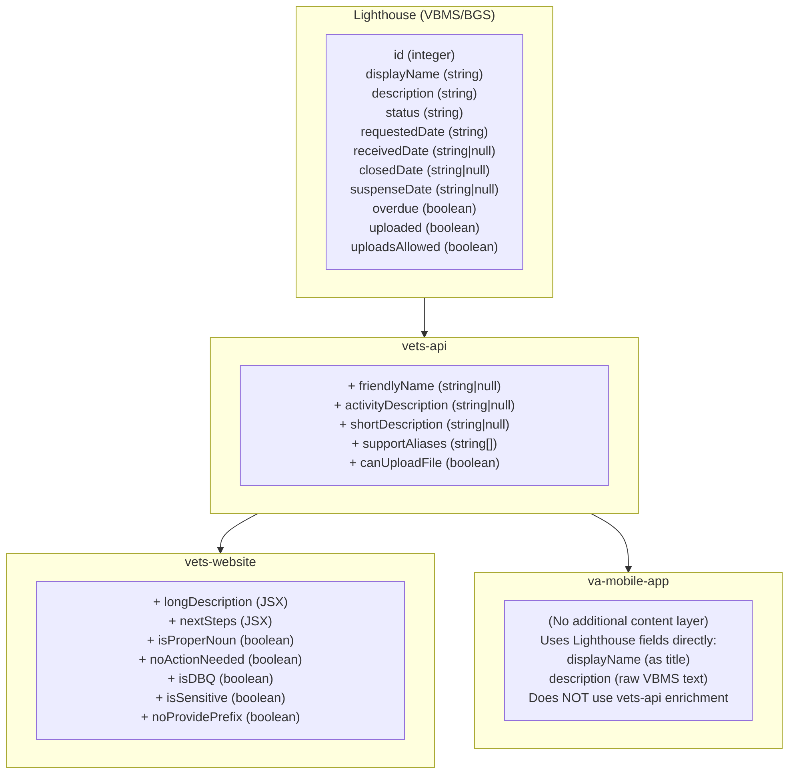

# Evidence Request Content Mappings

## Overview

Evidence request display content is distributed across multiple systems in the VA ecosystem. This document provides a comprehensive mapping of where evidence request content is defined, how it flows through the system, and where consolidation opportunities exist.

## Architecture Diagram



### Content Layer Summary

| Layer | Content Added | Used By |
|-------|---------------|---------|
| **Lighthouse** | Raw tracked item data (id, displayName, description, status, dates, etc.) | All platforms |
| **vets-api** | Friendlier display names, descriptions, upload rules, suppression | ⚠️ vets-website ONLY (mobile receives but ignores these fields) |
| **vets-website** | Rich JSX content (longDescription, nextSteps), UI flags (isDBQ, isSensitive, noProvidePrefix, etc.) | vets-website only |
| **va-mobile-app** | None - displays raw Lighthouse content directly | N/A |

### Platform Content Comparison

| Field | vets-website | va-mobile-app |
|-------|--------------|---------------|
| `displayName` (Lighthouse) | Used as fallback for title | ✅ **Used as title** |
| `description` (Lighthouse) | ⚠️ Used as fallback when `longDescription` not available | ✅ **Used as description** |
| `friendlyName` (vets-api) | ✅ Used as title | ❌ Not used |
| `shortDescription` (vets-api) | ✅ Used | ❌ Not used |
| `activityDescription` (vets-api) | ✅ Used | ❌ Not used |
| `canUploadFile` (vets-api) | ✅ Used | ❌ Not used (uses `uploadsAllowed`) |
| `longDescription` (vets-website) | ✅ Rich JSX content (overrides `description`) | ❌ N/A |
| `nextSteps` (vets-website) | ✅ Action items with links | ❌ N/A |
| UI flags (`isDBQ`, `isSensitive`, `noProvidePrefix`, etc.) | ✅ Used | ❌ N/A |

---

## 1. Lighthouse API (Source)

**Source**: VBMS/BGS via Lighthouse Benefits Claims API

The Lighthouse API returns tracked items (evidence requests) with multiple fields. The data originates from VBMS (Veterans Benefits Management System).

### Tracked Item Fields from Lighthouse

| Field | Type | Description |
|-------|------|-------------|
| `id` | integer | Unique identifier for the tracked item |
| `displayName` | string | Raw tracked item name from VBMS (e.g., "21-4142/21-4142a", "DBQ AUDIO Hearing Loss and Tinnitus") - **used as the key for content mappings** |
| `description` | string | Text description of what's needed from VBMS (often generic/technical) |
| `status` | string | Current status: `NEEDED_FROM_YOU`, `NEEDED_FROM_OTHERS`, `SUBMITTED_AWAITING_REVIEW`, `INITIAL_REVIEW_COMPLETE`, `NO_LONGER_REQUIRED`, `ACCEPTED` |
| `requestedDate` | string | Date the request was created (ISO 8601) |
| `receivedDate` | string\|null | Date something was received for this request |
| `closedDate` | string\|null | Date the tracked item was closed |
| `suspenseDate` | string\|null | Due date for the request ("respond by" date) |
| `overdue` | boolean | Whether the request is past the suspense date |
| `uploaded` | boolean | Whether documents have been uploaded for this request |
| `uploadsAllowed` | boolean | Whether file uploads are permitted for this request type |

### Example Tracked Item Response

```json
{
  "id": 395084,
  "displayName": "PMR Pending",
  "description": "Please complete and return the enclosed VA Form 21-4142, Authorization to Disclose Information, so that we can obtain the authorization to request treatment records from your private medical sources listed on the received VA Form 21-4142a, General Release for Medical Provider Information.",
  "status": "NEEDED_FROM_YOU",
  "requestedDate": "2023-03-16",
  "receivedDate": null,
  "closedDate": null,
  "suspenseDate": "2023-04-15",
  "overdue": false,
  "uploaded": true,
  "uploadsAllowed": true
}
```
---

## 2. vets-api (Content Enhancement Layer)

**Key Files**:
- [`lib/lighthouse/benefits_claims/service.rb`](https://github.com/department-of-veterans-affairs/vets-api/blob/master/lib/lighthouse/benefits_claims/service.rb) - Applies content transformations
- [`lib/lighthouse/benefits_claims/constants.rb`](https://github.com/department-of-veterans-affairs/vets-api/blob/master/lib/lighthouse/benefits_claims/constants.rb) - Content mapping definitions

vets-api intercepts the Lighthouse response and applies "friendlier language" transformations via the `apply_friendlier_language` method in `service.rb`.

> ⚠️ **Important**: While vets-api adds these enriched fields to the API response, **only vets-website uses them**. The mobile app receives these fields but ignores them entirely, displaying raw Lighthouse content instead.

### How Content is Applied

```ruby
def apply_friendlier_language(claim)
  tracked_items = claim['attributes']['trackedItems']
  return unless tracked_items

  tracked_items.each do |i|
    display_name = i['displayName']
    i['canUploadFile'] = 
      BenefitsClaims::Constants::UPLOADER_MAPPING[display_name].nil? ||
      BenefitsClaims::Constants::UPLOADER_MAPPING[display_name]
    i['friendlyName'] = BenefitsClaims::Constants::FRIENDLY_DISPLAY_MAPPING[display_name]
    i['activityDescription'] = BenefitsClaims::Constants::ACTIVITY_DESCRIPTION_MAPPING[display_name]
    i['shortDescription'] = BenefitsClaims::Constants::SHORT_DESCRIPTION_MAPPING[display_name]
    i['supportAliases'] = BenefitsClaims::Constants::SUPPORT_ALIASES_MAPPING[display_name] || []
  end
  tracked_items
end
```

### Constants Defined

#### `FRIENDLY_DISPLAY_MAPPING`
Human-readable display names shown in place of raw `displayName`.

| Raw displayName | Friendly Name |
|-----------------|---------------|
| `21-4142/21-4142a` | Authorization to disclose information |
| `Employment info needed` | Employment information |
| `EFT - Treasury Mandate Notification` | Direct deposit information |
| `PTSD - Need stressor details/med evid of stressful incdnt` | Details about cause of PTSD |
| `RV1 - Reserve Records Request` | Reserve records |
| `Proof of service (DD214, etc.)` | Proof of service |
| `PMR Request` | Non-VA medical records |
| `PMR Pending` | Non-VA medical records |
| `General Records Request (Medical)` | Non-VA medical records |
| `DBQ AUDIO Hearing Loss and Tinnitus` | Disability exam for hearing |
| `DBQ PSYCH Mental Disorders` | Mental health exam |
| `Employer (21-4192)` | Employment information |
| `Unemployability - 21-8940 needed and 4192(s) requested` | Work status information |
| `Request Service Treatment Records from Veteran` | Official service treatment records |
| `21-4142 incomplete - need provider address` | Address of non-VA medical provider |
| `Submit buddy statement(s)` | Witness or corroboration statements |
| `ASB - tell us where, when, how exposed` | Asbestos exposure information |
| `HAIMS STR Request` | Service treatment records |
| `Name of disability needed` | Name of disability |
| `NG1 - National Guard Records Request` | National Guard service treatment records |
| `DBQ RESP Sleep Apnea` | Sleep apnea exam |
| `DBQ MUSC Back (thoracolumbar spine)` | Back pain exam |
| `DBQ MUSC Knee and Lower Leg` | Knee and leg exam |
| `DBQ NEURO Headaches (including migraines)` | Headache and migraine exam |
| `21-4142` | Authorization to disclose information |
| `21-4142a` | Non-VA medical provider information |
| `DBQ PSYCH PTSD initial` | PTSD claim exam |
| `SSA medical evidence requested` | Medical records from the Social Security Administration |
| `DBQ PSYCH PTSD Review` | PTSD claim follow-up exam |
| `Clarification of Claimed Issue` | Clarify claimed condition |
| `DBQ GU Male Reproductive Organ` | Reproductive health exam |
| `ASB-medical evid of disease (biopsy) needed` | Asbestos exposure medical documentation |

#### `ACTIVITY_DESCRIPTION_MAPPING`
Short action-oriented descriptions for activity feeds.

| displayName | Activity Description |
|-------------|---------------------|
| `21-4142/21-4142a` | We need your permission to request your personal information from a non-VA source, like a private doctor or hospital. |
| `Employment info needed` | We need employment information from your most recent employer. |
| `EFT - Treasury Mandate Notification` | We need your direct deposit information in order to pay benefits, if awarded. |
| `PTSD - Need stressor details/med evid of stressful incdnt` | We need information about the cause of your posttraumatic stress disorder (PTSD). |
| `RV1 - Reserve Records Request` | We've requested your reserve records on your behalf. No action is needed. |
| `Proof of service (DD214, etc.)` | We've requested your proof of service on your behalf. No action is needed. |
| `PMR Request` | We've requested your non-VA medical records on your behalf. No action is needed. |

#### `SHORT_DESCRIPTION_MAPPING`
Brief explanatory text providing context.

| displayName | Short Description |
|-------------|-------------------|
| `RV1 - Reserve Records Request` | We've requested your service records or treatment records from your reserve unit. |
| `Proof of service (DD214, etc.)` | We've requested all your DD Form 214's or other separation papers for all your periods of military service. |
| `Employer (21-4192)` | We sent a letter to your last employer to ask about your job and why you left. |
| `PMR Pending` | We've requested your non-VA medical records from your medical provider. |
| `General Records Request (Medical)` | We've requested your non-VA medical records from your medical provider. |
| `Unemployability - 21-8940 needed and 4192(s) requested` | We need more information about how your service-connected disabilities prevent you from working. |
| `Request Service Treatment Records from Veteran` | We need certified copies of your service treatment records if you have them. |
| `21-4142 incomplete - need provider address` | We need your private physician's address to request information for your claim. |
| `Submit buddy statement(s)` | We need statements from people who know about your condition. |
| `ASB - tell us where, when, how exposed` | To process your disability claim for asbestos exposure, we need a bit more information from you. |
| `HAIMS STR Request` | We've requested your service treatment records from the Department of Defense. |
| `Name of disability needed` | We need to know what your disability is and how it's connected to your military service. |
| `DBQ RESP Sleep Apnea` | We've requested an exam to learn more about your sleep apnea. The examiner's office will contact you to schedule this appointment. |
| `DBQ MUSC Back (thoracolumbar spine)` | We've requested an exam to understand your back condition. The examiner's office will contact you to schedule this appointment. |
| `DBQ MUSC Knee and Lower Leg` | We've requested an exam for your knee and lower leg. The examiner's office will contact you to schedule this appointment. |
| `DBQ NEURO Headaches (including migraines)` | We've requested an exam for your headaches. The examiner's office will contact you to schedule this appointment. |
| `21-4142` | We need your permission to request your personal information from a non-VA source, like a private doctor or hospital. |
| `21-4142a` | We need information about where you received treatment so we can request your medical records from non-VA medical providers. |
| `DBQ PSYCH PTSD initial` | We've requested an exam related to your PTSD. The examiner's office will contact you to schedule this appointment. |
| `SSA medical evidence requested` | We've asked the Social Security Administration (SSA) for your medical records. |
| `DBQ PSYCH PTSD Review` | We've requested a follow-up exam related to your PTSD. The examiner's office will contact you to schedule this appointment. |
| `Clarification of Claimed Issue` | We need more information or a medical diagnosis for the condition in your benefits claim. |
| `DBQ GU Male Reproductive Organ` | We've requested an exam to understand the condition affecting your reproductive health. The examiner's office will contact you to schedule this appointment. |
| `ASB-medical evid of disease (biopsy) needed` | We need medical documentation that supports your claim. |
| `NG1 - National Guard Records Request` | We've asked your National Guard unit for your service treatment records. |

#### `SUPPORT_ALIASES_MAPPING`
Alternative names that map to the same content (for matching purposes).

#### `UPLOADER_MAPPING`
Determines whether file upload functionality is enabled for each tracked item type.

| displayName | Upload Enabled |
|-------------|----------------|
| `21-4142/21-4142a` | ✅ true |
| `Employment info needed` | ✅ true |
| `EFT - Treasury Mandate Notification` | ❌ false |
| `PTSD - Need stressor details/med evid of stressful incdnt` | ✅ true |
| `RV1 - Reserve Records Request` | ✅ true |
| `Proof of service (DD214, etc.)` | ✅ true |
| `PMR Request` | ✅ true |
| `General Records Request (Medical)` | ✅ true |
| `DBQ AUDIO Hearing Loss and Tinnitus` | ❌ false |
| `DBQ PSYCH Mental Disorders` | ❌ false |
| `PMR Pending` | ✅ true |
| `Employer (21-4192)` | ❌ false |
| `Unemployability - 21-8940 needed and 4192(s) requested` | ✅ true |
| `Request Service Treatment Records from Veteran` | ✅ true |
| `21-4142 incomplete - need provider address` | ✅ true |
| `Submit buddy statement(s)` | ✅ true |
| `ASB - tell us where, when, how exposed` | ✅ true |
| `HAIMS STR Request` | ❌ false |
| `Name of disability needed` | ✅ true |
| `DBQ RESP Sleep Apnea` | ❌ false |
| `DBQ MUSC Back (thoracolumbar spine)` | ❌ false |
| `DBQ MUSC Knee and Lower Leg` | ❌ false |
| `DBQ NEURO Headaches (including migraines)` | ❌ false |
| `21-4142` | ✅ true |
| `21-4142a` | ✅ true |
| `DBQ PSYCH PTSD initial` | ❌ false |
| `SSA medical evidence requested` | ❌ false |
| `DBQ PSYCH PTSD Review` | ❌ false |
| `Clarification of Claimed Issue` | ✅ true |
| `DBQ GU Male Reproductive Organ` | ❌ false |
| `ASB-medical evid of disease (biopsy) needed` | ✅ true |
| `NG1 - National Guard Records Request` | ❌ false |

#### `FIRST_PARTY_AS_THIRD_PARTY_OVERRIDES`
These tracked items display as "NEEDED_FROM_OTHERS" even when they're technically first-party requests:

- `PMR Pending`
- `Proof of service (DD214, etc.)`
- `NG1 - National Guard Records Request`
- `VHA Outpatient Treatment Records (10-7131)`
- `HAIMS STR Follow-up`
- `Audit Request`

#### `SUPPRESSED_EVIDENCE_REQUESTS`
These tracked items are hidden from users when feature flags are enabled:

- `Admin Decision`
- `ADMINCOD`
- `Attorney Fee`
- `Attorney Fee Release`
- `Awaiting Upload of Hearing Transcript`
- `Delayed BDD Exam Requests`
- `Exam Request - Processing`
- `Exam Review - Not Performed`
- `Exam Review - Partially Complete`
- `IT Ticket-Exam Control Issue`
- `ND Additional Action Required`
- `Pending Completion of Concurrent EP`
- `Rating Extraschedular Memorandum`
- `Records Research Task`
- `Resolution of Pending Rating EP`
- `RO Research Coordinator Review`
- `Second Signature`
- `Secondary Action Required`
- `Stage 2 Development`

---

## 3. vets-website (Frontend Content Layer)

**Key File**: [`src/applications/claims-status/utils/evidenceDictionary.jsx`](https://github.com/department-of-veterans-affairs/vets-website/blob/main/src/applications/claims-status/utils/evidenceDictionary.jsx)

The frontend maintains a dictionary of rich content for evidence requests. This content is currently implemented as JSX (React components) but the underlying content (text, links, lists) could potentially be moved to vets-api and served as structured data (JSON, markdown, etc.).

### Fields Defined

| Field | Type | Description |
|-------|------|-------------|
| `longDescription` | JSX | Detailed explanation of what's needed (rendered as React components with links) |
| `nextSteps` | JSX | Action items for the veteran with form links |
| `isProperNoun` | boolean | Whether the display name should retain capitalization |
| `noActionNeeded` | boolean | Whether veteran action is required |
| `isDBQ` | boolean | Disability Benefits Questionnaire flag |
| `isSensitive` | boolean | Sensitive content flag (displays "Request for evidence" instead of actual name) |
| `noProvidePrefix` | boolean | Skip "Provide" prefix in display |

### Evidence Types Covered in vets-website

| displayName | longDescription | nextSteps | isProperNoun | noActionNeeded | isDBQ | isSensitive | noProvidePrefix |
|-------------|-----------------|-----------|--------------|----------------|-------|-------------|-----------------|
| `21-4142/21-4142a` | ✅ | ✅ | - | - | - | - | - |
| `Employment info needed` | ✅ | ✅ | ❌ | - | - | - | - |
| `EFT - Treasury Mandate Notification` | ✅ | ✅ | ❌ | - | - | - | - |
| `RV1 - Reserve Records Request` | ✅ | - | - | - | - | - | - |
| `DBQ AUDIO Hearing Loss and Tinnitus` | ✅ | - | - | ✅ | ✅ | - | - |
| `DBQ PSYCH Mental Disorders` | ✅ | - | - | ✅ | ✅ | - | - |
| `Proof of service (DD214, etc.)` | ✅ | - | - | - | - | - | - |
| `PMR Pending` | ✅ | - | - | - | - | - | - |
| `Employer (21-4192)` | ✅ | - | - | ✅ | - | - | - |
| `General Records Request (Medical)` | ✅ | - | - | - | - | - | - |
| `Unemployability - 21-8940 needed and 4192(s) requested` | ✅ | ✅ | ❌ | - | - | - | - |
| `Request Service Treatment Records from Veteran` | ✅ | ✅ | ❌ | - | - | - | - |
| `21-4142 incomplete - need provider address` | ✅ | ✅ | ❌ | - | - | - | - |
| `Submit buddy statement(s)` | ✅ | ✅ | ❌ | - | - | - | - |
| `ASB - tell us where, when, how exposed` | ✅ | ✅ | - | - | - | ✅ | - |
| `HAIMS STR Request` | ✅ | - | ❌ | ✅ | - | - | - |
| `Name of disability needed` | ✅ | ✅ | ❌ | - | - | - | - |
| `DBQ RESP Sleep Apnea` | ✅ | - | ❌ | ✅ | ✅ | - | - |
| `DBQ MUSC Back (thoracolumbar spine)` | ✅ | - | ❌ | ✅ | ✅ | - | - |
| `DBQ MUSC Knee and Lower Leg` | ✅ | - | ❌ | ✅ | ✅ | - | - |
| `DBQ NEURO Headaches (including migraines)` | ✅ | - | ❌ | ✅ | ✅ | - | - |
| `21-4142` | ✅ | ✅ | - | - | - | - | - |
| `21-4142a` | ✅ | ✅ | - | - | - | - | - |
| `DBQ PSYCH PTSD initial` | ✅ | - | ✅ | ✅ | ✅ | - | - |
| `SSA medical evidence requested` | ✅ | - | ❌ | ✅ | - | - | - |
| `DBQ PSYCH PTSD Review` | ✅ | - | ✅ | ✅ | ✅ | - | - |
| `Clarification of Claimed Issue` | ✅ | ✅ | ❌ | - | - | - | ✅ |
| `DBQ GU Male Reproductive Organ` | ✅ | - | ❌ | ✅ | ✅ | - | - |
| `ASB-medical evid of disease (biopsy) needed` | ✅ | ✅ | - | - | - | ✅ | - |
| `NG1 - National Guard Records Request` | ✅ | - | ✅ | ✅ | - | - | - |

---

## 4. VA Mobile App

**Key Files**: 
- [`VAMobile/src/screens/BenefitsScreen/ClaimsScreen/ClaimDetailsScreen/ClaimStatus/ClaimFileUpload/FileRequest.tsx`](https://github.com/department-of-veterans-affairs/va-mobile-app/blob/develop/VAMobile/src/screens/BenefitsScreen/ClaimsScreen/ClaimDetailsScreen/ClaimStatus/ClaimFileUpload/FileRequest.tsx)
- [`VAMobile/src/screens/BenefitsScreen/ClaimsScreen/ClaimDetailsScreen/ClaimStatus/ClaimFileUpload/FileRequestDetails/FileRequestDetails.tsx`](https://github.com/department-of-veterans-affairs/va-mobile-app/blob/develop/VAMobile/src/screens/BenefitsScreen/ClaimsScreen/ClaimDetailsScreen/ClaimStatus/ClaimFileUpload/FileRequestDetails/FileRequestDetails.tsx)
- [`VAMobile/src/api/types/ClaimsAndAppealsData.ts`](https://github.com/department-of-veterans-affairs/va-mobile-app/blob/develop/VAMobile/src/api/types/ClaimsAndAppealsData.ts)

### Mobile's Approach

> ⚠️ **Critical Difference**: The mobile app does **NOT** use any of the vets-api enriched fields (`friendlyName`, `shortDescription`, `activityDescription`, etc.). It displays **raw Lighthouse data** directly to users.

The mobile app does **NOT** maintain a separate content dictionary like vets-website. It uses only raw Lighthouse fields from the API response:

#### Fields Used (Raw Lighthouse Data Only)

| Field | Used In | How It's Used |
|-------|---------|---------------|
| `displayName` | FileRequest.tsx, FileRequestDetails.tsx | **Displayed as the request title** (NOT `friendlyName`) |
| `description` | FileRequestDetails.tsx | **Displayed directly to users** as the request description (raw VBMS text) |
| `status` | Multiple files | Determines UI state (pending, reviewed, closed) |
| `type` | Multiple files | Categorizes request type (still_need_from_you, received_from_you, etc.) |
| `trackedItemId` | Upload flows | Used for document uploads and analytics |
| `uploaded` | FileRequest.tsx | Shows upload status indicator |
| `uploadsAllowed` | claims.tsx | Filters which requests can accept uploads (NOT `canUploadFile` from vets-api) |
| `uploadDate` | FileRequestDetails.tsx | Shows when documents were uploaded |
| `documents` | FileRequestDetails.tsx | Lists uploaded file names |
| `requestedDate` | Used for sorting/display | When the request was created |
| `receivedDate` | Used for status logic | When documents were received |
| `closedDate` | Used for status logic | When the request was closed |
| `suspenseDate` | Not directly displayed | Due date (could be used for overdue logic) |
| `overdue` | Available but usage varies | Overdue indicator |

#### Fields NOT Used (vets-api Enrichment Ignored)

The mobile app receives these vets-api enriched fields but **completely ignores them**:

| vets-api Field | Mobile Uses Instead | Impact |
|----------------|---------------------|--------|
| `friendlyName` | `displayName` (raw) | Users see "21-4142/21-4142a" instead of "Authorization to disclose information" |
| `shortDescription` | `description` (raw) | Users see raw VBMS text instead of user-friendly description |
| `activityDescription` | Not displayed | No activity feed descriptions |
| `supportAliases` | Not used | N/A |
| `canUploadFile` | `uploadsAllowed` (Lighthouse) | Functionally similar |

**This means mobile users see significantly less friendly content than web users for the same evidence requests.**

### Key Types

```typescript
export type ClaimEventData = {
  trackedItemId?: number | null;
  description?: string;        // From Lighthouse - displayed to users
  displayName?: string;        // From Lighthouse - used as title
  overdue?: boolean;           // From Lighthouse
  status?: string;             // From Lighthouse
  type: string;                // Request category
  date: string | null;
  uploaded?: boolean;          // From Lighthouse
  uploadsAllowed?: boolean;    // From Lighthouse
  requestedDate?: string | null;
  receivedDate?: string | null;
  closedDate?: string | null;
  suspenseDate?: string | null;
  documents?: Array<ClaimEventDocumentData>;
  // ... other fields
}
```
---

## Content Flow Summary

### For a Tracked Item like "21-4142/21-4142a"

#### Step 1: Lighthouse Returns Raw Data

```json
{
  "id": 394443,
  "displayName": "21-4142/21-4142a",
  "description": "VA Form 21-4142",
  "status": "NEEDED_FROM_YOU",
  "requestedDate": "2023-04-14",
  "receivedDate": "2023-03-15",
  "closedDate": null,
  "suspenseDate": null,
  "overdue": false,
  "uploaded": true,
  "uploadsAllowed": false
}
```

#### Step 2: vets-api Enriches (keyed by `displayName`)

```json
{
  // ... all Lighthouse fields, plus:
  "friendlyName": "Authorization to disclose information",
  "activityDescription": "We need your permission to request your personal information from a non-VA source, like a private doctor or hospital.",
  "shortDescription": null,
  "canUploadFile": true,
  "supportAliases": ["21-4142/21-4142a"]
}
```

#### Step 3: Frontend Rendering (DIFFERENT per platform)

| What Users See | vets-website | va-mobile-app |
|----------------|--------------|---------------|
| **Title** | `friendlyName` ("Authorization to disclose information") | `displayName` ("21-4142/21-4142a") |
| **Description** | `longDescription` from evidenceDictionary (rich JSX with bullet lists) | `description` from Lighthouse (raw VBMS text) |
| **Next Steps** | `nextSteps` from evidenceDictionary (JSX with form links) | ❌ Not shown |
| **Source** | evidenceDictionary.jsx | Direct API response |

#### Visual Comparison

**vets-website shows:**
> **Authorization to disclose information**
> 
> For your benefits claim, we need your permission to request your personal information from a non-VA source, like a private doctor or hospital.
> 
> Personal information may include:
> - Medical treatments
> - Hospitalizations
> - Psychotherapy
> - Outpatient care
>
> **Next steps**
> Use VA Form 21-4142 to give us permission... [link to form]

**va-mobile-app shows:**
> **21-4142/21-4142a**
> 
> VA Form 21-4142
