# [Claim Status Tool] - Document Status User Flow - Evidence Request
## Evidence Request Upload Flow

This diagram illustrates the complete lifecycle for submitting specifically requested evidence through the Claim Status Tool (CST) on VA.gov. The flow begins when the VA requests specific evidence (like Authorization to Disclose Information forms) and tracks the journey from the evidence request alert through document upload, submission, asynchronous processing (up to 2 days), and final storage in the veteran's eFolder. It includes error handling for submission validation (422 errors, Type 1 errors) and processing failures (Type 2 errors), with the happy path (animated green dashed edges) showing the successful end-to-end flow from evidence request to eFolder storage.

```mermaid
flowchart TD
    %% Node Declarations
    AA@{shape: circle, label: "Start"}
    A[User views claim on CST - Status Tab]@{shape: rect}
    B[User sees 'What you need to do' alert<br/>Authorization to Disclose Information]@{shape: curv-trap}
    C[User clicks 'Details' link and navigates to Evidence Request Page]@{shape: lean-r}
    G[User selects, or drags file for upload]@{shape: lean-r}
    H[User selects document type from dropdown]@{shape: lean-r}
    I[User clicks 'Submit documents for review']@{shape: lean-r}
    KD{Submission Result?}@{shape: diam}
    NAV[System navigates user back to Status Tab]@{shape: rect}
    L[Green confirmation banner appears]@{shape: curv-trap}
    E1[File Submission Validation Alert]@{shape: curv-trap}
    E2[Type 1 Error Alert shows]@{shape: curv-trap}
    M[User can navigate to Files Tab to see progress]@{shape: rect}
    P[File appears in 'File submissions in progress' section]@{shape: doc}
    T[⏳ Processing File ⏳ <br>up to 2 days]@{shape: delay}
    U{File Upload Status}@{shape: diam}
    V[File shown in 'Files Received' section]@{shape: doc}
    W[Type 2 Error Alert shows]@{shape: curv-trap}
    Y[Process complete - evidence request fulfilled<br/>File successfully stored in eFolder]@{shape: rounded}
    SUCCESS_END@{shape: dbl-circ, label: "Success!"}
    ERR_END1@{shape: dbl-circ, label: "error end"}
    ERR_END2@{shape: dbl-circ, label: "error end"}
    NOTE["🔗 Legend"]@{shape: notch-rect}
    E2_NOTE["`**Type 1 Error Behavior**
    • Persists until **end of session**
    • New type 1 failure replaces previous error`"]@{shape: notch-rect}
    W_NOTE["`**Type 2 Error Behavior**
    • Persists for _**30 days after failure date**_
    • Slim alert on claims list page
    • Full alert on Status tab and Files tab
    • Shows one file name + count if >2 files`"]@{shape: notch-rect}

    %% Edge Declarations
    AA h1@--> A
    A h2@--> B
    B h3@--> C
    C h4@--> G
    G h5@--> H
    H h6@--> I
    I h7@--> KD
    KD h8@-->|Success| NAV
    NAV h9@--> L
    KD -->|422 Error| E1
    KD -->|Type 1 Error| E2
    E2 --> ERR_END1
    E2 -.- E2_NOTE
    L h10@--> M
    M h11@--> P
    P h12@--> T
    T h13@--> U
    U h14a@--->|CREATED<br>QUEUED<br>PENDING| T
    U h14b@-->|SUCCESS| V
    U -->|FAILED| W
    W --> ERR_END2
    W -.- W_NOTE
    V h15@--> Y
    Y h16@--> SUCCESS_END

    %% Interactivity
    click NOTE "https://docs.mermaidchart.com/mermaid-oss/syntax/flowchart.html" "See legend" _blank

    %% Class Definition for Happy Path Animation
    classDef happyPath stroke:#4CAF50,stroke-dasharray: 9,5,stroke-dashoffset: 900,animation: dash 25s linear infinite;

    %% Apply Happy Path Styling to Edges
    class h1,h2,h3,h4,h5,h6,h7,h8,h9,h10,h11,h12,h13,h14a,h14b,h15,h16 happyPath

    %% Node Styling
    style A fill:#e1f5fe,color:#000000
    style B fill:#fff3e0,color:#000000
    style L fill:#c8e6c9,color:#000000
    style Y fill:#c8e6c9,color:#000000
    style T fill:#fff3e0,color:#000000
    style E1 fill:#ffcdd2,color:#000000
    style E2 fill:#ff4550,color:#000000
    style E2_NOTE fill:#fff9c4,color:#000000,stroke:#fbc02d,stroke-width:2px
    style W fill:#ff4550,color:#000000
    style W_NOTE fill:#fff9c4,color:#000000,stroke:#fbc02d,stroke-width:2px

    style SUCCESS_END fill:#4CAF50,color:#ffffff
    style ERR_END1 fill:#ff4550,color:#ffffff
    style ERR_END2 fill:#ff4550,color:#ffffff
```

