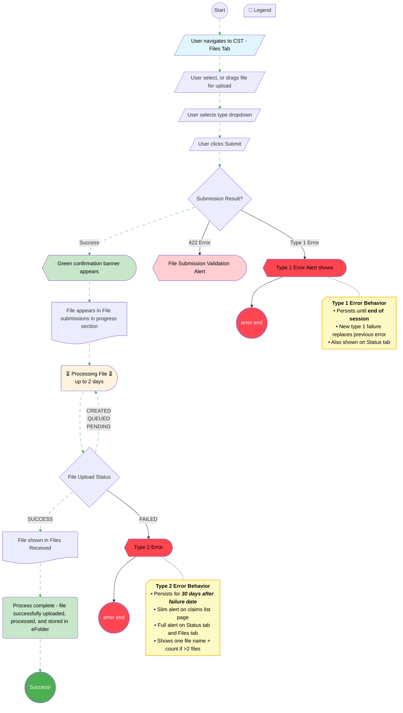

# [Claim Status Tool] - Document Status User Flow
## Additional Evidence

This diagram illustrates the complete lifecycle for submitting document evidence through the Claim Status Tool (CST) on VA.gov. The flow tracks the journey from file selection through submission, asynchronous processing (up to 2 days), and final storage in the veteran's eFolder. It includes error handling for submission validation (422 errors, Type 1 errors) and processing failures (Type 2 errors), with the happy path (animated green dashed edges) showing the successful end-to-end flow from user upload to eFolder storage.

