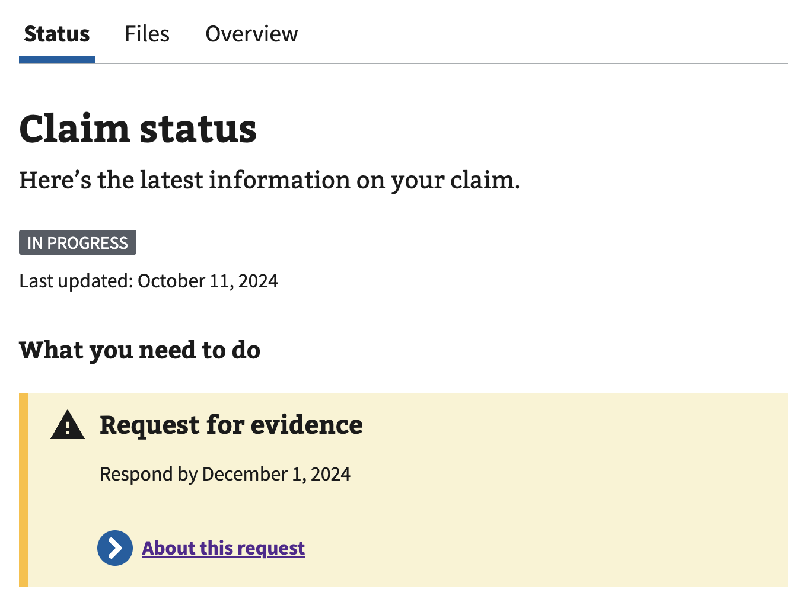

# Alert Audit

## Links
- Issue: [[CST Alert Improv] Audit CST Alerts #119651](https://github.com/department-of-veterans-affairs/va.gov-team/issues/119651)
- Epic: [CST Alerts Alignment and Improvements #119389](https://github.com/department-of-veterans-affairs/va.gov-team/issues/119389)

## Overview
This document provides a comprehensive audit of all VA alerts used in the Claims Status application. Each alert's "Deviations from Design System" may reference specific sections from the Design System guidelines found in the [Appendix](#appendix-design-system-reference).

## Generic Notification Component

A reusable notification system used across multiple pages to display success and error messages after user actions.

- Component: [src/applications/claims-status/components/Notification.jsx](../../components/Notification.jsx)
- Type: `<VaAlert>` React component
- Implementation: Uses Redux state management (`setNotification` action) for displaying temporary notifications
- Code:
  ```jsx
  export default function Notification({
    body,
    title,
    type,
    onClose,
    onSetFocus,
  }) {
    const closeable = !!onClose;
    useEffect(() => {
      if (typeof onSetFocus === 'function') {
        setTimeout(() => {
          onSetFocus();
        });
      }
    }, [title, body, onSetFocus]);

    return (
      <VaAlert
        data-testid="notification"
        close-btn-aria-label="Close notification"
        className="claims-alert"
        closeable={closeable}
        onCloseEvent={onClose}
        status={type}
        visible
      >
        <h2 slot="headline">{title}</h2>
        <p className="vads-u-margin-y--0">{body}</p>
      </VaAlert>
    );
  }
  ```

### Claim Detail Page Notifications
- Location:
  - Claim detail pages: /your-claims/:id/* - [ClaimDetailLayout.jsx:62](../../components/ClaimDetailLayout.jsx)
  
- Trigger: Shows when user navigates to claim detail after:
  - Submitting evidence waiver (5103 notice) - "We received your evidence waiver"
  - Requesting claim decision (AskVAPage without CST phases) - "Request received"
- Code:
  ```jsx
  {message && (
    <Notification
      title={message.title}
      body={message.body}
      type={message.type}
      onClose={clearNotification}
      onSetFocus={focusNotificationAlert}
    />
  )}

  // Redux action that creates the notification messages (actions/index.js)
  export function submit5103(id, trackedItemId, cstClaimPhasesEnabled = false) {
    return dispatch => {
      // ... request logic ...
      if (cstClaimPhasesEnabled) {
        dispatch(
          setNotification({
            title: 'We received your evidence waiver',
            body: 'Thank you. We\'ll move your claim to the next step as soon as possible.',
          }),
        );
      } else {
        dispatch(
          setNotification({
            title: 'Request received',
            body: 'Thank you. We have your claim request and will make a decision.',
          }),
        );
      }
    };
  }
  ```
- Deviations from Design System:
  - Alerts appear ABOVE the h1 (main page title), violating:
    - Section 11.2.4: Alerts should be placed "above h2 but below h1"
    - Section 6.1.1: Standard alerts should be "directly below intro text, near top of page"
    - This creates poor information hierarchy where users see notifications before understanding what page they're on
- Implementation Bug:
  - **Missing error notification**: When `submit5103` fails, the error is tracked in Redux state but never shown to users. The submit button changes to "Something went wrong..." and becomes disabled, but users get no explanation of what failed or how to proceed. This violates:
    - Section 4.2.1: "User feedback for actions taken (success and error)"
    - Section 9.3: "Include educational material in error messages"
    - The error handler should dispatch a notification similar to the success case

### Document Request Page Notifications
- Location:
  - Document request page: /your-claims/:id/document-request/:trackedItemId - [DocumentRequestPage.jsx:141](../../containers/DocumentRequestPage.jsx)
  
- Trigger: Shows when:
  - User successfully submits evidence waiver ("We received your evidence waiver")
  - User successfully requests claim decision ("Request received")
  - API errors occur during submission
- Code: **Identical to Claim Detail Page** - Same `submit5103` action, notification component (wrapped in `<div>`)
- Deviations: **Same as Claim Detail Page** - Alerts above h1
- Bug: **Same as Claim Detail Page** - Missing error notification.

### Additional Evidence Page Notifications
- Location:
  - Additional evidence page: /your-claims/:id/additional-evidence - [AdditionalEvidencePage.jsx:93](../../components/claim-files-tab/AdditionalEvidencePage.jsx)
  
- Trigger: Shows when:
  - File upload succeeds (e.g., "We received your file upload on [date]")
  - File upload fails
  - File validation errors occur (type, size)
- Code:
  ```jsx
  {message && (
    <Notification
      title={message.title}
      body={message.body}
      type={message.type}
      onSetFocus={focusNotificationAlert}
    />
  )}

  // Redux actions that create notification messages (actions/index.js)
  // SUCCESS: File upload completion
  dispatch(
    setNotification({
      title: `We received your file upload on ${uploadDate}`,
      body: (
        <span>
          If your uploaded file doesn't appear in the Documents
          Filed section on this page, please try refreshing the page.
        </span>
      ),
    }),
  );

  // ERROR: Various upload failure messages (utils/helpers.js)
  export const getUploadErrorMessage = (error, claimId) => {
    // Duplicate file error
    if (error?.errors?.[0]?.detail === 'DOC_UPLOAD_DUPLICATE') {
      return {
        title: `You've already uploaded ${error?.fileName || 'files'}`,
        body: (
          <>
            It can take up to 2 days for the file to show up in{' '}
            <va-link
              text="your list of documents filed"
              href={`/track-claims/your-claims/${claimId}/files`}
            />
            . Try checking back later before uploading again.
          </>
        ),
        type: 'error',
      };
    }

    // Invalid claimant error
    if (error?.errors?.[0]?.detail === 'DOC_UPLOAD_INVALID_CLAIMANT') {
      return {
        title: `You can't upload files for this claim here`,
        body: (
          <>
            Only the Veteran with the claim can upload files on this page. We're
            sorry for the inconvenience.
            <br />
            <va-link
              active
              text="Upload files with QuickSubmit"
              href="https://eauth.va.gov/accessva/?cspSelectFor=quicksubmit"
            />
          </>
        ),
        type: 'error',
      };
    }

    // Generic upload error
    return {
      title: `Error uploading ${error?.fileName || 'files'}`,
      body:
        error?.errors?.[0]?.title ||
        'There was an error uploading your files. Please try again',
      type: 'error',
    };
  };
  ```
- Deviations from Design System:
  - Alerts appear below h2 ("Claim files") but above h3 ("Additional evidence"), violating:
    - Section 6.1.2: Section-specific alerts should be placed directly below their section header (these relate to "Additional evidence" h3)
    - Section 11.2.4: Preferred pattern is to place alerts above h2 but below h1
    - Current placement creates ambiguous hierarchy where alerts float between two heading levels
- Implementation Bug:
  - **Mixed upload results only show errors, suppressing success feedback**: [Issue #115934](https://github.com/department-of-veterans-affairs/va.gov-team/issues/115934) - When uploading multiple files with mixed results (some succeed, some fail), users only see error messages and don't know which files uploaded successfully.

  The if-else logic in the `onAllComplete` callback determines both the notification shown and whether a redirect occurs:
  ```javascript
  // From actions/index.js - onAllComplete callback
  if (!hasError) {
    // ALL files succeeded
    dispatch({ type: DONE_UPLOADING }); // Sets uploadComplete: true → triggers redirect
    dispatch(setNotification({
      title: `We received your file upload on ${uploadDate}`,
      body: /* success message */
    }));
    // AdditionalEvidencePage will redirect to Files page due to uploadComplete
  } else {
    // ANY file failed (even if some succeeded)
    // No DONE_UPLOADING dispatch → uploadComplete stays false → no redirect
    dispatch(setAdditionalEvidenceNotification(
      getUploadErrorMessage(hasError, claimId),
    ));
    // User stays on Additional Evidence page with only error message
    // No success feedback for files that actually uploaded
  }
  ```

  **Current behavior:**
  - All files succeed → Sets `uploadComplete: true` → Page redirects to Files tab → Success message would show there
  - Any file fails → `uploadComplete` stays false → No redirect → User stays on page seeing only error message

  **Expected behavior:**
  - Mixed results should show both which files succeeded and which failed
  - Users need clear feedback to avoid re-uploading files that already succeeded

## Used Across Multiple Areas of the Application

### Claims Unavailable Alert
- Location:
  - Component: [src/applications/claims-status/components/ClaimsUnavailable.jsx](../../components/ClaimsUnavailable.jsx)
  - Your claims list: [/your-claims](https://staging.va.gov/track-claims/your-claims) - [YourClaimsPageV2.jsx:154](../../containers/YourClaimsPageV2.jsx)
  
  - Claim detail page: /your-claims/:id/* - [ClaimDetailLayout.jsx:117](../../components/ClaimDetailLayout.jsx)
  
  - STEM claim status: /your-stem-claims/:id/status - [StemClaimStatusPage.jsx:53](../../containers/StemClaimStatusPage.jsx)
  
- Type: Legacy `usa-alert usa-alert-warning`
- Trigger: Shows when ALL of these conditions are true:
  - User has access to claims data service (`canAccessClaims` is true)
  - Claims API has returned a response
  - Claims availability status is NOT 'AVAILABLE' (API returned an error or unavailable status)
  - Note: User can still see appeals information when claims are unavailable
- Code:
  ```jsx
  // Component definition
  function ClaimsUnavailable({ headerLevel = 4 }) {
    const Tag = `h${headerLevel}`;

    return (
      <div className="usa-alert usa-alert-warning claims-unavailable">
        <div className="usa-alert-body">
          <Tag className="claims-alert-header vads-u-font-size--h4">
            Claim status is unavailable
          </Tag>
          <p className="usa-alert-text">
            VA.gov is having trouble loading claims information at this time.
            Please check back again in an hour. Please note: You are still able to
            review appeals information.
          </p>
        </div>
      </div>
    );
  }

  // Usage in YourClaimsPageV2.jsx
  <h2>Your claims, decision reviews, or appeals</h2>
  <ClaimsUnavailable headerLevel={3} />

  // Usage in ClaimDetailLayout.jsx
  <h1>We encountered a problem</h1>
  <ClaimsUnavailable headerLevel={2} />

  // Usage in StemClaimStatusPage.jsx
  <h1>We encountered a problem</h1>
  <ClaimsUnavailable headerLevel={2} />
  ```
- Deviations from Design System:
  - Using legacy USWDS `usa-alert` CSS classes instead of modern `<va-alert>` web component
  - No ARIA role for dynamic alert (should have `role="alert"` if appearing after API failure)

### Claims & Appeals Unavailable Alert
- Location:
  - Component: [src/applications/claims-status/components/ClaimsAppealsUnavailable.jsx](../../components/ClaimsAppealsUnavailable.jsx)
  - [https://staging.va.gov/track-claims](https://staging.va.gov/track-claims/) - [ClaimsStatusApp.jsx:45](../../containers/ClaimsStatusApp.jsx)
  - Your claims list: [/your-claims](https://staging.va.gov/track-claims/your-claims) - [YourClaimsPageV2.jsx:150](../../containers/YourClaimsPageV2.jsx)
  
- Type: Legacy `usa-alert usa-alert-warning`
- Trigger: Shows when ALL of these conditions are true:
  - User has access to BOTH claims and appeals services (`canAccessClaims` and `canAccessAppeals` are both true)
  - Both APIs have returned responses
  - Claims availability status is NOT 'AVAILABLE' (claims API returned an error)
  - Appeals availability status is NOT 'AVAILABLE' (appeals API returned an error)
  - Note: This takes priority over individual unavailable alerts
- Code:
  ```jsx
  function ClaimsAppealsUnavailable() {
    return (
      <div className="usa-alert usa-alert-warning claims-unavailable">
        <div className="usa-alert-body">
          <h4 className="claims-alert-header">
            Claim and Appeal status is unavailable
          </h4>
          <p className="usa-alert-text">
            VA.gov is having trouble loading claims and appeals information at
            this time. Please check back again in a hour.
          </p>
        </div>
      </div>
    );
  }

  // Usage in YourClaimsPageV2.jsx (appears after h2)
  <h2>Your claims, decision reviews, or appeals</h2>
  <ClaimsAppealsUnavailable />
  ```
- Deviations from Design System:
  - Using legacy USWDS `usa-alert` CSS classes instead of modern `<va-alert>` web component
  - No ARIA role for dynamic alert (should have `role="alert"` if appearing after API failure)
- Implementation Bug:
  - Typo: "in a hour" should be "in an hour"
  - **ClaimsStatusApp.jsx usage is broken**: The alert at (`{!canUseApp && <ClaimsAppealsUnavailable />}`) will never display because `isDataAvailable` prop is not properly passed through the component hierarchy. For `AppContent` to receive `isDataAvailable` from `RequiredLoginView`, it must be a direct child, but the current structure prevents this prop from being available where the alert is rendered. This is dead code that appears functional but never executes.

## Claims List Page

### Appeals Unavailable Alert
- Location:
  - Component: [src/applications/claims-status/components/AppealsUnavailable.jsx](../../components/AppealsUnavailable.jsx)
  - Your claims list: [/your-claims](https://staging.va.gov/track-claims/your-claims) - [YourClaimsPageV2.jsx:161](../../containers/YourClaimsPageV2.jsx)
  
- Type: Legacy `usa-alert usa-alert-warning`
- Trigger: Shows when ALL of these conditions are true:
  - User has access to appeals data service (`canAccessAppeals` is true)
  - Appeals API has returned a response
  - Appeals availability status is NOT 'AVAILABLE' (API returned an error or unavailable status)
  - Note: User can still see claims information when appeals are unavailable
- Code:
  ```jsx
  function AppealsUnavailable() {
    return (
      <div className="usa-alert usa-alert-warning claims-unavailable">
        <div className="usa-alert-body">
          <h4 className="claims-alert-header">Appeal status is unavailable</h4>
          <p className="usa-alert-text">
            VA.gov is having trouble loading appeals information at this time.
            Please check back again in a hour. Please note: You are still able to
            review claims information.
          </p>
        </div>
      </div>
    );
  }
  ```
- Deviations from Design System:
  - Using legacy USWDS `usa-alert` CSS classes instead of modern `<va-alert>` web component
  - No ARIA role for dynamic alert (should have `role="alert"` if appearing after API failure)
- Implementation Bugs:
  - Typo: "in a hour" should be "in an hour"

### No Claims Alert
- Location:
  - Component: [src/applications/claims-status/components/NoClaims.jsx](../../components/NoClaims.jsx)
  - Your claims list (empty state): [/your-claims](https://staging.va.gov/track-claims/your-claims) - [YourClaimsPageV2.jsx:219](../../containers/YourClaimsPageV2.jsx)
  
- Type: Legacy `usa-alert usa-alert-info`
- Trigger: Shows when ALL of these conditions are true:
  - All data requests have completed loading (claims, appeals, and STEM claims APIs have returned)
  - The combined list of claims, appeals, and STEM claims is empty (user has zero items)
  - No errors occurred during data loading
- Code:
  ```jsx
  export default function NoClaims() {
    return (
      <div className="usa-alert usa-alert-info claims-alert background-color-only claims-alert-status">
        <h3 className="claims-alert-header usa-alert-heading">
          You do not have any submitted claims
        </h3>
        <p>This page shows only completed claim applications.</p>
      </div>
    );
  }
  ```
- Deviations from Design System:
  - Using legacy USWDS `usa-alert` CSS classes instead of modern `<va-alert>` web component
  - Is using an alert a good practice for "No claims" type messaging?
- Implementation Bugs:
  - The is used when there are no claims nor alerts but the content only mentions claims
  - If there is an error with claims we shouldn't show the no claims message. This has the potential to cause concern from a user who has claims when `/benefit_claims` is down

### Claims List Item - Requested Evidence Alert
- Location:
  - Component: [src/applications/claims-status/components/ClaimsListItem.jsx:103-111](../../components/ClaimsListItem.jsx)
  - Your claims list (individual claim cards): [/your-claims](/your-claims) - [ClaimsListItem.jsx](../../components/ClaimsListItem.jsx)
  
- Type: `<va-alert status="info" slim>`
- Trigger: Shows when ALL of these conditions are true:
  - Claim has `documentsNeeded` flag set to true (VA has requested evidence from the veteran)
  - Claim does NOT have a decision letter sent yet (`decisionLetterSent` = false)
  - Claim status is NOT 'COMPLETE' (claim is still in progress)
- Code:
  ```jsx
  <va-alert status="info" slim>
    <span className="vads-u-font-weight--bold">
      We requested more information from you:
    </span>{' '}
    Check the claim details to learn more.
    <div className="vads-u-margin-top--2">
      This message will go away when we finish reviewing your response.
    </div>
  </va-alert>
  ```
- Deviations from Design System:
  - NA

## STEM Details

### STEM Denied Details (Alert-styled)
- Location:
  - Component: [src/applications/claims-status/components/StemDeniedDetails.jsx](../../components/StemDeniedDetails.jsx)
  - STEM claim status page: /your-stem-claims/:id/status - [StemClaimStatusPage.jsx:50](../../containers/StemClaimStatusPage.jsx)
  
- Type: Custom div with alert-like styling (not a true alert component)
- Trigger: Shows when ALL of these conditions are true:
  - Feature flag `stem_automated_decision` is enabled (required for STEM claims to appear in claims list) - currently enabled in prod
  - User is viewing a STEM scholarship claim status page
  - Claim data is successfully loaded (`claimAvailable(claim)` returns true)
  - STEM scholarship application has `automatedDenial: true` (only denied claims are ever loaded into the system)
- Code:
  ```jsx
  // Relevant alert-styled section only (lines 27-31)
  <div className="vads-u-background-color--primary-alt-lightest vads-u-padding--2 vads-u-margin-bottom--3">
    <h2 className="claims-alert-header vads-u-font-size--h4">
      Your application was denied on {date}
    </h2>
  </div>
  ```
- Deviations from Design System:
  - Uses custom div styling instead of `<va-alert>` web component
  - Appears BEFORE intro text rather than after (Section 6.1.1 suggests alerts should be "directly below intro text")
  - Contains an h2 element styled as h4 (`vads-u-font-size--h4`) which creates semantic confusion
- Implementation Bugs:
  - **Dead feature flag**: The `stem_automated_decision` flag is a 5+ year old feature flag that has been removed from vets-api but still appears as enabled in the production feature flag list.
  - **Layout bug**: The `StemAskVAQuestions` component is rendered in a separate column using legacy grid patterns (`usa-width-one-third medium-4 column`), causing a significant visual layout issue where content appears misaligned


## Claim Details

### What We Are Doing Alert
- Location:
  - Component: [src/applications/claims-status/components/claim-status-tab/WhatWeAreDoing.jsx](../../components/claim-status-tab/WhatWeAreDoing.jsx)
  - Claim status tab: /your-claims/:id/status - [ClaimStatusPage.jsx:78](../../containers/ClaimStatusPage.jsx)
  
- Type: `<va-alert status="info" slim>`
- Trigger: Shows when ALL of these conditions are true:
  - User is viewing the status tab of an open claim
  - Claim has `currentPhaseBack: true` in the claim data. This indicates the claim was moved back to a previous processing phase.
- Code:
  ```jsx
  {currentPhaseBack && (
    <va-alert
      class="optional-alert vads-u-padding-bottom--1"
      status="info"
      slim
    >
      We moved your claim back to this step because we needed to find or
      review more evidence
    </va-alert>
  )}
  ```
- Deviations from Design System:
  - NA
- Implementation Bugs:
  - **CSS class used for testing**: The `optional-alert` class is used as a test selector but has no actual CSS styles defined anywhere in the codebase.

### Recent Activity - Third Party Request Alert
- Location:
  - Component: [src/applications/claims-status/components/claim-status-tab/RecentActivity.jsx](../../components/claim-status-tab/RecentActivity.jsx)
  - Claim status tab (Recent Activity section): /your-claims/:id/status - [ClaimStatusPage.jsx:96](../../containers/ClaimStatusPage.jsx)
  
- Type: `<va-alert status="info" slim>`
- Trigger: Shows when ALL of these conditions are true:
  - User is viewing the status tab of a claim
  - An activity item in the Recent Activity list has `status === 'NEEDED_FROM_OTHERS'`. This indicates VA is waiting for evidence from a third party (employer, school, medical provider, etc.).
- Code:
  ```jsx
  const thirdPartyRequesAlertText = item => {
    return (
      <va-alert
        data-testid={`item-from-others-${item.id}`}
        class="optional-alert vads-u-padding-bottom--1"
        status="info"
        slim
      >
        {item.activityDescription ? (
          <>
            {item.activityDescription}
            <br />
          </>
        ) : (
          renderDefaultThirdPartyMessage(item.oldDisplayName)
        )}
        <Link
          aria-label={`About this notice for ${item.friendlyName ||
            item.displayName}`}
          className="add-your-claims-link"
          to={`../needed-from-others/${item.id}`}
        >
          About this notice
        </Link>
      </va-alert>
    );
  };

  // Usage in activity list
  {item.status === 'NEEDED_FROM_OTHERS' &&
    thirdPartyRequesAlertText(item)}
  ```
- Deviations from Design System:
  - **Improper link component** (Section 8.1): Uses plain React Router `<Link>` instead of VA Design System's action link or `<va-link>` component for the "About this notice" link
  - **Misuse of slim alert** (Section 3.2.3): Slim alerts are only for immediate user feedback or sub-alerts in hierarchy. This is neither - it's unprompted content that appears on page load
  - **Should use Alert-Expandable**: This alert matches Alert-Expandable use cases perfectly: unprompted (loads with page) and its within page content (in list item)
- Implementation Bugs:
  - Has `optional-alert` which is an unused CSS Class
  - Typo in function name: `thirdPartyRequesAlertText`
  - **Partial page failure**: `renderDefaultThirdPartyMessage(displayName)` in utils/helpers.js:1325 calls `displayName.toLowerCase()` without null checking, causing TypeError when displayName is null/undefined. Same issue in `renderOverrideThirdPartyMessage` at line 1341. This breaks the Recent Activity section (goes blank) but rest of page still works.
  - **Inconsistent link styling**: Uses `add-your-claims-link` class which has no CSS definitions, leaving the link unstyled (browser defaults only)

### Closed Claim Alert
- Location:
  - Component: [src/applications/claims-status/components/claim-status-tab/ClosedClaimAlert.jsx](../../components/claim-status-tab/ClosedClaimAlert.jsx)
  - Claim status tab: /your-claims/:id/status - [ClaimStatusPage.jsx:88](../../containers/ClaimStatusPage.jsx)
  
- Type: `<va-alert status="info">`
- Trigger: Shows when ALL of these conditions are true:
  - User is viewing the status tab of a claim
  - Claim is closed (`!isOpen`): Either claim status is 'COMPLETE' OR claim has a `closeDate` value
  - The alert shows different content based on `decisionLetterSent` boolean prop
- Code:
  ```jsx
  const headerText = closeDate => {
    return closeDate
      ? `We closed your claim on ${buildDateFormatter()(closeDate)}`
      : 'We closed your claim';
  };

  export default function ClosedClaimAlert({
    closeDate,
    decisionLetterSent = false,
  }) {
    return (
      <va-alert
        data-testid="closed-claim-alert"
        class="vads-u-margin-bottom--4"
        status="info"
      >
        <h2 id="claims-alert-header" slot="headline">
          {headerText(closeDate)}
        </h2>
        {decisionLetterSent ? (
          <>
            <p>
              You can download your decision letter online now. You can also get
              other letters related to your claims.
            </p>
            <p className="vads-u-margin-y--0">
              We\'ll also send you a copy of your decision letter by mail. It
              should arrive within 10 days after the date we closed your claim,
              but it may take longer.
            </p>
            <div className="link-action-container">
              <Link className="vads-c-action-link--blue" to="/your-claim-letters">
                Get your claim letters
              </Link>
            </div>
          </>
        ) : (
          <p className="vads-u-margin-y--0">
            We mailed you a decision letter. It should arrive within 10 days after
            the date we decided your claim. It can sometimes take longer.
          </p>
        )}
      </va-alert>
    );
  }
  ```
- Deviations from Design System:
  - **Improper link component** (Section 8.1): Uses plain React Router `<Link>` with manual CSS class `vads-c-action-link--blue` instead of the VA Design System's proper action link component.

### Files Needed Alert
- Location:
  - Component: [src/applications/claims-status/components/claim-files-tab/FilesNeeded.jsx](../../components/claim-files-tab/FilesNeeded.jsx)
  - Status tab - What you need to do section: /your-claims/:id/status - [WhatYouNeedToDo.jsx:31](../../components/claim-status-tab/WhatYouNeedToDo.jsx)
  
  - Files tab - Additional evidence section: /your-claims/:id/files - [AdditionalEvidencePage.jsx:145](../../components/claim-files-tab/AdditionalEvidencePage.jsx)
  
- Type: `<va-alert status="warning">`
- Trigger: Shows when ALL of these conditions are true:
  - User is viewing the Files tab or Status tab of a claim
  - Tracked items have status === 'NEEDED_FROM_YOU' (evidence required from veteran)
  - Alert shows for each item that needs evidence (multiple alerts can appear)
- Code:
  ```jsx
  <va-alert
    data-testid={`item-${item.id}`}
    class="primary-alert vads-u-margin-bottom--2"
    status="warning"
  >
    <h4 slot="headline" className="alert-title">
      {getItemDisplayName()}
    </h4>
    <p>Respond by {formattedDueDate}</p>
    <span className="alert-description">{getItemDescription()}</span>
    <div className="link-action-container">
      <Link
        aria-label={`About this request for ${item.friendlyName || item.displayName}`}
        className="vads-c-action-link--blue"
        to={`../needed-from-you/${item.id}`}
        onClick={() => {
          if (previousPage !== null) {
            sessionStorage.setItem('previousPage', previousPage);
          }
        }}
      >
        About this request
      </Link>
    </div>
  </va-alert>
  ```
- Deviations from Design System:
  - **Improper link component** (Section 8.1): Uses plain React Router `<Link>` with CSS class `vads-c-action-link--blue` instead of VA Design System's proper action link component
- Implementation Bugs:
  - **CSS class used for testing**: The `primary-alert` class is used as a test selector in unit and E2E tests instead of using proper `data-testid` attributes
  - **Dead CSS and Dead Code**: The `.primary-alert .due-date-header` CSS rule (line 891 in claims-status.scss) is dead code. In addition, the DueDate component that used `.due-date-header` was removed on Aug 7, 2025 (commit 95490892db) when the cst_friendly_language feature flag was removed.

### Files Optional Alert
- Location:
  - Component: [src/applications/claims-status/components/claim-files-tab/FilesOptional.jsx](../../components/claim-files-tab/FilesOptional.jsx)
  - Additional evidence page: /your-claims/:id/additional-evidence - [AdditionalEvidencePage.jsx:155](../../components/claim-files-tab/AdditionalEvidencePage.jsx)
   (Its the second info alert shown)
- Type: `<va-alert status="info">`
- Trigger: Shows when ALL of these conditions are true:
  - User is viewing the Files tab
  - Tracked items have status === 'NEEDED_FROM_OTHERS' (evidence requested from third party)
  - Alert shows for each item VA is waiting for from others (multiple alerts can appear)
- Code:
  ```jsx
  <va-alert class="optional-alert vads-u-margin-bottom--2" status="info">
    <h4 slot="headline" className="alert-title">
      {getItemDisplayName()}
    </h4>
    <p>{getRequestText()}</p>
    <p className="alert-description">
      {item.shortDescription || item.activityDescription
        ? renderOverrideThirdPartyMessage(item)
        : renderDefaultThirdPartyMessage(item.displayName)}
    </p>
    <div className="call-to-action">
      <Link
        aria-label={`About this notice for ${item.friendlyName ||
          item.displayName}`}
        className="add-your-claims-link"
        to={`../needed-from-others/${item.id}`}
      >
        About this notice
      </Link>
    </div>
  </va-alert>
  ```
- Deviations from Design System:
  - **Improper link component** (Section 8.1): Uses React Router `Link`
  - **Incorrect placement**: Alert appears after FilesNeeded alerts rather than directly below the section header. Design System states alerts should be "placed directly below the header of that section"
- Implementation Bugs:
  - **CSS classes misused for testing**: Should use `data-testid` attributes instead of CSS classes for test selectors
  - **Inconsistent link styling**: Uses `add-your-claims-link` class which has no CSS definitions, leaving the link unstyled (browser defaults only)

### Past Deadline Alert

- Location:
  - Component: [src/applications/claims-status/components/claim-document-request-pages/DefaultPage.jsx](../../components/claim-document-request-pages/DefaultPage.jsx)
  - Document request detail page: /your-claims/:id/document-request/:trackedItemId - [DocumentRequestPage.jsx:65](../../containers/DocumentRequestPage.jsx)
  
- Type: `<va-alert status="warning">`
- Trigger: Shows when ALL of these conditions are true:
  - User is viewing a document request detail page
  - Tracked item has status === 'NEEDED_FROM_YOU' (evidence required from veteran)
  - Current date is after item.suspenseDate (deadline has passed)
- Code:
  ```jsx
  <va-alert status="warning" class="vads-u-margin-top--4">
    <h2 slot="headline">Deadline passed for requested information</h2>
    <p className="vads-u-margin-y--0">
      We haven't received the information we asked for. You can still
      send it, but we may review your claim without it.
    </p>
    <p>
      If you have questions, call the VA benefits hotline at{' '}
      <va-telephone contact="8008271000" /> (
      <va-telephone contact="711" tty="true" />
      ).
    </p>
  </va-alert>
  ```
- Deviations from Design System:
  - NA

### Adding Details Alert

- Location:
  - Component: [src/applications/claims-status/components/AddingDetails.jsx](../../components/AddingDetails.jsx)
   (in this case its being showed because claimType was set to `null`)
- Type: `<va-alert status="info" slim>`
- Trigger: Shows when ALL of these conditions are true:
  - User is viewing any claim detail page (status, overview, or files tab)
  - Claim is open (not closed)
  - Claim is missing required data: `!claimType || !contentions.length || !claimDate`
- Code:
  ```jsx
  <va-alert
    class="vads-u-margin-bottom--1"
    close-btn-aria-label="Close notification"
    full-width="false"
    slim
    status="info"
    visible="true"
    data-test-id="adding-details"
  >
    <p className="vads-u-margin-y--0">
      We can't show all of the details of your claim. Please check back later.
    </p>
  </va-alert>
  ```
- Deviations from Design System:
  - **Misuse of slim alert**: Slim alerts are for immediate feedback or creating a hierarchy of alerts within a page. This is neither - it's unprompted content that appears on page load alone without any
  standard alert to be subordinate to.
  - **Placement within section**: Alert appears after content in the "What you've claimed" section rather than directly below the h2 header. Design System specifies section alerts should be "placed directly below the header of that section"
- Implementation Bugs:
  - **Non-standard test attribute**: Uses `data-test-id` instead of standard `data-testid`
  - **Incorrectly triggers for valid claims**: The alert shows when `claimType` is null, but null `claimType` is normal behavior for certain claims from the API (see issue [#90936](https://github.com/department-of-veterans-affairs/va.gov-team/issues/90936)).

### Claim Phase Stepper Alert

- Location:
  - Component: [src/applications/claims-status/components/claim-overview-tab/ClaimPhaseStepper.jsx](../../components/claim-overview-tab/ClaimPhaseStepper.jsx)
  - Overview tab: /your-claims/:id/overview - [OverviewPage.jsx:85](../../containers/OverviewPage.jsx)
   (A new claim was created to show this: Claim for compensation - Received on September 15, 2024)
- Type: `<va-alert status="info" slim>`
- Trigger: Shows when ALL of these conditions are true:
  - User is viewing the Overview tab of a claim
  - Claim is a disability compensation or pension claim
  - Current phase is marked with `currentPhaseBack` flag (claim was moved back to a previous phase)
  - Alert appears within the accordion item for the current phase
- Code:
  ```jsx
  <va-alert
    class="optional-alert vads-u-padding-bottom--1"
    status="info"
    slim
  >
    We moved your claim back to this step because we needed to
    find or review more evidence
  </va-alert>
  ```
- Deviations from Design System:
  - **Misuse of slim alert**: Slim alerts are for immediate feedback or sub-alert hierarchy. This is neither - it's unprompted content that appears on page load
  - **Placement within accordion**: Alert appears inside an accordion item rather than at section level. Design System specifies alerts should be at page or section level
- Implementation Bugs:
  - **CSS class used for testing**: The `optional-alert` class has no CSS definitions and is only used as a test selector instead of using proper `data-testid` attributes

## Decision Letters Page

### Work In Progress (WIP) Alert
- Location:
  - Component: [src/applications/claims-status/components/WIP.jsx](../../components/WIP.jsx)
  - Decision letters page: [/your-claim-letters](https://staging.va.gov/track-claims/your-claim-letters) - [YourClaimLetters/index.jsx:139](../../containers/YourClaimLetters/index.jsx)
  
- Type: `<va-alert status="warning">`
- Trigger:
  - Decision letter feature flag (`claimLettersAccess`) is disabled (it is currently enabled in production)
- Code:
  ```jsx
  const WIP = () => (
    <va-alert status="warning">
      <h2 slot="headline">
        Decision letters aren\'t available to download right now.
      </h2>
      <p className="vads-u-margin-y--0">
        We\'re fixing some problems with this tool. Check back later. If you need
        information about your decision letters now, call us at{' '}
        <va-telephone contact="8008271000" /> (TTY: 711). We're here Monday
        through Friday, 8:00 a.m. to 9:00 p.m. ET.
      </p>
    </va-alert>
  )
  ```
- Deviations from Design System:
  - NA
- Implementation Bug:
  - **No longer needed Feature flag**: The `claimLettersAccess` feature flag is enabled in production and there's no reason to turn it off. The WIP component and the feature flag conditional logic in YourClaimLetters/index.jsx should be removed since this alert will never be shown to users. The entire `else` branch (lines 138-140) and WIP component can be deleted.

## Appeals Section

### Appeals Alert List

- Location:
  - Container: [src/applications/claims-status/components/appeals-v2/AlertsList.jsx](../../components/appeals-v2/AlertsList.jsx)
  - Individual Alert: [src/applications/claims-status/components/appeals-v2/Alert.jsx](../../components/appeals-v2/Alert.jsx)
  - Appeals status page: /appeals/:id/status - [AppealsV2StatusPage.jsx:104](../../containers/AppealsV2StatusPage.jsx)
  
- Type: Container with multiple legacy USWDS alerts
- Trigger: Shows when appeal has active alerts. Different alert types trigger based on:
  - Appeal status (active/inactive)
  - Specific dates (hearing dates, due dates)
  - Appeal type and stage
- Code:
  ```jsx
  // AlertsList container
  const alertsList = allAlertsContent.map((alert, index) => {
    const key = `${alert.type}-${index}`;
    return (
      <Alert
        key={key}
        title={alert.title}
        description={alert.description}
        displayType={alert.displayType}
      />
    );
  });
  ...
  
  <div className="alerts-list-container">
    {takeActionHeader}
    <ul className="alerts-list">{alertsList}</ul>
  </div>

  // Individual Alert component
  <li>
    <div className={`usa-alert ${cssClass}`}>
      <div className="usa-alert-body">
        <h4 className="usa-alert-heading">{title}</h4>
        <div className="usa-alert-text">{description}</div>
      </div>
    </div>
  </li>
  ```
- Alert Types (9 types defined in `utils/appeals-v2-helpers.jsx`):
  - **Take Action alerts** (usa-alert-warning):
    - `form9Needed` - Return VA Form 9 by due date
    - `scheduledHearing` - Upcoming hearing scheduled
    - `hearingNoShow` - Missed hearing, action required
    - `heldForEvidence` - Evidence submission window open
  - **Info alerts** (usa-alert-info):
    - `rampEligible` - RAMP program eligibility notification
    - `rampIneligible` - RAMP program ineligibility notice
    - `decisionSoon` - Decision timeline information
    - `blockedByVso` - VSO representation blocking
    - `evidentiaryPeriod` - Evidence submission period
- Deviations from Design System:
  - **Legacy USWDS classes**: Uses `usa-alert`, `usa-alert-warning`, `usa-alert-info` instead of modern `<va-alert>` web components
  - **Alerts in list items**: Wraps alerts in `<li>` elements, which is non-standard for alerts
  - **Missing ARIA roles**: No `role="alert"` for dynamic alerts that appear after page load
  - **Inconsistent heading levels**: Uses h4 for alert headings regardless of page structure

### Missing Events Alert

- Location:
  - Component: [src/applications/claims-status/components/appeals-v2/PastEventsSection.jsx](../../components/appeals-v2/PastEventsSection.jsx)
  - Appeals V2 status page: /appeals/:id - [AppealsV2StatusPage.jsx:115](../../containers/AppealsV2StatusPage.jsx)
  
- Type: Legacy `usa-alert usa-alert-warning`
- Trigger: Shows when appeal has `incompleteHistory` flag set to true
- Code:
  ```jsx
  <div className="usa-alert usa-alert-warning">
    <div className="usa-alert-body">
      <h4 className="usa-alert-heading">Missing events</h4>
      <p className="usa-alert-text">
        There may be some events missing from this page. If you have questions
        about a past form or VA decision, please contact your VSO or
        representative for more information.
      </p>
    </div>
  </div>
  ```
- Deviations from Design System:
  - **Legacy USWDS alert**: Uses `usa-alert` classes instead of modern `<va-alert>` web component

## Dead Code

### Standard 5103 Notice Alert

- Location:
  - Component: [src/applications/claims-status/components/claim-files-tab/Standard5103Alert.jsx](../../components/claim-files-tab/Standard5103Alert.jsx)
  - **DEAD CODE**: Not imported or used anywhere in the application
- Type: `<va-alert status="warning">`
- Trigger: N/A - Component is not used (dead code)
- Code:
  ```jsx
  <va-alert
    data-testid="standard-5103-notice-alert"
    class="primary-alert vads-u-margin-bottom--2"
    status="warning"
  >
    <h4 slot="headline" className="alert-title">
      {standard5103Item.displayName}
    </h4>
    <span className="alert-description">{standard5103Item.description}</span>
    <div className="link-action-container">
      <Link
        aria-label={`Details for ${standard5103Item.displayName}`}
        title={`Details for ${standard5103Item.displayName}`}
        className="vads-c-action-link--blue"
        to="../5103-evidence-notice"
        onClick={() => {
          if (previousPage !== null) {
            sessionStorage.setItem('previousPage', previousPage);
          }
        }}
      >
        Details
      </Link>
    </div>
  </va-alert>
  ```
- Deviations from Design System:
  - **Improper link component**: Uses React Router `Link` with CSS class instead of VA Design System link component
- Implementation Bugs:
  - **Dead code**: Component exists but is never imported or used anywhere. 10 month old comment states "Not currently being used".

### Ask VA To Decide Alert
- Location:
  - Component: [src/applications/claims-status/components/AskVAToDecide.jsx](../../components/AskVAToDecide.jsx)
  - **DEAD CODE**: Not imported or used anywhere in the application
- Type: Legacy `usa-alert usa-alert-info`
- Trigger: N/A - Component is not used
- Code:
  ```jsx
  export default function AskVAToDecide() {
    return (
      <div className="usa-alert usa-alert-info background-color-only claims-alert-status alert-with-details">
        <div className="item-title-container">
          <h4 className="claims-alert-header">Ask for your Claim Decision</h4>
          <p>
            You can ask us to start evaluating your claim if you don't have any
            more documents or evidence to file.
          </p>
        </div>
        <div className="button-container">
          <Link
            aria-label="View details about asking VA for a claim decision"
            title="View details about asking VA for a claim decision"
            className="usa-button usa-button-secondary view-details-button"
            to="../ask-va-to-decide"
          >
            View Details
          </Link>
        </div>
      </div>
    );
  }
  ```
- Deviations from Design System:
  - Using legacy USWDS `usa-alert` CSS classes instead of modern `<va-alert>` web component
- Implementation Bug:
  - **Component is dead code**: This component exists in the codebase but is no longer imported or used anywhere. History:
    - Originally used in FilesPage.jsx
    - Aug 2, 2024 (commit bbc6b45bdc): Hidden behind `cst5103UpdateEnabled` feature flag when Standard 5103 Notice functionality was added
    - Aug 12, 2025 (commit 56230b644): Completely removed from usage when the feature flag was removed
    - The AskVAPage.jsx now handles the "ask-va-to-decide" functionality directly without using this alert component

## Appendix: Design System Reference

### Component Types Used

1. VA Web Components `<va-alert>`
2. React Component Library `<VaAlert>`
3. Legacy USWDS Alerts: Older implementation using USWDS CSS classes (`usa-alert`).

### Design System Quick Reference
Full doc: https://design.va.gov/components/alert

#### 1. Implementation Example
```javascript
<va-alert
  close-btn-aria-label="Close notification"
  status="info"  // info | warning | success | error
  visible
>
  <h2 slot="headline">Headline text (required for standard)</h2>
  <p className="vads-u-margin-y--0">Alert body content</p>
</va-alert>
```

#### 2. Alert Types

2.1. **Informational (default)**
   - Used to provide helpful information or something that warrants a user's attention. Not used for negative consequences.

2.2. **Warning**
   - Used to warn a user, such as when there are negative consequences, or when something has gone wrong.

2.3. **Success**
   - Used to indicate success.

2.4. **Error**
   - Used to indicate an error or failure.

#### 3. Standard vs Slim Alerts

3.1. **Standard Alert Properties:**
   - 3.1.1. Standard alerts must contain headings
   - 3.1.2. Can be dismissible
   - 3.1.3. Used in most use cases and within static content pages

3.2. **Slim Alert Properties:**
   - 3.2.1. Do not contain headings
   - 3.2.2. Can be dismissible
   - 3.2.3. Only appropriate with these constraints:
     - 3.2.3.1. Immediate feedback to the user without full page load
     - 3.2.3.2. Sub-alerts when creating hierarchy of alerts (not stacking)

#### 4. Uses of Alerts

4.1. **To notify users about system status:**
   - 4.1.1. In-application system status (error or warning, no user action required)
   - 4.1.2. Access messages when item unavailable (error or warning)

4.2. **To respond to user action:**
   - 4.2.1. User feedback for actions taken (success and error)

4.3. **Engagement messages:**
   - 4.3.1. Nudge user to enter or update data (informational)

4.4. **Unprompted in-page alerts:**
   - 4.4.1. Consider Alert - Expandable instead

#### 5. When NOT to Use Alerts

5.1. Unprompted in-page alerts: Use Alert - Expandable
5.2. Clarifying background information: Use Additional info component
5.3. System maintenance: Use Banner - Maintenance
5.4. As the only content on a page: Alert should not be only/majority of content

#### 6. Placement

6.1. **Standard Alert:**
   - 6.1.1. In most cases, placed directly below intro text, near top of page
   - 6.1.2. When section-specific, placed directly below header of that section

6.2. **Slim Alert:**
   - 6.2.1. Related to form field/section: below the label, legend, or section header
   - 6.2.2. Info variation: can be placed between sections
   - 6.2.3. Save-in-progress success/error: directly below Back/Continue button pair

#### 7. How to Use Alerts

7.1. Tell users what they need to do and make task as easy as possible
7.2. Message should be concise, in plain language
7.3. Allow dismissal wherever appropriate
7.4. Don't include notifications unrelated to user's current goal
7.5. Don't stack alerts one after another
7.6. Order multiple alerts by severity (most critical first, ideally top of page)
7.7. Co-locate with relevant content when within page body
7.8. Should not contain other expandable components (like Additional info)
7.9. Standard alerts must contain headings; Slim alerts do not

#### 8. Links Within Alerts

8.1. Preferred: Use action link for single clear next step or call-to-action
8.2. Acceptable: Link - Active style
8.3. Use correct variations: Link - Directions for maps, Telephone component for phone numbers
8.4. Don't use bold text for standard links within alert messages

#### 9. Content Considerations

9.1. Be polite in error messages — don't place blame on the user
9.2. VA no longer says "Please" in alerts
9.3. Include educational material in error messages
9.4. Don't overdo it — too many notifications will be ignored
9.5. Don't use jargon and computer code

#### 10. Accessibility Considerations

10.1. **Focus Management:**
   - 10.1.1. No auto-dismissal based on timer or time limit
   - 10.1.2. Focusable elements should include: heading, body copy, phone numbers, and buttons

10.2. **ARIA Roles:**
   - 10.2.1. Static alert (page load): No role needed
   - 10.2.2. Important, time-sensitive (after interaction): `role="alert"`
   - 10.2.3. Interactive alerts: `role="alertdialog"`
   - 10.2.4. Advisory information: `role="status"`

#### 11. Additional Best Practices from VA.gov Issues

The following best practices come from related GitHub issues that have identified alert improvements needed across VA.gov:

11.1. **Alert Hierarchy and Priority**
   - Source: [Issue #80585 - Alert accessibility concerns](https://github.com/department-of-veterans-affairs/va.gov-team/issues/80585) & [Issue #116262 - Handling multiple alerts in CST](https://github.com/department-of-veterans-affairs/va.gov-team/issues/116262)
   - 11.1.1. Show only the highest priority alert when multiple are triggered
   - 11.1.2. Implement clear hierarchy: Error > Warning > Info > Success
   - 11.1.3. Consider read/unread states for persistent notifications
   - 11.1.4. Allow archiving of handled alerts when appropriate

11.2. **Placement Consistency**
   - Source: [Issue #96593 - CST alert placement alignment](https://github.com/department-of-veterans-affairs/va.gov-team/issues/96593)
   - 11.2.1. Maintain consistent placement across similar contexts
   - 11.2.2. Get accessibility specialist review for placement decisions
   - 11.2.3. Consider technical feasibility when designing placement
   - 11.2.4. Preferred pattern: Place alerts above h2 but below h1

11.3. **Content and Style Consistency**
   - Source: [Issue #101614 - Evidence request alert design consistency](https://github.com/department-of-veterans-affairs/va.gov-team/issues/101614)
   - 11.3.1. Use VA Design System (VADS) aligned language across all alerts
   - 11.3.2. Maintain consistent tone and messaging style
   - 11.3.3. Create templates for common alert scenarios
   - 11.3.4. Same alert purpose should use same alert type across the application

11.4. **Avoiding Alert Stacking**
   - Source: [Issue #116262 - Handling multiple alerts in CST](https://github.com/department-of-veterans-affairs/va.gov-team/issues/116262)
   - 11.4.1. Separate multiple alerts visually on the page
   - 11.4.2. Consider using "prefill pattern" for placement
   - 11.4.3. Distribute alerts throughout the page near relevant content
   - 11.4.4. Never place multiple alerts of the same type consecutively
