# Backend Service Architecture Diagram

## Benefits Claims

The `BenefitsClaimsController` is the Rails controller in vets-api that handles all claims status API endpoints. It retrieves claims data from the [Lighthouse Benefits Claims API](https://developer.va.gov/explore/api/benefits-claims), manages document upload status tracking via local database records and polling to [Lighthouse Benefits Documents API](https://developer.va.gov/explore/api/benefits-documents), and supports 5103 waiver submissions.

For detailed architecture documentation including sequence diagrams and API response structures, see [BenefitsClaimsController Architecture](benefits-claims-architecture.md).

```mermaid
flowchart LR
    User[👤 User] --> VAGov[🌐 VA.gov Frontend]
    VAGov --> VetsAPI[🔧 vets-api]
    VetsAPI --> Controller[📋 BenefitsClaimsController]
    Controller --> LHService[☁️ Lighthouse Service]
    Controller --> DB[(🗄️ Database)]
    LHService --> External[External VA Systems]
```

## Document Uploads
_12/16/2025 - TODO: UPDATE THIS DIAGRAM_

## Appeals
_12/16/2025 - TODO: UPDATE THIS DIAGRAM_

## STEM Claims
_12/16/2025 - TODO: UPDATE THIS DIAGRAM_

