# VA.gov Claims Status Tool - BenefitsClaimsController Architecture

This document outlines the architecture flow for a user accessing their claims status on VA.gov.

## High-Level Architecture

```mermaid
flowchart LR
    User[👤 User] --> VAGov[🌐 VA.gov Frontend]
    VAGov --> VetsAPI[🔧 vets-api]
    VetsAPI --> Controller[📋 BenefitsClaimsController]
    Controller --> LHService[☁️ Lighthouse Service]
    Controller --> DB[(🗄️ Database)]
    LHService --> External[External VA Systems]
```



## User Flow: Claim Status Tool - `/track-claims/your-claims` (Index)


## User Flow: Claim Status Tool - `/track-claims/your-claims/{id}` (Show)


## User Flow: Submit 5103 Waiver - `/track-claims/your-claims/{id}/submit5103` (Submit5103)


## User Flow: Failed Evidence Submissions - `/track-claims/failed_upload_evidence_submissions` (Failed Uploads)


## System Components

### Frontend (VA.gov)

- **VA.gov Frontend**: Single-page application that handles user authentication and displays claims status information

### Backend (vets-api)

- **BenefitsClaimsController**: Rails controller handling claims API endpoints
- **Lighthouse Service**: Integration with Lighthouse Benefits Claims API
- **EvidenceSubmission Model**: Database model for document upload tracking

## Key Features

### Authorization & Validation

- User must be authenticated with lighthouse access

### Data Processing

- Claim type language mapping for user-friendly display
- Document upload status tracking (behind feature flag)
- Evidence submission filtering and metadata processing

### Logging & Monitoring

- Detailed claim type logging for DataDog analytics
- Evidence request tracking for support purposes

## Feature Flags

### General CST:

- `cst_suppress_evidence_requests_website`: Controls evidence request suppression (show endpoint only)
- `cst_use_claim_title_generator_web`: Enables the claim title generator to add `displayTitle` and `claimTypeBase` to claim responses

### [Document Status Initiative](https://github.com/department-of-veterans-affairs/va.gov-team/blob/master/products/claim-appeal-status/CST%20Product/Document%20Status%20Initiative.md)

- `cst_show_document_upload_status`: Controls document upload status display and evidence submission tracking
- `cst_update_evidence_submission_on_show`: Enables polling Lighthouse for updated evidence submission statuses when viewing a claim (show endpoint only)

## API Response Structure

The base response structure for claims data comes from the [Lighthouse Benefits Claims API](https://developer.va.gov/explore/api/benefits-claims/docs?version=current). The following sections describe the transformations applied to the Lighthouse response before returning it to the frontend.

### Index Endpoint (`GET /v0/benefits_claims`)

**Base Response:** [Lighthouse GET /benefits-claims](https://developer.va.gov/explore/api/benefits-claims/docs?version=current)

**Response Transformations:**

| Transformation | Description | Feature Flag |
|----------------|-------------|--------------|
| `claimType` mapping | Replaces `claimType` values using `BenefitsClaims::Constants::CLAIM_TYPE_LANGUAGE_MAP` for user-friendly display | Default (when title generator disabled) |
| Add `displayTitle` | Adds human-readable claim title to `attributes.displayTitle` | `cst_use_claim_title_generator_web` |
| Add `claimTypeBase` | Adds base claim type classification to `attributes.claimTypeBase` | `cst_use_claim_title_generator_web` |
| Add `evidenceSubmissions` | Adds array of evidence submission records to `attributes.evidenceSubmissions` for each claim (see Evidence Submissions structure below) | `cst_show_document_upload_status` |

### Show Endpoint (`GET /v0/benefits_claims/{id}`)

**Base Response:** [Lighthouse GET /benefits-claims/{id}](https://developer.va.gov/explore/api/benefits-claims/docs?version=current)

**Response Transformations:**

| Transformation | Description | Feature Flag |
|----------------|-------------|--------------|
| `claimType` mapping | Replaces `claimType` values using `BenefitsClaims::Constants::CLAIM_TYPE_LANGUAGE_MAP` for user-friendly display | Default (when title generator disabled) |
| Add `displayTitle` | Adds human-readable claim title to `attributes.displayTitle` | `cst_use_claim_title_generator_web` |
| Add `claimTypeBase` | Adds base claim type classification to `attributes.claimTypeBase` | `cst_use_claim_title_generator_web` |
| RV1 status override | Changes `status` to `NEEDED_FROM_OTHERS` for tracked items with `displayName` of "RV1 - Reserve Records Request" | Always applied |
| Suppress evidence requests | Removes tracked items with `displayName` values in `BenefitsClaims::Constants::SUPPRESSED_EVIDENCE_REQUESTS` | `cst_suppress_evidence_requests_website` |
| Add `canUpload` | Adds `attributes.canUpload` boolean based on presence of user's BIRLS ID | Always applied |
| Add `evidenceSubmissions` | Adds array of evidence submission records to `attributes.evidenceSubmissions` (see Evidence Submissions structure below) | `cst_show_document_upload_status` |

### Submit 5103 Endpoint (`POST /v0/benefits_claims/{id}/submit5103`)

**Request Payload:**

```json
{
  "trackedItemId": "string (optional)"
}
```

**Response:** Returns the Lighthouse service response directly without transformation. See [Lighthouse POST /benefits-claims/{id}/5103](https://developer.va.gov/explore/api/benefits-claims/docs?version=current).

### Failed Upload Evidence Submissions Endpoint (`GET /v0/benefits_claims/failed_upload_evidence_submissions`)

**Note:** This endpoint does not call Lighthouse directly. It queries local `EvidenceSubmission` records and enriches them with tracked item information from Lighthouse.

**Response Structure:**

When `cst_show_document_upload_status` feature flag is enabled, returns:

```json
{
  "data": [ /* Array of Evidence Submission objects (see Evidence Submissions Structure below) */ ]
}
```

When feature flag is disabled, returns: `{ "data": [] }`

### Evidence Submissions Structure

When `cst_show_document_upload_status` feature flag is enabled, the `evidenceSubmissions` array added to claims contains:

```json
{
  "acknowledgement_date": "timestamp",
  "claim_id": "integer",
  "created_at": "timestamp",
  "delete_date": "timestamp",
  "document_type": "string",
  "failed_date": "timestamp",
  "file_name": "string",
  "id": "integer",
  "lighthouse_upload": "boolean",
  "tracked_item_id": "integer",
  "tracked_item_display_name": "string",
  "tracked_item_friendly_name": "string",
  "upload_status": "string",
  "va_notify_status": "string"
}
```

**Note:** Evidence submissions are filtered to exclude duplicates that already appear in the claim's `supportingDocuments` (matched by `originalFileName`).
