# VA.gov Claims Status Tool - BenefitsClaimsController Architecture

This document outlines the architecture flow for a user accessing their claims status on VA.gov.

## High-Level Architecture

```mermaid
flowchart LR
    User[👤 User] --> VAGov[🌐 VA.gov Frontend]
    VAGov --> VetsAPI[🔧 vets-api]
    VetsAPI --> Controller[📋 BenefitsClaimsController]
    Controller --> LHService[☁️ Lighthouse Service]
    Controller --> DB[(🗄️ Database)]
    LHService --> External[External VA Systems]
```

## User Flow: Claim Status Tool - `/track-claims/your-claims` (Index)

## User Flow: Claim Status Tool - `/track-claims/your-claims/{id}` (Show)

## System Components

### Frontend (VA.gov)
- **VA.gov Frontend**: Single-page application that handles user authentication and displays claims status information

### Backend (vets-api)
- **BenefitsClaimsController**: Rails controller handling claims API endpoints
- **Lighthouse Service**: Integration with Lighthouse Benefits Claims API
- **EvidenceSubmission Model**: Database model for document upload tracking

## Key Features

### Authorization & Validation
- User must be authenticated with lighthouse access

### Data Processing
- Claim type language mapping for user-friendly display
- Document upload status tracking (behind feature flag)
- Evidence submission filtering and metadata processing

### Logging & Monitoring
- Detailed claim type logging for DataDog analytics
- Evidence request tracking for support purposes

## Feature Flags
- `cst_show_document_upload_status`: Controls document upload status display
- `cst_suppress_evidence_requests_website`: Controls evidence request suppression (show endpoint only)

## API Response Structure

### Index Endpoint (`/v0/benefits_claims`)
Returns JSON array with:
- List of all user claims with processed language mappings
- Upload failure status per claim (when `cst_show_document_upload_status` feature enabled)
- Basic claim information and tracked items

### Show Endpoint (`/v0/benefits_claims/{id}`)
Returns JSON object with:
- Individual claim details with processed language mappings
- Manual status overrides (RV1 items)
- Filtered evidence requests (when `cst_suppress_evidence_requests_website` feature enabled)
- `canUpload` flag based on user's BIRLS ID
- Evidence submission metadata (when `cst_show_document_upload_status` feature enabled)
- Detailed tracked items with status information
