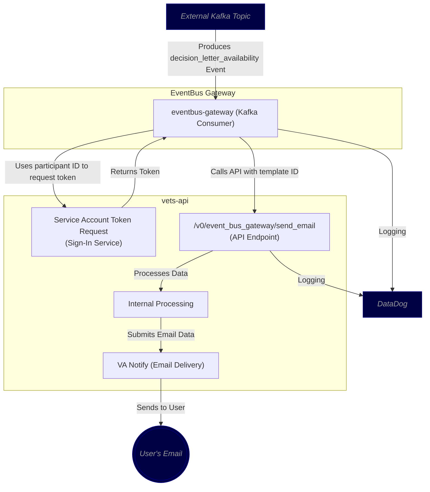

# Decision Letter Email Notifications Architecture Diagram

## Legend

- Items in blue are external.

## Notes
- Communication between the Kafka topic and the Eventbus Gateway is authenticated via restricted IAM roles between the LHDI AWS
  account and the DSVA AWS account, ensuring that messages are encrypted and sent securely.
- Alternate consideration was to have the Eventbus Gateway send an email directly to VA Notify, but due to the convenience of
  having all the necessary items to craft and send the email (profile connection for personalization) already functioning within
  vets-api, the decision was to use a service authorization approach instead.
- Libraries being used by Eventbus Gateway are all preexisting within the va.gov ecosystem.
- No data is currently being persisted in relation to the incoming events outside of DataDog logging.
- No new code was introduced to the sign in service or VA Notify, but we are willing to discuss alternatives we hadn't considered
  on their use in this workflow.
