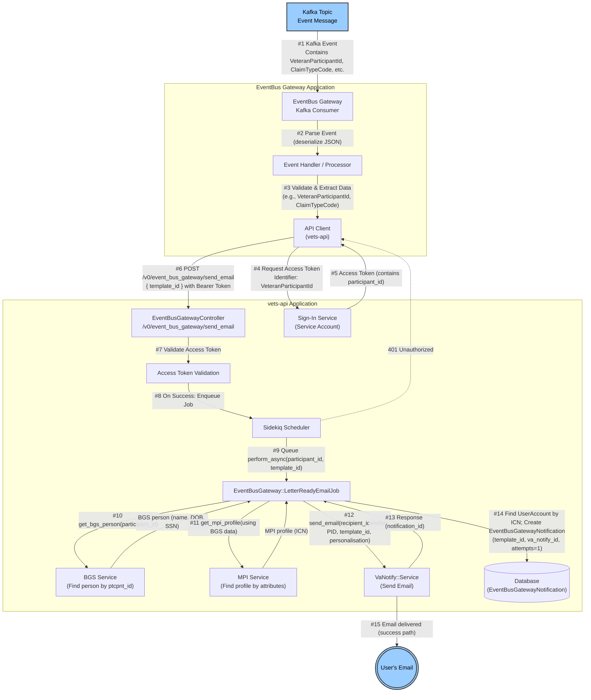
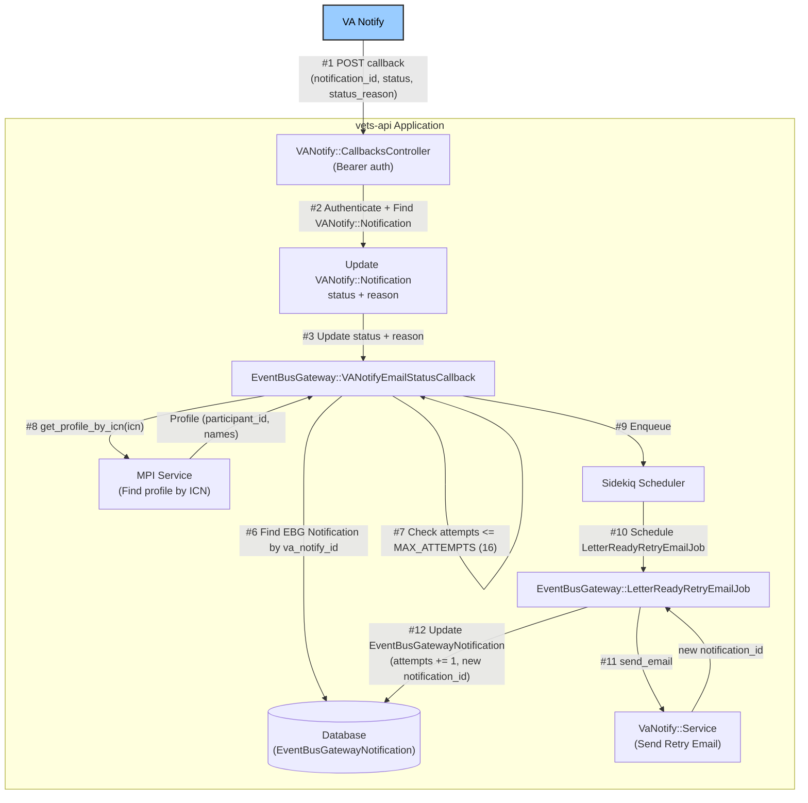

# Data Flow Diagram: EventBus Gateway & `/v0/event_bus_gateway/send_email` (with Authorization)

This document provides two focused data flow diagrams reflecting the current architecture:
- Diagram 1: Initial request through successful email sending via `EventBusGateway::LetterReadyEmailJob`.
- Diagram 2: Callback processing via `EventBusGateway::VANotifyEmailStatusCallback` and retry enqueuing via `EventBusGateway::LetterReadyRetryEmailJob`.

### Diagram 1 — Initial Request to Successful Email Send (LetterReadyEmailJob)

### Diagram 2 — Callback Processing and Retry Enqueue (VANotifyEmailStatusCallback ➜ LetterReadyRetryEmailJob)

## Data & Authorization Flow Details

- EventBus Gateway requests an access token using the `VeteranParticipantId` and calls `/v0/event_bus_gateway/send_email` with `template_id`.
- vets-api validates the token, enqueues `LetterReadyEmailJob`, which fetches BGS + MPI data and sends email via VA Notify.
- On VA Notify callback with `temporary-failure`, `VANotifyEmailStatusCallback` looks up the corresponding notification, ensures attempts are within limit, and enqueues `LetterReadyRetryEmailJob` using `perform_in(1.hour, ...)` with fresh personalisation.
- The retry job sends a new email via VA Notify and atomically updates the `EventBusGatewayNotification` with incremented attempts and the latest `va_notify_id`.

---

**Legend:**
- Blue Nodes: External systems
- Grouped Nodes: Application boundaries
- Arrows: Data flow (with key data highlighted)
