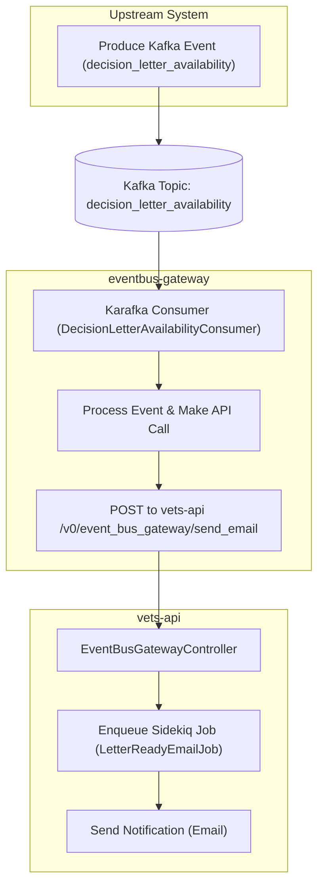

```mermaid
flowchart TD
    subgraph Upstream["Upstream System"]
        A1["Produce Kafka Event (decision_letter_availability)"]
    end

    subgraph EventBusGateway["eventbus-gateway"]
        B1["Karafka Consumer (DecisionLetterAvailabilityConsumer)"]
        B2["Process Event & Make API Call"]
        B3["POST to vets-api /v0/event_bus_gateway/send_email"]
    end

    subgraph VetsAPI["vets-api"]
        C1["EventBusGatewayController"]
        C2["Enqueue Sidekiq Job (LetterReadyEmailJob)"]
        C3["Send Notification (Email)"]
    end

    K[("Kafka Topic: decision_letter_availability")]

    A1 --> K
    K --> B1
    B1 --> B2
    B2 --> B3
    B3 --> C1
    C1 --> C2
    C2 --> C3
```
