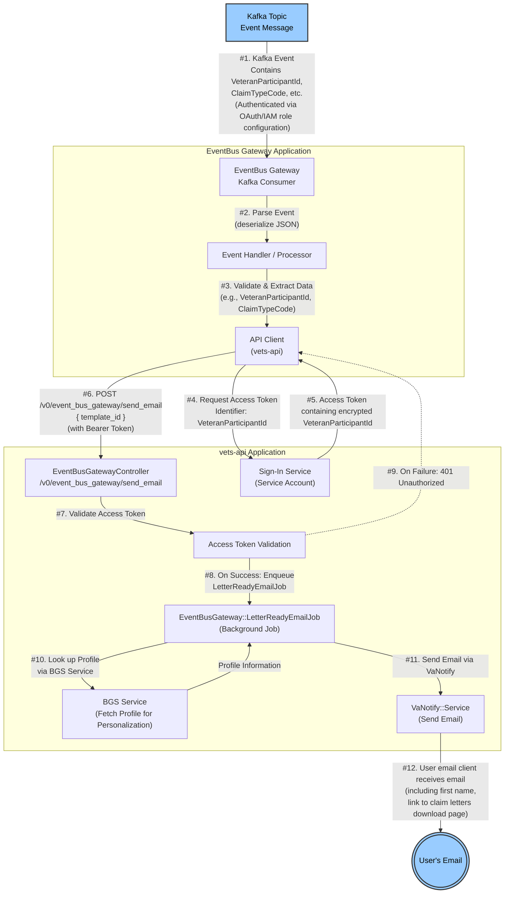

# Data Flow Diagram: EventBus Gateway & `/v0/event_bus_gateway/send_email` (with Authorization)

This diagram illustrates the data flow for events coming into the EventBus Gateway application, including the authorization flow for the `/v0/event_bus_gateway/send_email` endpoint in the `vets-api` application.

## Data & Authorization Flow Details

- **Kafka Event (input):**  
  - Receives a JSON message with keys like `VeteranParticipantId`, `ClaimTypeCode`, etc.

- **EventBus Gateway:**  
  - Securely subscribed to `decision_letter_availability` topic via cross-account IAM roles (LHDI/DSVA) configured to connect to one another.
    Scope of access in Kafka is restricted to the relevant topic.
  - Consumes and parses Kafka events.
  - Extracts key data (`VeteranParticipantId`, `ClaimTypeCode`).
  - Requests an access token using the `VeteranParticipantId` from the Sign-In Service (`vets-api`).
  - Calls the `/v0/event_bus_gateway/send_email` endpoint in `vets-api` with the access token (`participant_id` encrypted within the token),
    sending the `template_id` for use with this notification.
  - All data being handled is read-only.

- **vets-api:**
  - `/v0/event_bus_gateway/send_email` controller validates the access token.
  - If valid, enqueues a Sidekiq job (`LetterReadyEmailJob`).
  - The token is **not** stored anywhere for later use.
  - If token validation fails, responds with 401 Unauthorized.
  - The job fetches additional info (first name) from BGS using `participant_id`.
  - Sends an email through VaNotify, using the resolved name and template provided by the gateway.
  - The email contains a link to the Claim Letters Page, but no automatic login is included in the link
    (the user must authenticate when they access the page, as normal).
  - Data being handled is read-only; Sidekiq writes some portion of it to the queue for use with VA Notify.  No Veteran information is updated
    or changed as part of this process.

---

**Legend:**
- Blue Nodes: External systems
- Grouped Nodes: Application boundaries
- Arrows: Data flow (with key data highlighted)
- Dashed Arrow: Error/Unauthorized path
