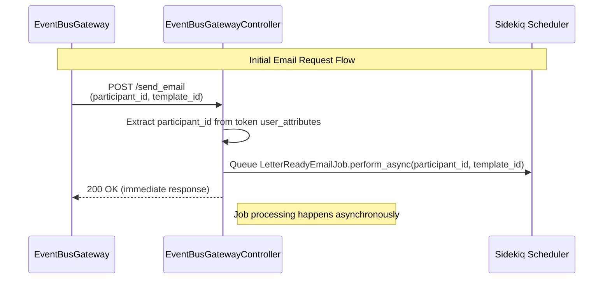
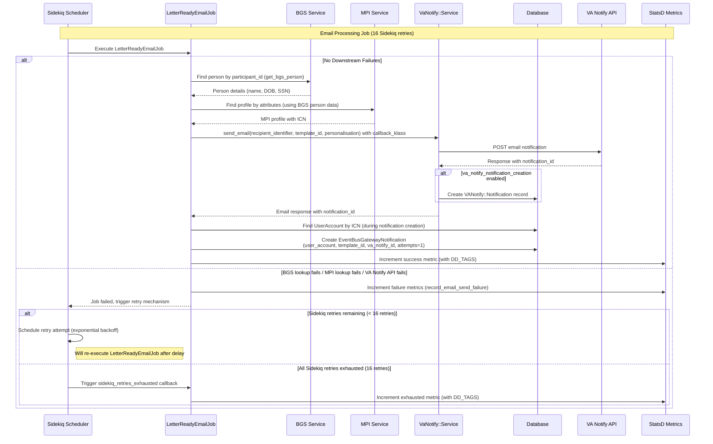
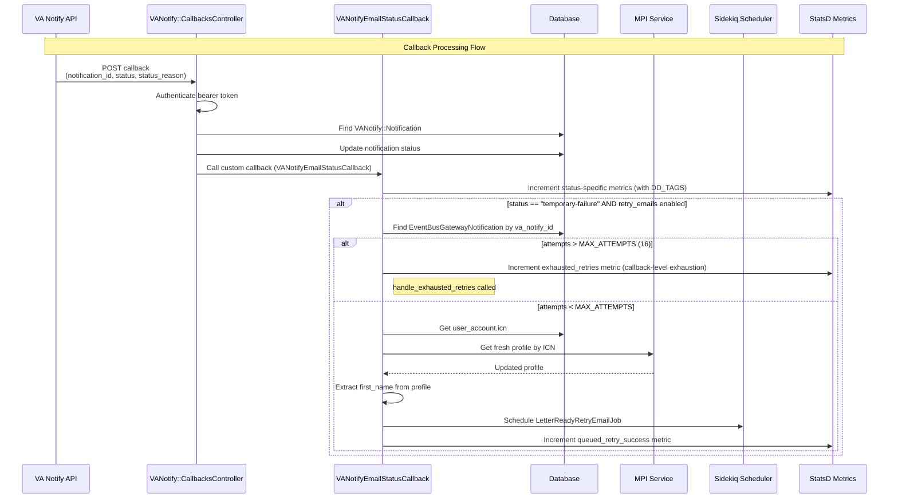
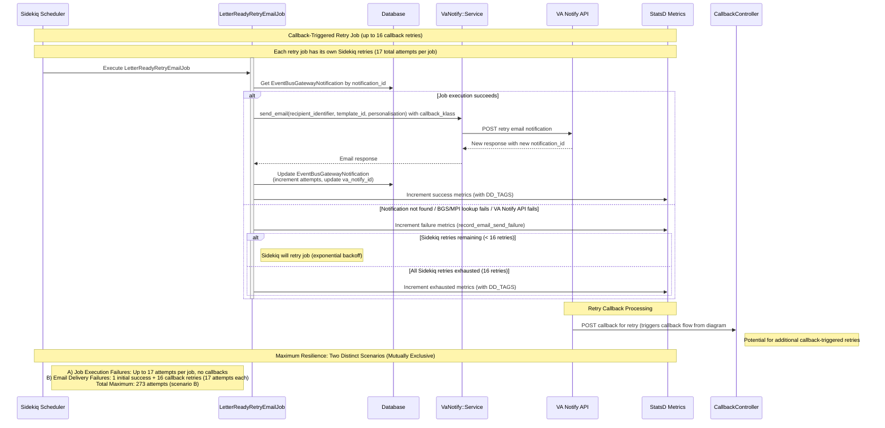

# Decision Letter Email Notifications Sequence Diagram

## Sequence Diagrams

### 1. Initial Request Flow

This diagram shows the initial email request handling and job queuing:

### 2. LetterReadyEmailJob Processing

This diagram shows the detailed job execution, data gathering, email sending, and retry handling:

### 3. Callback Processing and Retry Decision Flow

This diagram shows how callbacks are processed and retry decisions are made:

### 3. LetterReadyRetryEmailJob Processing

This diagram shows the detailed retry job execution with enhanced validation:

## Quick Reference Summary

### Key Flow Steps
1. **Request Reception** → EventBusGatewayController receives POST to `/send_email`
2. **Job Queuing** → LetterReadyEmailJob queued asynchronously
3. **Data Gathering** → Fetch veteran data from BGS and MPI services
4. **Email Sending** → Send via VA Notify API with callback configuration
5. **Status Tracking** → Create EventBusGatewayNotification record with attempts=1
6. **Callback Processing** → VA Notify posts status updates back to callback endpoint
7. **Retry Logic** → Temporary failures trigger intelligent dual-level retry mechanism
8. **Comprehensive Monitoring** → Enhanced metrics and logging with DataDog integration

### Critical Components
- **EventBusGatewayController** - REST endpoint with token validation
- **LetterReadyEmailJob** - Primary email job (16 Sidekiq retries + DD_TAGS)
- **LetterReadyRetryEmailJob** - Enhanced retry job (16 Sidekiq retries + validation)
- **VANotifyEmailStatusCallback** - Status callback handler with retry logic
- **VaNotify::Service** - VA Notify API client with monitoring
- **EventBusGatewayNotification** - Enhanced tracking model with attempts
- **Constants Module** - Centralized configuration and DataDog tagging

### Maximum Resilience Strategy
**Two Distinct Scenarios (Mutually Exclusive)**:
- **Job Execution Failures**: Up to 17 attempts (BGS/MPI/VA Notify API failures)
- **Email Delivery Failures**: Up to 273 attempts (1 successful send + 16 callback retries × 17 job attempts each)
- **Separate Exhaustion Handling**: Independent metrics and logging for each failure type
- **Enhanced Monitoring**: Comprehensive DataDog tagging distinguishing failure scenarios

## Notes

- All communication between the Eventbus Gateway and Kafka is secured through IAM roles connected across AWS accounts, since LHDI is hosted in a separate environment from vets-api and the Eventbus Gateway.
- The `event_bus_gateway_controller` in `vets-api` inherits from `ServiceAccountApplicationController` and leverages that to check the validity of the token before any action is executed.
