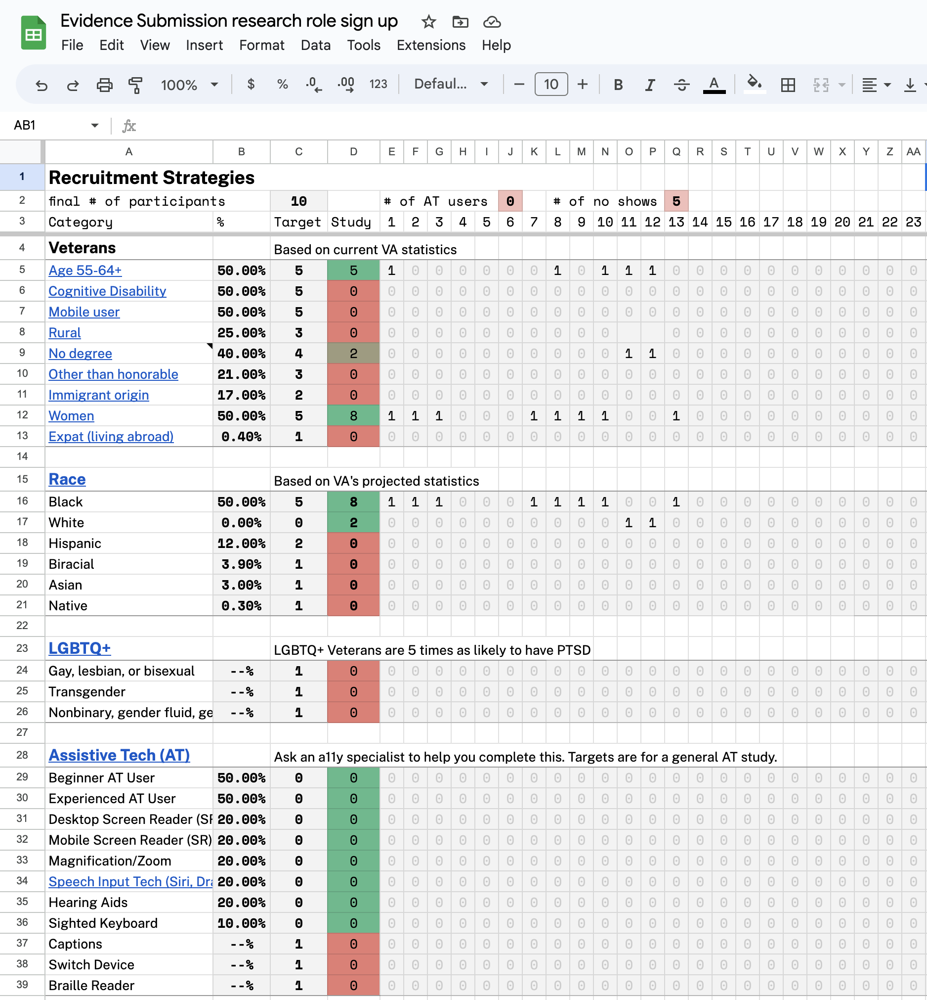

# Evidence Submission Usability Testing Research Findings 

**Office of the CTO - Digital Experience (OCTO-DE), Benefits Claimant Experience Management Tools, Claim Status Tool**

Date: June 2023

Skyler Schain · skyler@coforma.io

[Research readout](https://github.com/department-of-veterans-affairs/va.gov-team/files/11875309/Evidence.Submission.Research.Findings.pdf) (PDF)

## Research Goals
With this research we were hoping to validate the usability of our design concepts for "Track 1" Evidence Submission work. "Track 1" is a set of near-term, concrete user experience and accessibility updates we want to make to CST.

See the [full research plan](https://github.com/department-of-veterans-affairs/va.gov-team/blob/master/products/claim-appeal-status/research/2023-05-Evidence-Submission/research-plan.md) for more details.

## Research Questions

* Does this new design make it easier for Veterans to understand when they have an evidence submission request in CST? Are they better able to understand exactly what that request is and how to act on it?
* Does including the Claim ID in the claim card make it easier for Veterans to distinguish between different claims in CST?
* Do Veterans respond positively to the new layout of the Claim Details page, with separate sections dedicated to Veteran actions and VA actions?
* Do Veterans respond positively to other UX improvements in this version of CST?
  

## Methodology 

Remote usability testing sessions with Veteran participants.

## Key Findings

1. Most participants said they prefer the new CST design to the current design. In particular, they prefer the layout and display of information.

2. Participants were able to navigate the evidence request flow without much difficulty.

3. Participants like seeing the “Recent activity” section because they like clearly seeing that the VA is taking action to gather necessary information for the claim.

4. Participants seemed neutral about Claim IDs. Without a clear reason for needing it, the use value to these (sighted) users is not very clear. 

5. Participants responded well to the CST status page framing of “What you need to do” and “What we’re doing.”

## Secondary Findings

1. More than anything, participants want to know how long it will take for the request to be fulfilled. This is the question behind many of the other questions they have.

2. Participants like the blurb associated with the evidence request that explains what the request is and how to fulfill it.

3. It’s not always clear where files are coming from in the “Document files” section of the Files tab.

4. Participants responded well to the line “This is the longest step in the process.” Transparent, self-aware language like this seems to set better expectations and put Veterans at ease.

5. After seeing the Status page, the Overview page with the claim stepper feels redundant to most participants

## Hypotheses and Conclusions

*1. The new design will help Veterans distinguish between different claims in CST.*

**MAYBE TRUE**. Participants didn't appear to have any problems distinguishing between claims in CST. There wasn't any conclusive evidence,     however, that the new design was responsible. We were expecting participants to cite Claim IDs as helpful for this, but they didn't really. In sum, users had no trouble distinguishing between the two claims in the prototype, but it's not clear which aspects of this design were most effective. Further research would be needed if we wanted to conclusively answer that question.

*2. Veterans will prefer the new Status page to the old Status page overall.*

**TRUE**. When asked, 9/10 participants said that they prefer the new design to the current design. (The last participant didn't give a definitive answer.) Participants cited the visual design and specifcity of detail as the primary reasons why they preferred it. 

*3. The new design will give Veterans a strong understanding of what is happening with their claim at any given time.*

**TRUE**. 9/10 participants expressed a clear understanding of the Status page. In response to the question "How much would you say you understand what's going on with this claim on a scale of 1-5?" 7/10 participants responded with a 5/5. Two other participants did not give a number but said that they clearly understood.

*4. The new design will help Veterans distinguish between requests for them that they need to act on and requests for third parties that they don't need to act on.*

**LIKELY TRUE.** We did not see any participants confuse third party evidence requests for first party requests. The specificity of items in the "Recent activity" section seemed to resolve issues we had seen in [past research](https://github.com/department-of-veterans-affairs/va.gov-team/blob/master/products/claim-appeal-status/research/2023-03-Initial-Decisions-CST/research-findings.md#6-alarming-and-confusing-ui-lead-veterans-to-feel-anxiety-about-their-claim-often-these-items-are-most-relevant-for-other-actors-in-the-claims-process) in which Veterans were confused about whether to take action on evidence requests. To validate this completely, we should test the scenario where there is an open third party request that the Veteran _could_ provide evidence for if they choose.

*5. The new design will make it easy for Veterans to see requests for evidence submission and understand what those requests are.*

**TRUE.** There were no issues with participants noticing the evidence submission request or finding their way to it within the claim details page. Participants especially liked the blurb that describes what exactly the request is and how to fulfill it that appears in the request page (Buddy Statement page in the prototype). 

*6. The new design will make it clear to Veterans whether or not they need to take any action to advance their claim.*

**TRUE.** All participants were able to see that there was a request for them in the second flow, which showed them the CST home page with an evidence request alert for their in-progress claim. Participants stated that they would take action to fulfill the Buddy Statement request.

## Details of Findings 

### 1. Most participants said they prefer the new CST design to the current design. In particular, they prefer the visual design and specificity of detail. 

Labels: BNFT: Disability, Claims Status, PRDT: Claim-status-tool

When prompted to compare the CST status pages side-by-side, there was a clear preference for the new design for most participants. A couple Veterans mentioned that they found the stepper with the claim stages useful, but the majority did not.

> “After seeing the (new) page, it just seems that the information is formatted better, in such a way that I have more faith that things are going on behind the scenes.” - P2

> “The other (new) page LOOKED cleaner, even though this one has fewer words on it.” – P9

> “This is good…Everything I saw is an improvement over where we are.” – P12

### 2. Participants were able to navigate the evidence request flow without much difficulty.

Labels: BNFT: Disability, Claims Status, PRDT: Claim-status-tool, DSP: Notifications

None of the participants had trouble identifying that they had a request, and that they needed to take action to fulfill the request.

Two Veterans said they would use the Files tab to add evidence. This might result in delays in processing, so the next design iteration needs to solve for this so that Veterans don’t make that mistake.

A couple Veterans mentioned they wanted more information about _why_ they were getting this particular request.

> “This feels like they were ‘right on it.’ Because it shows the dates when this was needed and the deadline to submit it.” – P7

> "They're giving me what I need to do, when I need to get it turned in, and a way for me to turn it in, so that the VA can make a decision...Had I not known there was something for me to do, my 179 days would be a lot longer." – P9

### 3. Participants are reassured by the “Recent activity” section because it tells them that the VA is taking action to gather necessary information for the claim.

Labels: BNFT: Disability, Claims Status, PRDT: Claim-status-tool, DSP: Notifications

The level of detail in the prototype’s “Recent activity” section reassured Veterans that action was being taken on their claim, that it was not stuck, and that the VA was gathering necessary materials to process the claim. 

Keeping this level of detail in implementation will be key to this feature’s success.

> “I like that part about it…it shows what they're (VA) doing.” – P2

> "I like (this) version becaues it gives more information and it shows (the Veteran) what you've actually done." – P11

### 4. Participants were neutral about Claim IDs. They didn’t see a clear value in it, but were not bothered by it either.

Labels: BNFT: Disability, Claims Status, PRDT: Claim-status-tool

Participants felt neutral about the Claim ID. It’s only useful to them if they are using it as a reference for the call center. Multiple participants mentioned that the call center uses SSN for finding and referencing their claims.

We do need the claim headers to be unique, but the “Submitted on” date could satisfy that requirement without Claim IDs.

>  “That's a claim number which...if you were to call they don't ever ask you about a claim number.” – P1

>  “When you call the VA, they're not going to ask for that number, they want your social.” – P7

### 5. Participants responded well to the CST status page framing of “What you need to do” and “What we’re doing.”

Labels: BNFT: Disability, Claims Status, PRDT: Claim-status-tool

The shift to an action-oriented approach for the Status tab was well-received. Many participants called out that they like being reassured that there was nothing they had to do to advance the claim. 

Seeing the details of up-to-date VA actions gave them confidence that the claim was being attended to.

>  “5/5, because ‘what you need to do’ and ‘what were doing’ those two things are significant for us.” – P7

>  “You don’t have to do anything right now...that’s good.” – P13

## Recommendations

1. Stay the course of updating the Claims Status Tool based on these findings. 
    * Participants preferred the new design to the current design.  
2. Adopt the action-oriented design principle. Be proactive in reassuring Veterans about what they do and don’t have to do while a claim is in progress.
    * The reassuring messaging of "You don't need to do anything right now" really resonated with participants. Multiple Veterans called that out as useful and anxiety-reducing. 
3. Remove Claim IDs from the design proposal, given that they don’t seem to provide much value. Consider adding them in the future if a use case becomes clear.
    * The research didn't reveal any ways in which Claim IDs would be uniquely valuable parts of the user interface. As a reference, Veteran Social Security Numbers seem to be more common. As a way to distinguish headers for a11y purposes, the "Submitted on: [date]" string will work.
4. Explore ways to ensure Veterans use the request widget to add evidence, rather than the Files tab.
    * A couple participants would have uploaded evidence via the Files tab, and files uploaded in this way are not expedited in the same way evidence request files are. They do not get looked at by the VSR as quickly as they would if they'd been uploaded via the request widget. 
5. Explore ways to make it clearer where Documents Filed items came from, and way to clarify the relationship Documents Filed and Recent Activity.
    * Participants were not able to tell where files in the "Documents filed" section of the Files tab came from, because the UI does not specify. 
6. Beyond Track 1, consider ways to consolidate information even more between the three tabs (Status, Files, and Overview), given that participants found some of the information to be redundant.
    * A number of participants found the Overview tab to be redundant and not providing unique value. There might be a way to further optimize the page and reduce the clicks necessary to get to all relevant information.

## Next Steps

- Review this work with the VA platform team to discuss how best to phase implementation.
- Update design with high-priority iterations (See below: Further design iterations and explorations needed)

## Further design iterations needed

- How do we guide users to use the Evidence Request page instead of the Files tab for adding evidence when it’s requested? Files added via the files tab won’t go to the right place.
- Can Claim ID be reduced visually and remain part of the header for a11y purposes?
- What happens after the Veteran submits the evidence? Is there a confirmation of some sort?
- What does the Status page look like when there is a 3P request out that the Veteran can optionally fulfill?

## Further research needed

- We will need to test the design with AT users once it has been implemented in code.
- Talk to the call center team about whether or not a unique Claim ID would be useful to them as a reference object. If so, consider adding Claim IDs to the UI.

## Appendix

[Research plan](https://github.com/department-of-veterans-affairs/va.gov-team/blob/master/products/claim-appeal-status/research/2023-05-Evidence-Submission/research-plan.md)

[Conversation guide](https://github.com/department-of-veterans-affairs/va.gov-team/blob/master/products/claim-appeal-status/research/2023-05-Evidence-Submission/conversation-guide.md)

## Tools used for Synthesis

[Mural board ](https://app.mural.co/t/coforma8350/m/coforma8350/1686321516166/8a42c94042663df1108c85662a7e32096552b448?sender=uf0ac39cb9487bbab2ebe3184)

## Pages and applications used

[Prototype](https://www.sketch.com/s/98e35645-34eb-40cf-80c1-6c4952943584/prototype/a/252DFC7E-C58A-478F-A521-5C082886DA75)

## Secondary research

[CST Initial Decisions Research](https://github.com/department-of-veterans-affairs/va.gov-team/blob/master/products/claim-appeal-status/research/2023-03-Initial-Decisions-CST/research-findings.md)

## Who we talked to 

**Recruitment criteria**

We talked to **10 participants.**

Audience segment:
* Veterans: 10 

Gender:
* Male: 2 
* Female: 8 

Devices used during study: 
* Desktop: 9 
* Tablet: 1 
* Smart phone: 0 
* Assistive Technology: 0

Age:
* 25-34: 1
* 35-44: 3
* 45-54: 1
* 55-64: 2
* 65+: 3

Education:
* High school degree or equivalent: 1
* Some college (no degree): 1
* Associate's degree, trade certificate or vocational training: 0
* Bachelor's degree: 1
* Master's degree: 7
* Doctorate degree: 0

Race:
* White: 2
* Black: 8
* Hispanic: 0
* Biracial: 0
* Asian: 0
* Native: 0
* 

## Underserved groups we haven’t talked to 

This research does not include the perspectives of the following marginalized Veteran groups:
_List all groups in red from the spreadsheet_
* Cognitive disability
* Expat
* Gay, lesbian, or bisexual
* Transgender
* Nonbinary, gender fluid, gender queer, Two-Spirit (Indigenous only), or another gender beyond man or woman

