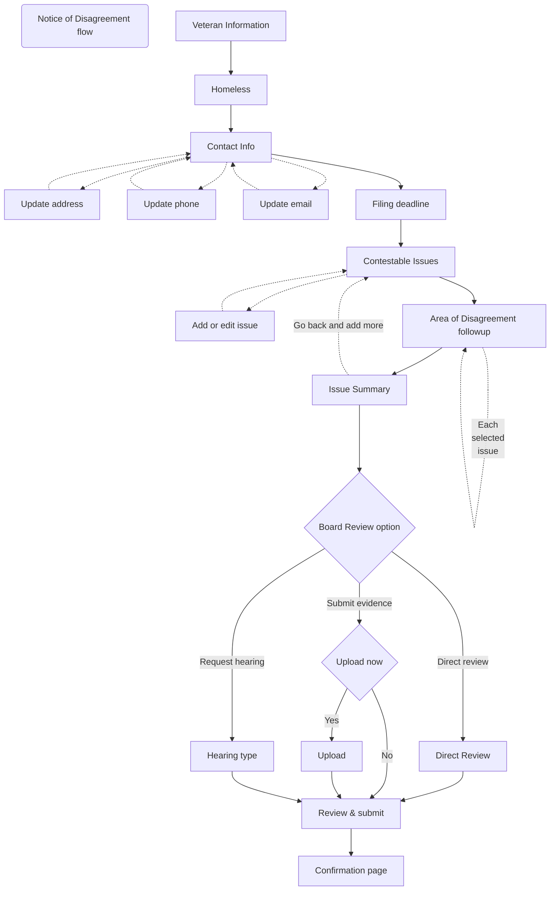

```mermaid
flowchart TB
    Title(Notice of Disagreement flow)

    A[Veteran Information] --> B[Homeless]
    B --> C[Contact Info]

    C -.-> D[Update address] -.-> C
    C -.-> E[Update phone] -.-> C
    C -.-> F[Update email] -.-> C

    C --> G[Filing deadline]
    G --> H[Contestable Issues]

    H -.-> I[Add or edit issue] -.-> H

    H --> J[Area of Disagreement followup]
    J -. Each \n selected \n issue .-> J
    J --> K[Issue Summary] -. Go back and add more .-> H
    K --> L{Board Review option}
    L -- Direct review --> M[Direct Review] --> Q[Review & submit]
    L -- Submit evidence --> N{Upload now}
    N -- No --> Q
    N -- Yes --> O[Upload] --> Q
    L -- Request hearing --> P[Hearing type] --> Q
    Q --> R[Confirmation page]
```
