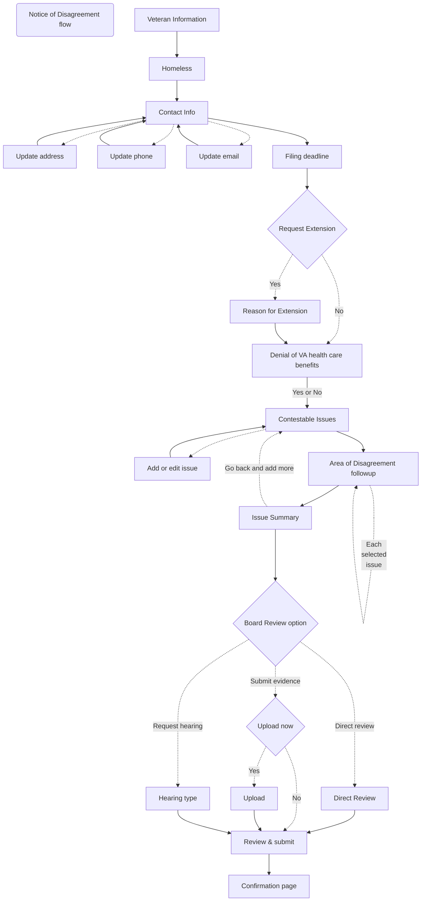

```mermaid
flowchart TB
    Title(Notice of Disagreement flow)

    A[Veteran Information] --> homeless[Homeless]
    homeless --> ContactInfo[Contact Info]

    ContactInfo -.-> UpdateAddress[Update address] --> ContactInfo
    ContactInfo -.-> UpdatePhone[Update phone] --> ContactInfo
    ContactInfo -.-> UpdateEmail[Update email] --> ContactInfo

    ContactInfo --> Deadlines[Filing deadline]
    Deadlines --> RequestExtension{Request Extension}

    RequestExtension -. No .-> DenialVAHC[Denial of VA health care benefits]
    RequestExtension -. Yes .-> ReasonForExtension[Reason for Extension]
    ReasonForExtension --> DenialVAHC
    DenialVAHC -- Yes or No --> ContestableIssues[Contestable Issues]

    ContestableIssues -.-> AddIssue[Add or edit issue] --> ContestableIssues

    ContestableIssues --> AreaOfDisagreement[Area of Disagreement followup]
    AreaOfDisagreement -. Each \n selected \n issue .-> AreaOfDisagreement
    AreaOfDisagreement --> IssueSummary[Issue Summary] -. Go back and add more .-> ContestableIssues
    IssueSummary --> BoardReviewOption{Board Review option}
    BoardReviewOption -. Direct review .-> DirectReview[Direct Review] --> ReviewAndSubmit[Review & submit]
    BoardReviewOption -. Submit evidence .-> UploadNow{Upload now}
    UploadNow -. No .-> ReviewAndSubmit
    UploadNow -. Yes .-> Upload[Upload] --> ReviewAndSubmit
    BoardReviewOption -. Request hearing .-> HearingType[Hearing type] --> ReviewAndSubmit
    ReviewAndSubmit --> Confirmation[Confirmation page]
```
