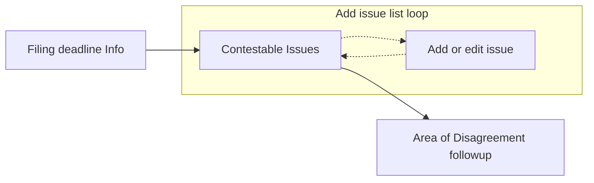
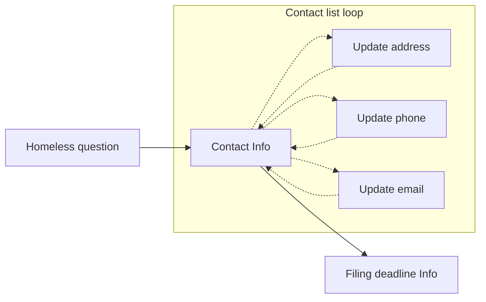
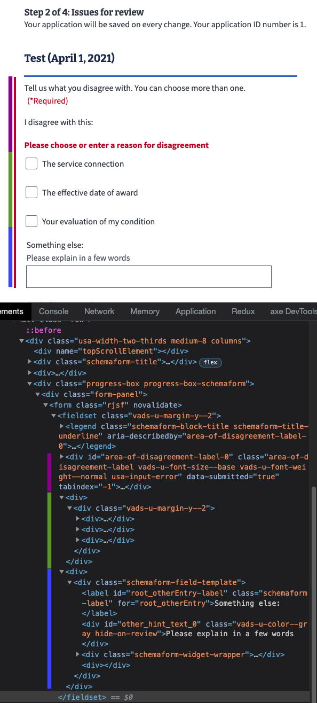

# Notice of Disagreement details

## Frontend Code

Folder: https://github.com/department-of-veterans-affairs/vets-website/tree/master/src/applications/appeals/10182

## Decisions of note

### Prefill

The backend is set up to provide:
- Veteran's mailing address, phone and email; **but** we're not using it on the front end because it's available in Redux profile data, and it needs to be checked dynamically for updates. Prefill only happens upon starting a form.
- Two additional pieces of prefill data are used:
  - Veteran's last 4 of their SSN
  - Veteran's last 4 of their VA File number

Returned within the `nonPrefill` part of the data


```js
{
  "data": {
    "attributes": {
      "veteran": {
        "address": {
          "addressLine1": "",
          "addressLine2": "",
          "addressLine3": "",
          "city": "",
          "stateCode": "",
          "zipCode5": "",
          "countryName": "",
          "internationalPostalCode": ""
        },
        "phone": {
          "areaCode": "",
          "phoneNumber": ""
        },
        "emailAddressText": ""
      }
    }
  },
  "nonPrefill": {
    "veteranSsnLastFour": "1234",
    "veteranVaFileNumberLastFour": "1234"
  }
}
```

### Contestable and legacy issues

Lighthouse provides two separate endpoints for contestable issue (`/notice_of_disagreements/contestable_issues`, but this may go away as Lighthouse is planning on combining HLR & NOD contestable issues) and legacy issues (`/legacy_appeals`). Our backend combines the data from both ([`/v0/notice_of_disagreement/contestable_issues`](https://department-of-veterans-affairs.github.io/va-digital-services-platform-docs/api-reference/#/notice_of_disagreements/getContestableIssues)) to reduce the number of API calls. The result is:

```js
{
  "data": [
    {
      // contestable issue
      "id": null,
      "type": "contestableIssue",
      "attributes": {
        "ratingIssueReferenceId": "142894",
        "ratingIssueProfileDate": "2021-03-12",
        "ratingIssueDiagnosticCode": "5260",
        "ratingIssueSubjectText": "Ankylosis of knee",
        "ratingIssuePercentNumber": "10",
        "description": "Service connection for Ankylosis of knee is granted with an evaluation of 10 percent effective December 2, 2020.",
        "isRating": true,
        "latestIssuesInChain": [{
          "id": null,
          "approxDecisionDate": "2021-03-12"
        }],
        "decisionIssueId": null,
        "ratingDecisionReferenceId": null,
        "approxDecisionDate": "2021-03-12",
        "rampClaimId": null,
        "titleOfActiveReview": null,
        "sourceReviewType": null,
        "timely": true
      }
    },
    // any additional contestable issues
    {
      // Legacy appeals appended to this list
      "id": "35",
      "type": "legacyAppeal",
      "attributes": {
        // 3 legacy appeals shown here, this array will be empty if the
        // Veteran has no legacy appeals
        "issues": [{
          "summary": "Service connection, benign ear neoplasm"
        }, {
          "summary": "New and material evidence to reopen claim for service connection, impairment of knee"
        }, {
          "summary": "Service connection, migraines"
        }],
        // Mock user 233
        "veteranFullName": "Cara Bartlett",
        "decisionDate": "2021-10-17T00:00:00.000Z",
        "latestSocSsocDate": "2021-09-18T00:00:00.000Z"
      }
    }
  ]
}
```

Legacy appeals are all combined into one entry (the last entry) with a different `"type"`, but only the `"summary"` is provided and the wording may or may not match the contestable issue's `ratingIssueSubjectText` or `description`. So we have no sure method to coorelate legacy appeals with eligible issues.

### List loop pattern

Prior to the NOD form, list loops were done in-line (see [Arrays example](https://rjsf-team.github.io/react-jsonschema-form/)). Add an item and it appears below with controls to edit or delete. NOD originally had 3 pages, 1) showed a selectable list of API-loaded eligible issues, 2) asked if the Veteran wanted to add more issue and 3) Array loop pattern page for manually entering issues.

In a design review, we were directed to change this to a list loop pattern where all issues (API-loaded and entered) were shown on one page. And adding a new item or editing an item would take the Veteran to a new page. Luckily, the form system team had just implemented a [custom page method](https://department-of-veterans-affairs.github.io/veteran-facing-services-tools/forms/bypassing-schemaform) which allowed bypassing the form-systems linear flow.



A similar list-loop pattern is also used on the contact info page. In place originally was a link directing the Veteran to their profile page in a new tab, but it was not an ideal method since we shifted the Veteran out of the form flow. So we implemented code from the profile team which opened up an editor within a modal. At the design review, this was considered confusing. The profile team, again luckily, had just implemented code that allowed inline editing of profile data, but we instead followed the review recommendation of creating a new page for each bit of contact info that was to be edited: mailing address, mobile phone and email.



### Filing deadline (previous opt-in page)

The Higher-Level Review (HLR) v2 update made it very similar to the Notice of Disagreement form, except for this page. The Board met with us and changed the language for this page numerous times. For HLR, the opt-in page is optional and includes a checkbox. It is only shown when the contestable issues endpoint includes legacy appeals, or if an issue is manually entered. For NOD, the `socOptIn` value is required by Lighthouse so it's always submitted as `true`; but in the last Board review recommendation for this page, they decided to remove the checkbox and move it earlier in the flow.

## What are some things we'd make better if we had more time?

### Area of disagreement grouped checkboxes

Because the [checkbox group pattern is being used](https://department-of-veterans-affairs.github.io/veteran-facing-services-tools/forms/available-features-and-usage-guidelines#checkbox-group), showing validation errors needs to be set to the outer wrapper. Then connecting the description, checkbox group and extra freeform input requires some custom CSS to show the red border ([workaround code](https://github.com/department-of-veterans-affairs/vets-website/blob/master/src/applications/appeals/10182/utils/ui.js#L31-L41)).

<details><summary>Page showing HTML</summary>


</details>

<p>

**Improvement**: This current implementation isn't ideal, and may be improved by using the [custom page method](https://department-of-veterans-affairs.github.io/veteran-facing-services-tools/forms/bypassing-schemaform) to completely customize this page and use the [`va-checkbox-group` web component](https://design.va.gov/storybook/?path=/docs/components-va-checkbox-group--default).
</p>

### Contact loop testing

The `10182-contact-loop.cypress.spec.js` file tests the loop from the contact info page to each of the subpages:
- First cancelling the change, and return to the contact info page.
- Secondly changing and updating the info and returning to the contact info page

The problem is with the address change intermediate step. If an entered address isn't 100% accurate, it should show a page asking to verify or choose another address. The problem may be with the code in [`ProfileInformationFieldController.jsx`](https://github.com/department-of-veterans-affairs/vets-website/blob/master/src/platform/user/profile/vap-svc/components/ProfileInformationFieldController.jsx) (around line 160).
