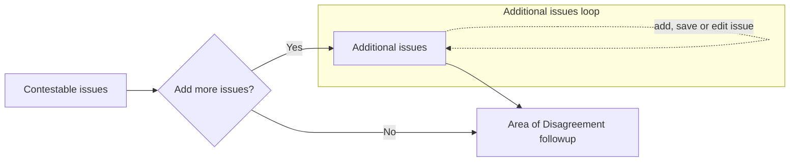
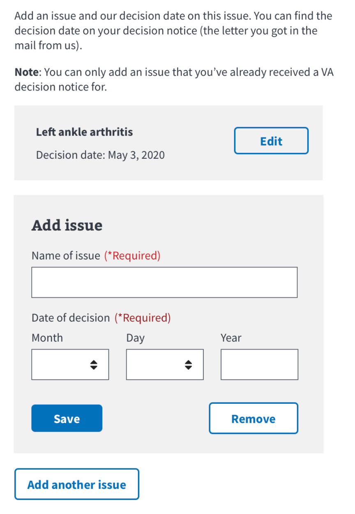
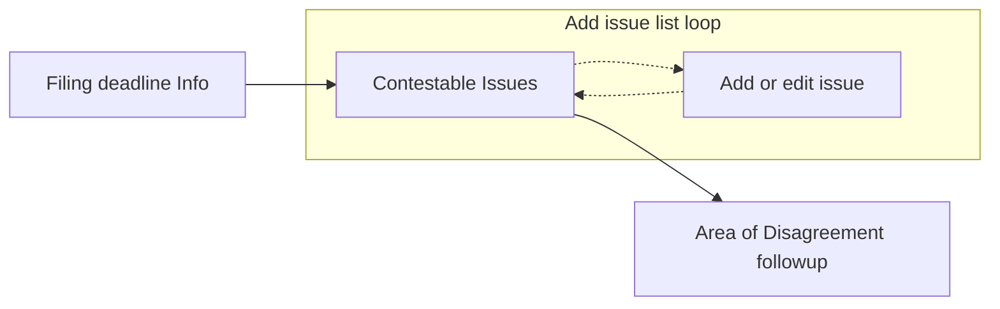
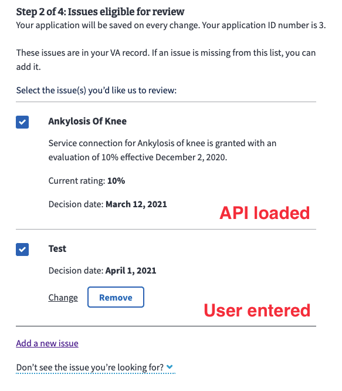
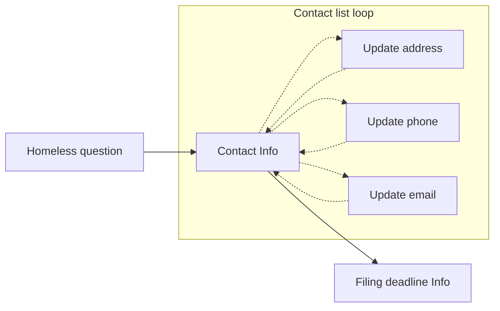

# Notice of Disagreement details

## Frontend Code

Folder: https://github.com/department-of-veterans-affairs/vets-website/tree/main/src/applications/appeals/10182

## Decisions of note

Almost all of these sections match the Higher-Level Review (HLR) tech docs because the two forms have a lot of similarity

### Verify identity

When a Veteran has not verified their account (LOA 1), the prefill (SSN & VA file number) and contestable issues will not load. This leads to a sub-optimal experience and possibly rejected submission. We are now showing an alert with a link pointing to the `/verify` page instead of the start button. Once verified (LOA 3), the Veteran can start the form normally.

### Prefill

The backend is set up to provide:
- Veteran's mailing address, phone and email; **but** we're not using it on the front end because it's available in Redux profile data, and it needs to be checked dynamically for updates. Prefill only happens upon starting a form the first time.
- Two additional pieces of prefill data are used:
  - Veteran's last 4 of their SSN
  - Veteran's last 4 of their VA File number

Returned within the `nonPrefill` part of the data

```js
{
  "data": {
    "attributes": {
      "veteran": {
        // Address, phone & email are not used, because they're added in
        // prefill, but never updated
        "address": {
          "addressLine1": "",
          "addressLine2": "",
          "addressLine3": "",
          "city": "",
          "stateCode": "",
          "zipCode5": "",
          "countryName": "",
          "internationalPostalCode": ""
        },
        "phone": {
          "areaCode": "",
          "phoneNumber": ""
        },
        "emailAddressText": ""
      }
    }
  },
  "nonPrefill": {
    // Data for Veteran info page
    "veteranSsnLastFour": "1234",
    "veteranVaFileNumberLastFour": "1234"
  }
}
```

### Contestable issues

Our backend gets this data from ([`/v0/notice_of_disagreement/contestable_issues`](https://department-of-veterans-affairs.github.io/va-digital-services-platform-docs/api-reference/#/notice_of_disagreements/getContestableIssues)). The result is:

```js
{
  "data": [
    {
      // contestable issue
      "id": null,
      "type": "contestableIssue",
      "attributes": {
        "ratingIssueReferenceId": "142894",
        "ratingIssueProfileDate": "2021-03-12",
        "ratingIssueDiagnosticCode": "5260",
        "ratingIssueSubjectText": "Ankylosis of knee",
        "ratingIssuePercentNumber": "10",
        "description": "Service connection for Ankylosis of knee is granted with an evaluation of 10 percent effective December 2, 2020.",
        "isRating": true,
        "latestIssuesInChain": [{
          "id": null,
          "approxDecisionDate": "2021-03-12"
        }],
        "decisionIssueId": null,
        "ratingDecisionReferenceId": null,
        "approxDecisionDate": "2021-03-12",
        "rampClaimId": null,
        "titleOfActiveReview": null,
        "sourceReviewType": null,
        "timely": true
      }
    }
    // any additional contestable issues
  ]
}
```

The issues provided by Lighthouse need additional processing. In the [`getEligibleContestableIssues` function](https://github.com/department-of-veterans-affairs/vets-website/blob/main/src/applications/appeals/10182/utils/submit.js#L66), contestable issues loaded from the API are filtered out:
- Empty `ratingIssueSubjectText` entries (see [Slack](https://dsva.slack.com/archives/CSKKUL36K/p1623956682119300?thread_ts=1623863323.111700&cid=CSKKUL36K))
- If they contain the word `deferred` in either the `ratingIssueSubjectText` or `description` as these issues are no longer eligible.
- Have a `approxDecisionDate` greater than one year in the past.
- Lighthouse is removing the ["Granted: {your issue} is denied" entries](https://dsva.slack.com/archives/CSKKUL36K/p1623863323111700).

Before being added to the form data, the [`processContestableIssues` function](https://github.com/department-of-veterans-affairs/vets-website/blob/main/src/applications/appeals/10182/utils/helpers.js#L97):
- Filters out issues with no `ratingIssueSubjectText`
- Sorts the list by newest date first, then by title if the dates are equal

These two functions may be more clean/dry if combined in the future.

### Use of `appStateSelector`

In the `config/form.js` file, use of `appStateSelector` is necessary to provide the form data for both the `contestableIssues` and `additionalIssues` because of a bug in the form system that does not provide the correct `formData` value on the review & submit page. Instead of `formData`, the `fieldData` (data only for that page) is provided and breaks validation.

### Filing deadline (previous opt-in page)

The Higher-Level Review (HLR) v2 update made it very similar to the Notice of Disagreement form, except for this page. The Board met with us and changed the language for this page numerous times. For HLR, the opt-in page is optional and includes a checkbox. It is only shown when the contestable issues endpoint includes legacy appeals, or if an issue is manually entered. For NOD, the `socOptIn` value is required by Lighthouse so it's always submitted as `true`; but in the last Board review recommendation for this page, they decided to remove the checkbox and move it earlier in the flow.

### List loop pattern

Prior to the NOD form, list loops were done in-line (see [Arrays example](https://rjsf-team.github.io/react-jsonschema-form/)) and [list loop tech notes](https://github.com/department-of-veterans-affairs/va.gov-team/blob/master/teams/vsa/engineering/forms-system/list_loop.md).

In initial work, there were 3 pages:

1. Contestable issues loaded from the API - this page allowed Veteran to select, via checkbox, issues to include in the submitted HLR
2. Gating page asking a yes/no question to the Veteran about adding more issues.
3. Add issue list loop page with checkboxes for each.



<details><summary>Additional issues list loop appearance</summary>


</details>

<p></p>

In a design review, we were directed to change this to a list loop pattern where all issues (API-loaded and entered) were shown on one page. And adding a new item or editing an item would take the Veteran to a new page. Luckily, the form system team had just implemented a [custom page method](https://department-of-veterans-affairs.github.io/veteran-facing-services-tools/forms/bypassing-schemaform) which allowed bypassing the form-systems linear flow.



<details><summary>New combined issue page appearance</summary>


</details>

<p></p>

See the [list loop tech notes v2](https://github.com/department-of-veterans-affairs/va.gov-team/blob/master/teams/vsa/engineering/forms-system/list_loop_v2.md) for details on how this is set up.

---

A similar list-loop pattern is also used on the contact info page. In place originally was a link directing the Veteran to their profile page in a new tab, but it was not an ideal method since we shifted the Veteran out of the form flow. So we implemented code from the profile team which opened up an editor within a modal. At the design review, this was considered confusing. The profile team, again luckily, had just implemented code that allowed inline editing of profile data, but we instead followed the review recommendation of creating a new page for each bit of contact info that was to be edited: mailing address, mobile phone and email.



See the [list loop tech notes v2](https://github.com/department-of-veterans-affairs/va.gov-team/blob/master/teams/vsa/engineering/forms-system/list_loop_v2.md) for details on how this is set up.

### Representative Name

In the PDF, the Veteran is asked for the name of their representative &ndash; a Veterans Service Organization (VSO) or accredited representative, and it was included in our original work ([NOD representative page design](https://vsateams.invisionapp.com/console/share/8Y10I6K7DU9R/600538565)). But while presenting the flow to the Board, they requested to have this page removed ([Slack](https://dsva.slack.com/archives/CSKKUL36K/p1623876169114300)). Lighthouse's schema still includes this data, but it's not required.

## What are some things we'd make better if we had more time?

### Contact loop testing

The `10182-contact-loop.cypress.spec.js` file tests the loop from the contact info page to each of the subpages:
- First cancelling the change, and return to the contact info page.
- Secondly changing and updating the info and returning to the contact info page

The problem is with the address change intermediate step. If an entered address isn't 100% accurate, it should show a page asking to verify or choose another address. The problem may be with the code in [`ProfileInformationFieldController.jsx`](https://github.com/department-of-veterans-affairs/vets-website/blob/master/src/platform/user/profile/vap-svc/components/ProfileInformationFieldController.jsx) (around line 160).
