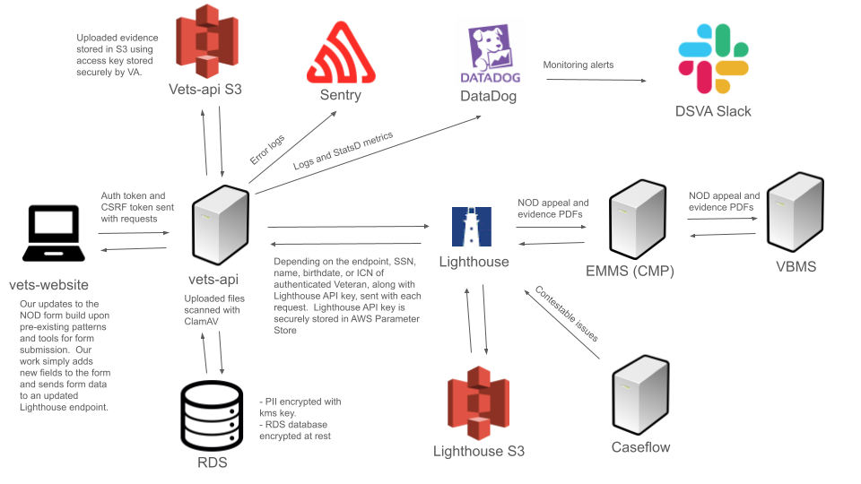
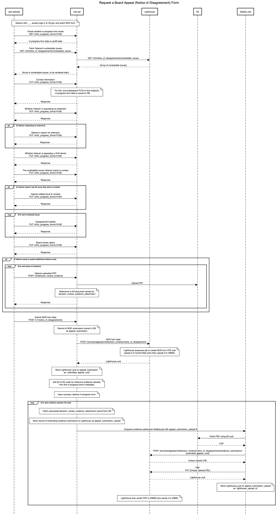

# Engineering

## Monitoring

- [NOD Dashboard in DataDog](https://vagov.ddog-gov.com/dashboard/tvp-imf-tb7/benefits-notice-of-disagreement?refresh_mode=sliding&view=spans&from_ts=1707842761257&to_ts=1708447561257&live=true)
- Monitors
  - [NOD/SC - Evidence Upload to Lighthouse - Permanent Errors](https://vagov.ddog-gov.com/monitors/168064?view=spans) 
  - [NOD and SC Evidence traffic is low](https://vagov.ddog-gov.com/monitors/159450?view=spans)
  - [NOD and SC Evidence traffic anomaly check](https://vagov.ddog-gov.com/monitors/169739?view=spans)
  - [NOD - Overall Claim Submission traffic is low](https://vagov.ddog-gov.com/monitors/168196?view=spans)
  - [NOD - Overall Claim Submission API traffic anomaly check](https://vagov.ddog-gov.com/monitors/172997?view=spans)
  - [NOD - Overall Claim Submission - Errors](https://vagov.ddog-gov.com/monitors/165264?view=spans)
  - [NOD - Get Contestable Issues API traffic anomaly check](https://vagov.ddog-gov.com/monitors/172710?view=spans)
  - [NOD - Get Contestable Issues - Error rate](https://vagov.ddog-gov.com/monitors/202306?view=spans)
  - [NOD - Evidence Uploads to Lighthouse API traffic anomaly check](https://vagov.ddog-gov.com/monitors/173040?view=spans)
  - [NOD - Evidence Upload to S3 API traffic anomaly check](https://vagov.ddog-gov.com/monitors/172998?view=spans)

## Backend

###  Architecture Diagram

Technically vets-api and Lighthouse run on the same server, but we treat each other more like they're separate servers.

[Source PPTX](architecture-diagram.pptx)

### Sequence Diagram

[Source UML](sequence-diagram.uml) - update with  https://sequencediagram.org/

## Front-end

- [Overview](NOD_frontend_overview.md)
- [Details](NOD_frontend_details.md)

## Frontend and Backend Success/Error Response/Messages

- [NOD_frontend_backend_interactions](NOD_frontend_backend_interactions.md)
