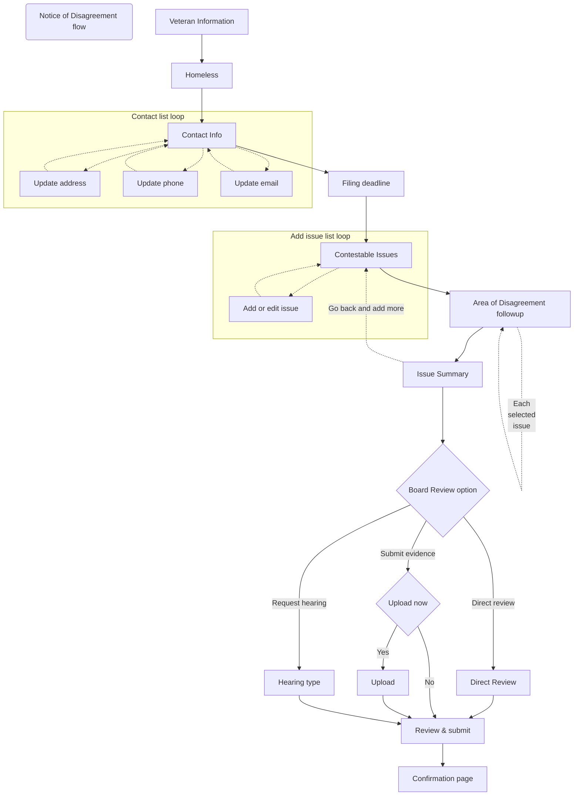

# Engineering

## Backend
###  Architecture Diagram
Technically vets-api and Lighthouse run on the same server, but we treat each other more like they're separate servers

[Architecture Diagram Source](NOD_architecture.drawio) - update with  https://app.diagrams.net/

### Sequence Diagram

[sequence_diagram_source](sequence_diagram_source) - update with  https://sequencediagram.org/

## Front-end

- [Overview](NOD_frontend_overview)
- [Details](NOD_frontend_details)

