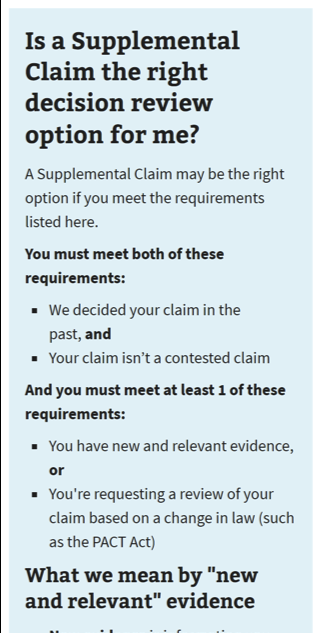
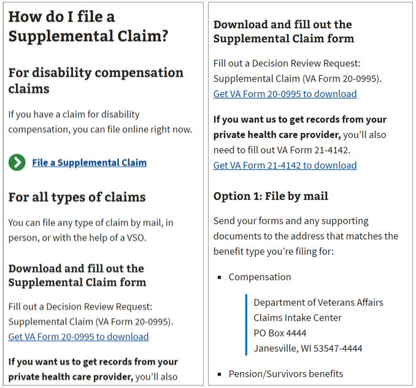
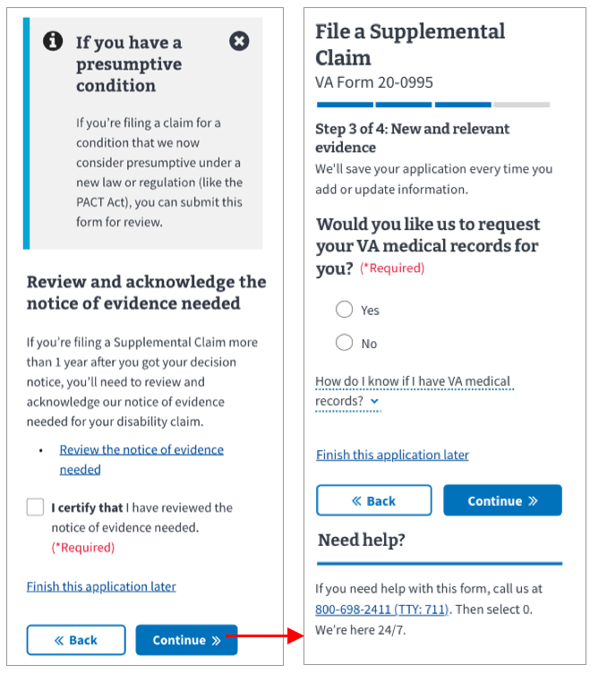
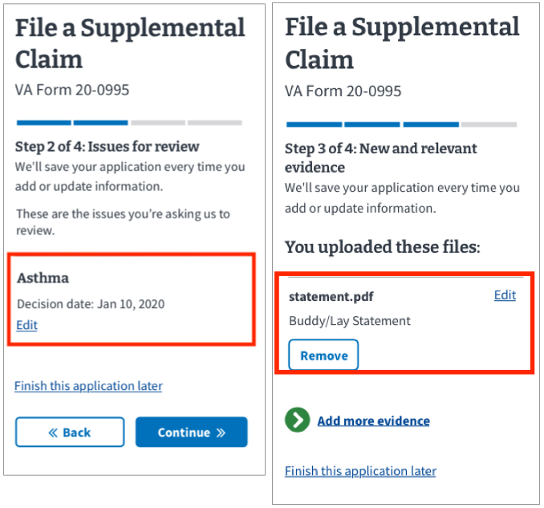
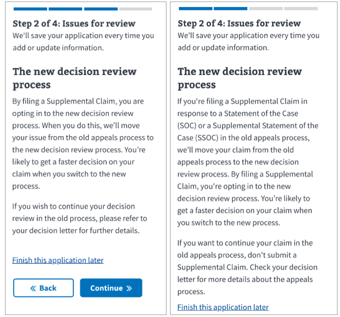
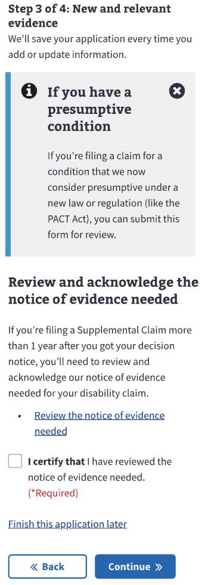
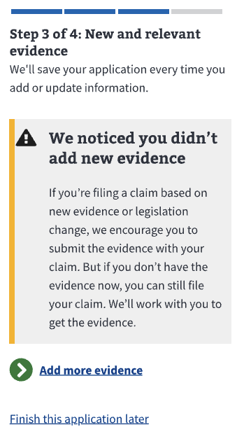
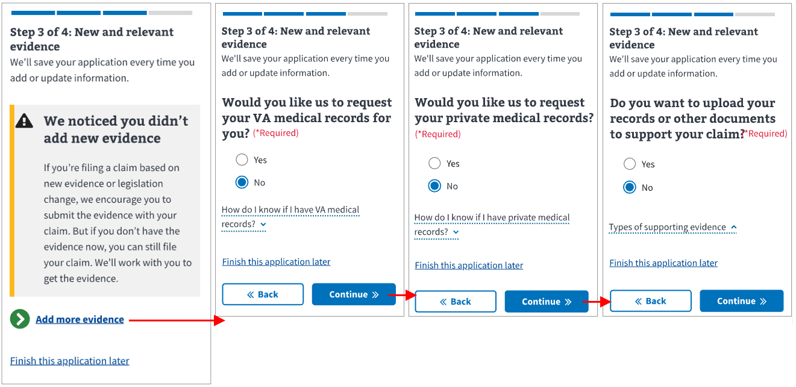
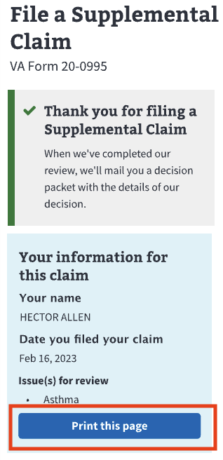

# Supplemental Claims MVP - PACT

**Office of the CTO - Digital Experience (OCTO-DE), Decision Reviews, Benefits Decision Reviews**

Date: 03/2023

Eileen Chi [eileen.chi@coforma.io](eileen.chi@coforma.io)

**Jump to:**

[Hypotheses and conclusions](https://github.com/department-of-veterans-affairs/va.gov-team/blob/master/products/decision-reviews/Supplemental-Claims/Research/1222-PACT-Act/research-findings.md#hypotheses-and-conclusions)

[Key findings](https://github.com/department-of-veterans-affairs/va.gov-team/blob/master/products/decision-reviews/Supplemental-Claims/Research/1222-PACT-Act/research-findings.md#key-findings)

[Recommendations](https://github.com/department-of-veterans-affairs/va.gov-team/blob/master/products/decision-reviews/Supplemental-Claims/Research/1222-PACT-Act/research-findings.md#recommendations)

[Who we talked to](https://github.com/department-of-veterans-affairs/va.gov-team/blob/master/products/decision-reviews/Supplemental-Claims/Research/1222-PACT-Act/research-findings.md#who-we-talked-to)

[Further research needed](https://github.com/department-of-veterans-affairs/va.gov-team/blob/master/products/decision-reviews/Supplemental-Claims/Research/1222-PACT-Act/research-findings.md#further-research-needed)

## Background

Starting in January 2023, Veterans filing claims for presumptive conditions that are PACT Act eligible are allowed to file a Supplemental Claim without including new evidence to prove service connection. To get a disability rating, Veterans must prove that their time in service caused their condition. For claims that fall under the PACT Act, we remove the burden of proof. Veterans with presumptive conditions can file a Supplemental Claim without providing new evidence for service connection.

[Link to product brief](https://github.com/department-of-veterans-affairs/va.gov-team/blob/master/products/decision-reviews/Supplemental-Claims/readme.md)

This is the second study done for Supplemental Claims. The OCTO Objectives and Veteran Journey are not different from the initial study.

[Research findings for the MVP Prototype](https://github.com/department-of-veterans-affairs/va.gov-team/blob/master/products/decision-reviews/Supplemental-Claims/Research/MVP%20Usability%20Research/research-findings.md)

### OCTO Objectives

- [ ]  Increase the usage and throughput of VA services
- [ ]  Decrease the time Veterans spend waiting for an outcome
- [ ]  Increase the quality and reliability of VA services

### Veteran Journey

Since Veterans can file Supplemental Claims benefits with VA between 180 and 90 days before separating from the military, this work impacts the Veteran journey from ***serving***, to ***getting out***, and all the way to ***dying***, as survivors can also file Supplemental Claims on the Veteran’s behalf. This work especially maps to the ***taking care of myself*** part of the Veteran journey, as Supplemental Claims for disability compensation supports:

- Recognizing and addressing mental health needs
- Managing primary care and chronic health issues
- Maintaining my health

## Research Goals

1. Determine if the process of filing a PACT-eligible Supplemental Claim is clear and actionable.

2. Determine if the user can understand what presumptive conditions are, and what happens when they submit a claim without evidence.

3. Validate that users can successfully and confidently submit a claim with or without adding evidence.

## Research Questions

- Do Veterans understand if this is the right form for them?
- Do Veterans understand the requirements for submitting a Supplemental Claim?
- Do Veterans feel confident enough when submitting a form they think is a PACT-eligible claim?

## Methodology

We conducted hour-long remote moderated research sessions via Zoom on February 21 - March 1, 2023. Participants were asked to go through a hypothetical scenario where they were told that they are Hector, a veteran who has a presumptive condition covered by PACT, and could file a Supplemental Claim for their previously denied decision. We also tested an optional task where they could upload new evidence to their claim, after they’ve reached the evidence summary.

We opted to test with a [mobile prototype](https://www.sketch.com/s/d2416db4-9a4f-4919-abe4-20ba4bdcfd89/prototype/a/A4ED99CB-748B-4EED-8F83-5D6733BA9F42) to focus on ability to complete the form in a restricted screen space and to gauge the form length. Further usability on desktop screens is recommended.

## Hypotheses and Conclusions

- We believe that all Veterans will be able to confidently complete a Supplemental Claim. **Maybe True.**

9 out of 10 rated the form experience 8 and above, but 6 out of 10 rated their confidence in  their submission 8 and above. The lower ratings come from the lack of their lack of confidence in the review and not being able to explicitly say that they qualify under PACT. Most of the participants thought the form was straightforward, and almost all (with exception of Veterans who normally file through a third-party) said they would use the form once it goes online. Several participants with cognitive disabilities mentioned that although the form seems simple, they'll take a few sessions to go through the information, or apply with help from a family member.

- We believe Veterans will understand the decisions they need to make with the content presented to them. **Likely True.**

Participants understood the content presented to them in the introduction page, especially in the introduction box that highlighted the requirements for submitting a Supplemental Claim. They also understood what the PACT Act and presumptive conditions are. A few participants noted that the content was long, and would require multiple sessions to complete the form. All participants understood what each section of the evidence page allows them to do, but a few struggled with going back to add evidence because they didn’t remember the sequence of evidence screens.

- We believe Veterans are more likely to achieve a favorable outcome by submitting a Supplemental Claim via this digital experience. **Maybe True.**

Before applying, all of the participants understood the requirements of a Supplemental Claim, and they were guided through the experience on how to submit the various types of evidence through the online experience. We believe that there will be an increase of successfully submitted Supplemental Claims online, but cannot predict a favorable outcome. Although our content gives examples of various evidence types, it can not predict or suggest the exact evidence needed for a successful outcome since it is on a case-by-case basis.

## Key Findings

1. Most participants had a clear understanding of the requirements for filing Supplemental Claims and what presumptive conditions are.
2. A few participants were not able to locate the action link to file a Supplemental Claim on the unauthorized site-wide introduction page.
3. Most participants tried to add evidence to their Supplemental Claims, despite understanding that they don't need evidence to prove service connection for presumptive conditions.
4. Most participants thought the 'Edit' link on the issue summary page and evidence summary page would let them perform an action different from what they actually do.
5. Half of the participants were confused by the Appeals Modernization Act because they didn't know about the old appeals process, but still continued with the form.
6. Participants understood what the notice of evidence needed is, and more than half clicked the link to view the required external page before certifying.
7. A few participants experienced confusion when they reached the warning alert on the evidence summary page.
8. Half of the participants struggled with going back and uploading evidence from the evidence summary page.
9. Most of the participants misunderstood the action for the 'print this page' button.

## Details of Findings

### Finding 1

Labels: BNFT: Disability, INTIVE: PACT Act, DSC: Featured content

Most participants had a clear understanding of the requirements for filing Supplemental Claims and what presumptive conditions are. They found the information they needed in the blue introduction box, and clearly located the sections that talked about presumptive conditions and PACT.

One participant thought they could use a Supplemental Claim for a worsening condition, and only realized that’s not true when they saw it was for a claim they disagree with.

> "Ahh that first one. You have new or relevant evidence. A lot of people don't know it. A lot of people don't know you can get more evidence and apply it. When I first started I thought the only way to do it was the HLR then go to the board... well, file a Supplemental. You can't ADD new evidence if it goes to HLR.”
> 

> "In recent years, this presumptive thing ... is new to me. I'm glad they explain that.”
> 

> "Oh yea. I like the way you're putting that in there [info alert for presumptive] just to remind them.”
> 

> “It's clear what a Supplemental Claim is, it can get confusing between this and a higher level review… New and relevant evidence, the information here is clear… It definitely makes the Supplemental Claim easier to understand.”

>"If you do have a presumptive condition, you don't need prove that your service caused the condition. That was a big confusion among veterans."

### Finding 2

Labels: BNFT: Disability, DSC: Action Link, PRDT: Content

A few participants were not able to locate the action link to file a Supplemental Claim on the unauthorized site-wide introduction page.

For participants who missed the link, they saw they could download and file a Supplemental Claim by mail, but could not locate where they could file a Supplemental Claim *online*. They also didn’t notice the difference between filing for a _disability claim_ vs _all types of claims_.

> "I would've made the file online and put it below file a supplemental claim cuz I look right over it. I didn't see it. It is hidden.”
> 

> “I see file by mail but not too many people do stuff by mail anymore. File in person, you can go to he VA clinic, if you live near one. but then you’d have to take time off work. I whizzed right past the ‘file online’ button.”
> 

### Finding 3

Labels: BNFT: Disability, INTIVE: PACT Act

Most participants tried to add evidence to their Supplemental Claims, despite understanding that they don't need evidence to prove service connection for presumptive conditions.

Since the evidence flow was presented to them, participants were inclined to add evidence, even when they understood they didn’t need any to prove service connection. When asked why, participants mentioned that it’s better to include copies of medical records, even if the VA has them from the original claim. Some mentioned annotating and uploading their own records to ensure it’s being read.

> “Well you don't NEED evidence BUT if I've been going to the VA for asthma tests I'll be like yea they got additional evidence, so yeaaa get the additional evidence. BUT it does say you don't NEED evidence right? So it's like you have an option. I'm going to give you ALL you need before you turn me down again.”
> 

> “I would submit it just to make sure there's copies in there.”

> “If I were applying for PACT I would upload my private medical records. A lot of veterans don't trust the VA. I would upload only anything that is new.”

### Finding 4

Labels: BNFT: Disability, DSC: Form controls

Most participants thought the 'Edit' link on the issue summary page and evidence summary page would let them perform an action different from what they actually do.

Due to proximity, participants thought the ‘Edit’ links were to meant to edit the information that it’s closest to. For the issue summary, it was the decision date. For the evidence summary, it’s the name of the document. In actuality, the edit links would navigate them back to the previous screens where they could select issues or upload evidence.

> “If you don't agree with the decision date, you can edit here.”
> 

> “If you edit the claim condition you can probably go in and add more information, if it's being filed under the PACT Act, or a new condition. You can put in what it falls under.”
> 

> “The edit button - maybe if you want to change the name of the file. If you have more buddy statements or anything else, you can add that.”
> 

### Finding 5

Labels: BNFT: Disability, DSP: Contextual help

Half of the participants were confused by the Appeals Modernization Act because they didn't know about the old appeals process, but still continued with the form.

This screen is shown conditionally for issues we know fall under the old appeals process, and for issues that we don’t know fall under the old appeals process. We tested two sets of copy for this page, one that was simplified for plain language but didn’t pass legal requirements, and one that fulfills legal requirements. Both triggered the same level of concern over what the old appeals process was, but the content with the extra legal language took participants twice as long to read, and for some to re-read.

For participants who knew about the old appeals process, they were drawn to the fact that switching over may mean a faster decision. For participants unfamiliar to the old appeals process, they were likely to finish the application later after checking their decision letter or asking a third party for more information.

> “I guess that's the only thing that I'd want is more clarification on the old process and what the new process is and what might be advantageous about that.”

> “I would still hit continue but  would still like to see what my options were for the older process.”

> "Just personally I'd probably ask questions outside of this process. If it were me I'd probably click the [finish this later] link and stop the process to learn about it first.”

> “In the past when we appeal something, they told us it takes 3-5 yrs. So with this saying it will be switch to a new process... OMG, it's a big help. We are happy you guys changed the verbiage”

### Finding 6

Labels: BNFT: Disability, DSC: Link

Participants understood what the notice of evidence needed is, and more than half clicked the link to view the required external page before certifying.

> “It's good there's a link here for notice of evidence needed.”
> 

> “I am saying I have looked at this and I have verified that it's in the 1 year period.”

> “This is asking me about evidence. Oh yeaaaa. They say you gotta file a supplemental you should do it in a certain timeframe, but alot of people don't."

### Finding 7

Labels: BNFT: Disability, DSC: Alert boxes

A few participants experienced confusion when they reached the warning alert on the evidence summary page.

Because of the ambiguous language in the warning alert, a few participants felt that they needed to attach evidence to the claim. They experienced confusion and questioned what type of evidence is needed to support their claim, especially since the introduction told them it wasn’t needed.

> “Should I provide anything additional that really shows I was there? But my DD214 would show that I'm there, so I would think everything's good.”
> 

> “Now, I'm puzzled on what evidence I have to submit because before it says I didn't need to submit evidence. That's what the PACT Act said.”
> 

### Finding 8

Labels: BNFT: Disability, DSC: Action Link, DSC: Progress bars, DSP: Experimental

Half of the participants struggled with going back and uploading evidence from the evidence summary page.

We prompted participants to upload evidence as an optional task for 8 of the participants, and several participants felt lost when they were brought back to the VA medical records screen. Although they had just gone through the order of evidence (VA medical, private medical, upload documents), a few struggled getting back to the ‘upload documents’ page (which is third in the flow). They had the expectation that since they wanted to upload evidence, the add evidence button would lead them straight to the upload screen, and didn't expect to have to click through. The progress bar not changing for the section also makes it unclear that they moved backwards in the form.

> “Well I know what I was looking for wasn't forward, so I was jumping back.”
> 

> “I would say some people would think that a buddy statement is consider a medical record sometimes, I don't remember if I submitted it under this. or if there was a separate screen.”

> "_Do you want to upload your records?_ Yeah. Maybe someone will be patient enough to click to it... that was like two clicks before I got to here. I was expecting to see another option other than... but... you can always... put something in there... maybe a direct link to this? so they don't have to click through two things.""

### Finding 9

Labels: BNFT: Disability, DSC: Buttons

Most of the participants misunderstood the action for the 'print this page' button.

Most participants expected a way to download a copy of their completed form when the form was submitted, and applied that expectation to the button. In actuality, the button only prints the confirmation page.

> "Oh yea, print page. I expect this to print my claim. I expect it to print my supplemental claim. Now, being... a little difficult... I would say I want a copy of the original too. So I want to print the original plus the Supplemental that way I can look at it and compare that I have everything there. You gotta make sure EVERYTHING is there.”
> 

> “I would expect that this would print the form.”
> 

### Additional Insights

1. Most participants desired a separate notification for submission of the Intent to File and Supplemental Claims form. They expect notifications to be in their email and on mobile

> “Some places have text messages now in addition to email. i hope that gets implemented.”
> 

> “It would be great to get EMAIL or SMS updates on the claim status versus relying on login into [VA.gov](http://va.gov/) daily.”
> 
2. Participants are likely (more than half) to skip the second form introduction page, if they enter from the site wide introduction page.
3. Several participants referenced the ease of navigating a tax form when describing their experience with form navigation.

> “It's kind of like how I work. Even when filing taxes, I jump back and forth.”
> 

> “Like Turbo Tax, if you click on a link it'll open up a box, so you can read the information, but it doesn't take you out of the flow.”
> 
4. Participants identified themselves as exceptionally adept with technology, and although they found the PDF uploads a familiar process, they are concerned for other Veterans they interact with who may not be as tech savvy.

> “I work with elderly. When they try to upload docs, they never know where they saved things.”
> 

> “90% of VET will be using their phone, because their grandkids buy it for them. They don't know how to navigate tech much. Unless VETs have an app that converts the image they take with their phone camera to PDF it wouldn't help. if you can allow multiple formats, it will be a big help.”

> “I'm 50 yrs and consider myself tech savvy, I would have to go to app store and use google drive app and it would involve a lot of stuff”

> "I don't think this would be helpful to VETs between ages of 40-70, they're not going to understand: file upload limitation, resolution, pdf formats etc"
> 
5. Several participants mentioned they would ‘finish this application later’ when they need to take a break, do more research, or ask for clarification.

> "If I got frustrated, I'd click finish this application later. I'll be like, I MUST have missed something.”
> 

> "Just personally I'd probably ask questions outside of this process. If it were me I'd probably click the link and stop the process to learn about it first.”
> 

## Recommendations

1. Increase visibility of start claim CTA on the site wide introduction (and possibly change language to fit Veteran’s mental models)
2. Add clarifying language for worsening conditions to decrease the chances of Veterans confusing Supplemental Claim form with a 526 Claims for Increase
3. Remove redundant edit link from evidence summary page, and associate the edit link to the header, so it’s associated to the right task
4. Either meet veteran expectations of the ‘print this page’ button on the confirmation page, or clarify the language
5. Provide more explanation about the old appeals process on the new decision reviews process page
6. Provide more clarity for those applying for presumptive conditions on the evidence summary language
7. Explore into other possible wayfinding solutions for the form system, and non-linear form experiences. The progress bar does not help Veterans track where they are in the process when navigating back and forth through the form. Possibly something simiilar to the [task lisk](https://design-system.service.gov.uk/patterns/task-list-pages/) in the uk.gov system.
8. Simplify the document upload functionality, which affects all forms with uploads

## Next Steps

1. Work with product and engineering to implement quick fix recommendations before launch
2. Work with product and engineering to add more complex recommendations to post-launch roadmap
3. Share results with other teams (legal and content)
4. Conduct further research to address gaps from this study

## Further research needed

- Future usability with assistive technology, especially magnification/zoom, desktop and mobile screen readers, as well as Veterans who experience arthritis or other dexterity issues. We'd like to understand if scrolling on desktop and mobile devices presents any difficulty.
- Further research needed with veterans who aren’t familiar with the decision review process, and veterans who are not as comfortable with technology.
- Possible research needed on the document upload functionality when form is in staging or production.
  - Multiple veterans mentioned that they would upload their own documents to the claim. They also voiced concern over the PDF limitations and specific upload process being too difficult for less tech saavy and older veterans.

## Appendix

[Research plan](https://github.com/department-of-veterans-affairs/va.gov-team/blob/f7f135c365c0e2f316b9731e0b1ff8c0b0ebfa26/products/decision-reviews/Supplemental-Claims/Research/1222-PACT-Act/research-plan.md)

[Conversation guide](https://github.com/department-of-veterans-affairs/va.gov-team/blob/f7f135c365c0e2f316b9731e0b1ff8c0b0ebfa26/products/decision-reviews/Supplemental-Claims/Research/1222-PACT-Act/conversation-guide.md)

## Tools used for Synthesis

[Mural](https://app.mural.co/t/coforma8350/m/coforma8350/1676302103233/c0fe1e04853c9a80ea98dc63c9e6397d071c7617?sender=udbf574074425980f04c55360) (restricted, please request access)

## Pages and applications used

[Prototype used in testing](https://www.sketch.com/s/d2416db4-9a4f-4919-abe4-20ba4bdcfd89/prototype/a/A4ED99CB-748B-4EED-8F83-5D6733BA9F42)

## Other supporting documents created

[Sketch file](https://www.sketch.com/s/d2416db4-9a4f-4919-abe4-20ba4bdcfd89/p/9B9A6622-6A03-4151-99B5-AD62020D958B/canvas#About)

## Secondary research
- [Initial Supplemental Claims MVP Prototype Research](https://github.com/department-of-veterans-affairs/va.gov-team/blob/master/products/decision-reviews/Supplemental-Claims/Research/MVP%20Usability%20Research/research-findings.md)
- [Supplemental Claims PACT Desk Research](https://github.com/department-of-veterans-affairs/va.gov-team/blob/master/products/decision-reviews/Supplemental-Claims/Research/1222-PACT-Act/desk-research-pact-Act.md)

## Who we talked to

Intended audience for this research: Veterans. Other claimant types can file a Supplemental Claim, but these use cases have been de-scoped for MVP.

Recruitment strategy: We will test with Veterans only for as that is the scope of our MVP, and specifically focusing on Veterans who have claimed disability in the past. We are testing a prototype, which won't allows testing for assistive technology, but will plan to do that when we have an instance in staging.

We recruited for more older veterans in this study, to understand how Veterans who might be eligible via the PACT act would navigate this experience.

**Recruitment criteria**

We talked to **10 participants.**

Audience segment:

- Veterans: 10
- Caregivers: 0
- Family members of a Veteran: 0

Gender:

- Male: 6
- Female: 4

LGBTQ+:

- Transgender: 0
- Nonbinary, gender fluid, gender queer, Two-Spirit (Indigenous only), or another gender beyond man or woman: 0
- Gay, lesbian, or bisexual: 0

*Devices used during study:* We tested a mobile prototype, so some participants were on desktop, but navigating in a mobile environment.  

- Desktop: 5
- Tablet: 0
- Smart phone: 5
- Assistive Technology: 0

Age:

- 25-34: 1
- 35-44: 1
- 45-54: 3
- 55-64: 5
- 65+: 0
- Unknown: x

Education:

- High school degree or equivalent: 4
- Some college (no degree): 2
- Associate's degree, trade certificate or vocational training: 2
- Bachelor's degree: 2
- Master's degree: 0
- Doctorate degree: 0
- Unknown: 0

Geographic location:

- Urban: 7
- Rural: 3
- Unknown: 0

Race:

- White: 4
- Black: 5
- Hispanic: 1
- Biracial: 4
- Asian: 2
- Native: 3

Disability and Assistive Technology (AT):

- Cognitive: 4

### Underserved groups we haven’t talked to

This research does not include the perspectives of the following marginalized Veteran groups:

- Immigrant origin
- Other than honorable
- Gay, lesbian, or bisexual
- Transgender
- Nonbinary, gender fluid

[VA recruitment tracker for equality](VA-recruitment-tracker-for-equality-2023-01-Supplemental-Claims-PACT.pdf)
