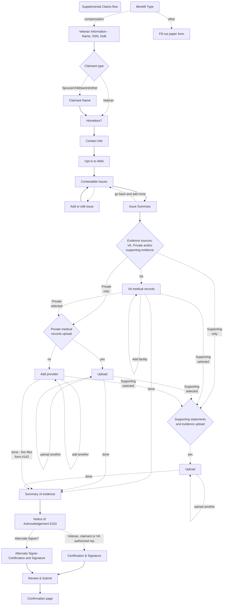

Supplemental Claims v1 flow (limited to compensation-only benefit type)

```mermaid
flowchart TB
    Title(Supplemental Claims flow)

    BenefitType[Benefit Type] -. compensation .-> VetInfo
    BenefitType -. other .-> PDF[Fill out paper form]

    VetInfo[Veteran Information - Name, SSN, DoB] --> ClaimantType{Claimant type}

    ClaimantType -. Spouse/child/parent/other .-> ClaimantName[Claimant Name]
    ClaimantType -. Veteran .-> Homeless[Homeless?]

    ClaimantName --> Homeless
    Homeless --> ContactInfo[Contact Info]

    ContactInfo --> OptIn[Opt in to AMA]
    OptIn --> ContestableIssues[Contestable Issues]

    ContestableIssues .-> AddOrEdit[Add or edit issue] --> ContestableIssues
    IssueSummary -. go back and add more .-> ContestableIssues

    ContestableIssues --> IssueSummary[Issue Summary]

    IssueSummary --> EvidenceTypes{Evidence sources:<br>VA, Private and/or<br>supporting evidence}

    %% =============================
    %% Supporting evidence (from 526)
    %% =============================

    EvidenceTypes -. VA .-> VAMR[VA medical records]
    EvidenceTypes -. Private<br>only .-> PrivateMrUploadQuestion{Private medical<br>records upload}
    EvidenceTypes -. Supporting<br>only .-> StatementsUploadQuestion{Supporting statements<br>and evidence upload}

    EvidenceSummary[Summary of evidence]
    VAMR -. done .-> EvidenceSummary
    PrivateMrUpload -. done .-> EvidenceSummary
    PrivateProvider -. done - this files<br>form 4142 .-> EvidenceSummary
    StatementsUpload -. done .-> EvidenceSummary

    VAMR -. Supporting<br>selected .-> StatementsUploadQuestion
    VAMR -. Private<br>selected .-> PrivateMrUploadQuestion
    VAMR -. Add facility .-> VAMR

    PrivateMrUploadQuestion -. yes .-> PrivateMrUpload[Upload]
    PrivateMrUpload -. upload another .-> PrivateMrUpload
    PrivateMrUploadQuestion -. no .-> PrivateProvider[Add provider]
    PrivateProvider -. add another .-> PrivateProvider

    StatementsUploadQuestion -. yes .-> StatementsUpload[Upload]
    StatementsUpload -. upload another .-> StatementsUpload

    PrivateMrUpload -. Supporting<br>selected .-> StatementsUploadQuestion
    PrivateProvider -. Supporting<br>selected .-> StatementsUploadQuestion
    %% =============================

    EvidenceSummary --> Acknowledgment[Notice of Acknowledgement 5103]
    Acknowledgment -. Veteran, claimant or VA authorized rep .-> Certification[Certification & Signature]
    Certification --> ReviewSubmit[Review & Submit]

    Acknowledgment -. Alternate Signer? .-> AltCertification[Alternate Signer Certification and Signature]
    AltCertification --> ReviewSubmit

    ReviewSubmit --> Confirmation[Confirmation page]
```
