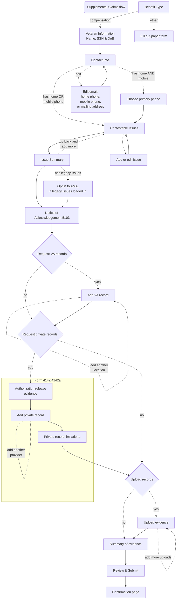

# Supplemental Claims

V1 flow limited to compensation-only benefit type

## Note:
- Summary of Evidence page:
  - Editing VA records will return you to the individual record; continue through all pages to return to the summary
  - Editing private records will return you to the individual record; continue through all pages to return to the summary
  - Private authorization page is not included
  - Editing uploads will return you to the upload page
  - This behavior remains the same when editing the summary from the review & submit page
- Contact info (email, home phone, mobile phone and mailing address)
  - Editing from the contact info page will take you to a new edit page; updating or canceling will return you to the contact info page
  - Editing from the review & submit page will take you to a new edit page; updating or canceling will return you to the review & submit page
