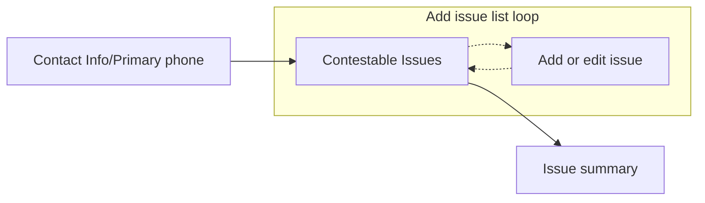
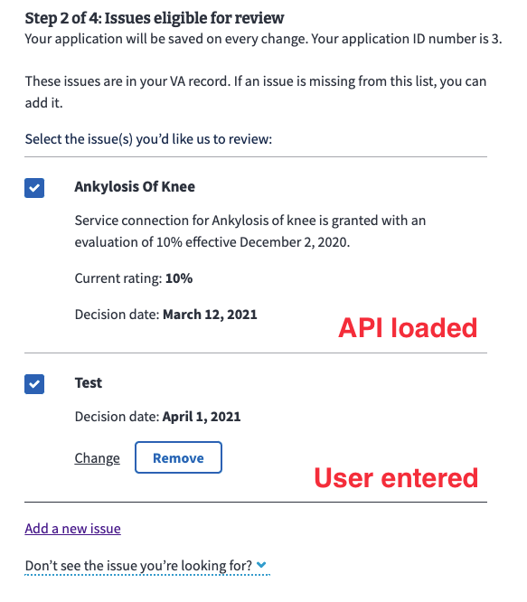
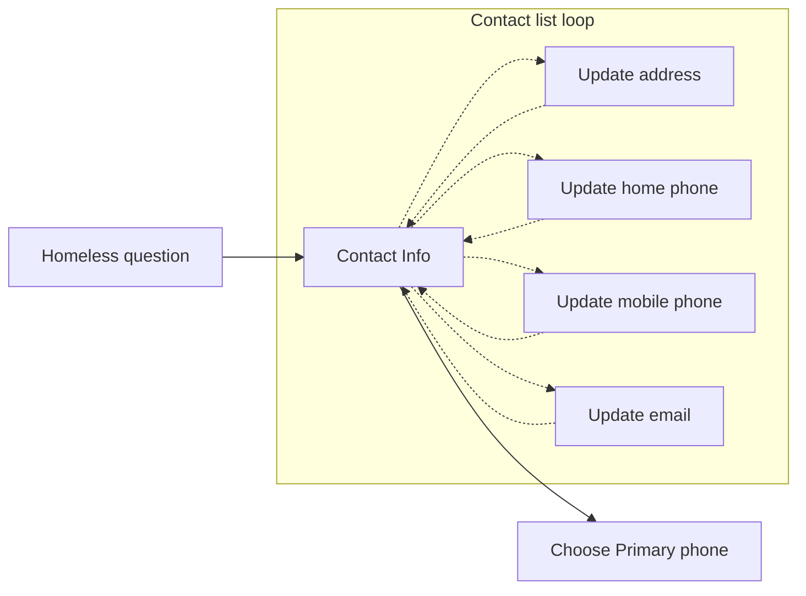
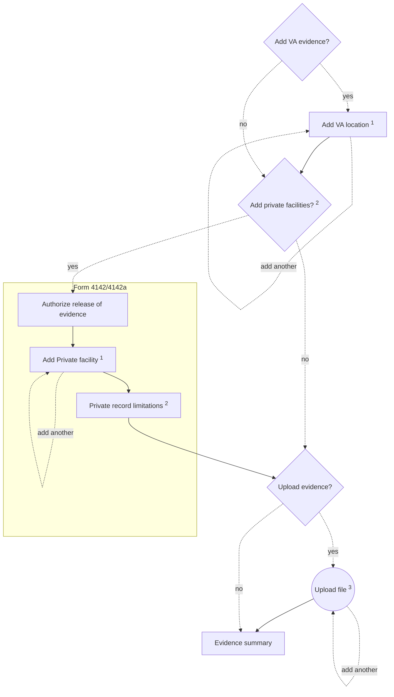
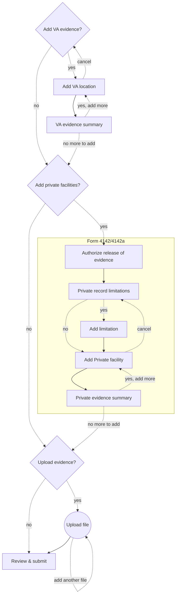

# Supplemental Claim (SC) details

## Frontend Code

Folder: https://github.com/department-of-veterans-affairs/vets-website/tree/main/src/applications/appeals/995

## Decisions of note

A lot of these sections match the Higher-Level Review (HLR) and Notice of Disagreement (NOD) tech docs because these forms have a lot of similarity

### Subtask

In order to ask questions before starting the form, we needed to add a wizard; but the [wizard pattern](https://design.va.gov/patterns/wizards) was deprecated, and had no replacement. So, a new [subtask pattern](https://design.va.gov/patterns/help-users-to/complete-a-sub-task) was developed to ask one question per page.

The [subtask component](https://depo-platform-documentation.scrollhelp.site/developer-docs/va-forms-library-sub-tasks) was built based on the wizard code, and modified to show one question, or task, per page.

### Verify identity and missing info alerts

When a Veteran has not verified their account (Level of Assurance, LOA 1), the prefill (SSN & VA file number) and contestable issues will not load. This leads to a sub-optimal experience and likely a rejected submission. For unverified (LOA 1) users, we show an alert with a link pointing to the `/verify` page instead of the start button. Once verified (LOA 3), a Veteran can start the form normally.

Even with a verified identity (LOA 3), the Veteran may not have their date of birth (DoB) or Social Security Number (SSN) associated with their account. In this case, we show another alert letting the Veteran know that we couldn't find their DoB or SSN and that they must contact the help center. This data can't be modified online, and we can not submit the form if either is missing.

Note: The SSN isn't available on the introduction page (save-in-progress data loads on form start), so we check the [appeals policy](https://github.com/department-of-veterans-affairs/vets-api/blob/master/app/policies/appeals_policy.rb) Redux state in `user.profile.claims.appeals` which when `true`, lets us know that the policy has been satisfied (checks for LOA 3 and SSN). After the Veteran starts the form, we get the prefill last four of their SSN.

### Prefill

The backend is set up to provide:
  - Veteran's last 4 of their SSN
  - Veteran's last 4 of their VA File number (no longer used)

```js
{
  "formData": {
    "veteranSsnLastFour": "1234",
    "veteranVaFileNumberLastFour": "1234"
  },
  "metadata": {
    "version": 0,
    "prefill": true,
    "returnUrl": "/veteran-information"
  }
}
```

We show this on the [Veteran info page](https://design.va.gov/patterns/help-users-to/know-when-their-information-is-prefilled#prefilled-information-the-user-cant-update). Along with their name and date of birth.

### Intent to File (ITF)

After completing the research and building the form, we were informed that a Supplemental Claim submission must include a compensation-type Intent to File (ITF, Form 21-0966) as per a [Federal Circuit court decision on July 30, 2021](http://cafc.uscourts.gov/sites/default/files/opinions-orders/19-1600.OPINION.7-30-2021_1811957.pdf) ([interim guidance](https://docs.google.com/document/d/1KMDTsETnIUrqjHheUPjtdmk1pf-LPdkp)). We have been in discussions with stakeholders about this because only one compensation-type ITF is allowed to be active at a time. Adding one may cause the previous one to be closed. And if there is already an active ITF intended to be associated with a 526 submission, submitting a Supplemental Claim first would cause that active ITF to be associated with the Supplemental Claim.

The VA business stakeholders are currently in discussion on how to progress (as of Feb 2023). But for now, we're going to use the same endpoint that 526 uses.

When first implemented, failing to retreive or create an ITF would block progressing through the form. There is now an informational alert stating that we can't confirm that an ITF exists, then allow the Veteran to proceed.

<details><summary>ITF not confirmed</summary>

</details>

### Homelessness

The housing status question is included with the new SC form flow (released March 2025). It follows the recommended [housing status design pattern](https://design.va.gov/patterns/ask-users-for/housing-status). Our form includes a lead in "Are you experiencing homelessness or at risk of becoming homeless?" yes-no question because the form includes a checkbox, but the collaboration cycle still wrote up a ticket (see [#102164](https://github.com/department-of-veterans-affairs/va.gov-team/issues/102164)). Our decision is to leave the yes/no question in place.

### Contact information

Our Decision Review forms display and allow editing profile contact information (address, email, home & mobile phone). The ["Hub and spoke" documentation](https://depo-platform-documentation.scrollhelp.site/developer-docs/va-forms-library-how-to-create-the-contact-info-ar) which is out-of-date (as of 3/2025); refer to the [updated contact info documentation in this ticket](https://github.com/department-of-veterans-affairs/vets-design-system-documentation/issues/2262).

There has also been a design update following the [updatable prefilled information pattern](https://design.va.gov/patterns/help-users-to/update-prefilled-information#prefilled-information-the-user-can-update). Which is being worked on by the profile team.

Note: If the Veteran indicates that they are homeless, or at risk, the mailing address on the contact information page is made optional.

### Primary phone

For HLR & NOD, the contact information page only asks the user to edit their mobile phone. But after some discussion (no research) we decided to include both the home and mobile number since some Veteran's may not have a mobile phone, or even a home phone. The contact info page uses profile components which requires both a mobile and home phone to be filled in. Immediately after the contact page is a page asking the Veteran about their primary phone number.

### Contestable issues

We get a list of contestable issues after the form has started from within the main form application file. The call is in the wrapper to ensure that if the Veteran returns to the form at a later date, only the latest list of contestable issues is shown.

The frontend makes an api call to [`/decision_reviews/v1/supplemental_claims/contestable_issues/compensation`](https://department-of-veterans-affairs.github.io/va-digital-services-platform-docs/api-reference/?url=https://dev-api.va.gov/v1/apidocs#/supplemental_claims/getContestableIssues3) (we're only supporting "compensation" benefits types currently). Our backend uses this Lighthouse endpoint ([`/contestable_issues/supplemental_claims?benefit_type=compensation`](https://developer.va.gov/explore/api/decision-reviews/docs?version=current)). The result is:

<details><summary>Example JSON of contestable issues with legacy data</summary>

```js
{
  "data": [
    {
      // contestable issue
      "id": null,
      "type": "contestableIssue",
      "attributes": {
        "ratingIssueReferenceId": "142894",
        "ratingIssueProfileDate": "2021-03-12",
        "ratingIssueDiagnosticCode": "5260",
        "ratingIssueSubjectText": "Ankylosis of knee",
        "ratingIssuePercentNumber": "10",
        "description": "Service connection for Ankylosis of knee is granted with an evaluation of 10 percent effective December 2, 2020.",
        "isRating": true,
        "latestIssuesInChain": [{
          "id": null,
          "approxDecisionDate": "2021-03-12"
        }],
        "decisionIssueId": null,
        "ratingDecisionReferenceId": null,
        "approxDecisionDate": "2021-03-12",
        "rampClaimId": null,
        "titleOfActiveReview": null,
        "sourceReviewType": null,
        "timely": true
      }
    },
    // any additional contestable issues
    {
      // Legacy appeals appended to this list
      "id": "35",
      "type": "legacyAppeal",
      "attributes": {
        // 3 legacy appeals shown here, this array will be empty if the
        // Veteran has no legacy appeals
        "issues": [{
          "summary": "Service connection, benign ear neoplasm"
        }, {
          "summary": "New and material evidence to reopen claim for service connection, impairment of knee"
        }, {
          "summary": "Service connection, migraines"
        }],
        // Mock user 233
        "veteranFullName": "Cara Bartlett",
        "decisionDate": "2021-10-17T00:00:00.000Z",
        "latestSocSsocDate": "2021-09-18T00:00:00.000Z"
      }
    }
  ]
}
```
</details>
<br />

Legacy appeals are all combined into one entry (the last entry) with a different `"type"`, but only the `"summary"` is provided and the wording may or may not match the contestable issue's `ratingIssueSubjectText` or `description`. So we have no sure method to coorelate legacy appeals with eligible issues.

Additionally, the issues provided by Lighthouse need additional processing. In the [`getEligibleContestableIssues` function](https://github.com/department-of-veterans-affairs/vets-website/blob/main/src/applications/appeals/shared/utils/issues.jsx#L222), contestable issues loaded from the API are filtered out:
- If the `ratingIssueSubjectText` or `description` contains any of the following words, the issues are no longer considered to be eligible:
  - `deferred`
  - `apportionment`
  - `attorney fees`
- Have a `approxDecisionDate` greater than one year in the past (HLR only).

Before being added to the form data, the [`processContestableIssues` function](https://github.com/department-of-veterans-affairs/vets-website/blob/main/src/applications/appeals/shared/utils/issues.jsx#L101):
- Filters out issues with no `ratingIssueSubjectText`
- Sorts the list by newest date first, then by title if the dates are equal

A collaboration cycle for the new SC flow (3/2025) included a ticket to update the contestable issue cards. We should be using a [va-checkbox tile with custom content](https://design.va.gov/storybook/?path=/docs/uswds-va-checkbox--docs#tile-with-custom-content) (see [#102160](https://github.com/department-of-veterans-affairs/va.gov-team/issues/102160)). The code is located in the appeals shared folder, so changing it will effect all Decision Review forms. Partial implementation can be found in the [`102160-imposter-checkbox` branch](https://github.com/department-of-veterans-affairs/vets-website/tree/102160-imposter-checkbox) - updating of keyboard-only end-to-end tests remain.

### Use of `appStateSelector`

In the `config/form.js` file, use of `appStateSelector` is necessary to provide the form data for both the `contestableIssues` and `additionalIssues` because of a bug in the form system that does not provide the correct `formData` value on the review & submit page. Instead of `formData`, the `fieldData` (data only for that page) is provided and breaks validation.

### Opt-in/acknowledge pages

The Supplemental Claim flow includes 3 opt-in/verify pages:
- **Opt-in to Appeals Modernization Act** (AMA) checkbox is optional. The page will only show up in the flow if the contestable issues includes at least one legacy appeal, OR the Veteran adds one or more custom issues (because we can not determine if the issue is in the legacy appeal process, or not)
- **Acknowledge notice of evidence needed** checkbox is required. The PDF includes a 5103 Notice of acknowledgement checkbox which this page corresponds to. The original link content has been included in the page so the Veteran doesn't need to leave the form flow to read the details
- **Acknowledge release of information** checkbox is required. This page will only show if the Veteran chooses to add private provider medical evidence. Private evidence will fill out a form 4142 (Authorization to Disclose Information to the Department of Veterans Affairs (VA))

### VA Evidence

The original SC form asked for a treatment date range from each facility that is added. The range was expected in `YYYY-MM-DD` format. The newer SC form asks for a optional single treatment in a `YYYY-MM` format. It also includes a checkbox to indicate that no date is to be provided. See this [decision on why we're only submitting one date of record](https://github.com/department-of-veterans-affairs/benefits-team-1-docs/discussions/3)

Lighthouse made their API backwards compatible, but still required us to submit a date range with only the start date required (if provided). If the checkbox is checked, or no date is provided (it's optional), then the evidence date object is completely omitted from the submission for that facility - this was a compromise made to get submissions working.

The VA evidence pages are using a new list loop pattern (third pattern mentioned in list loop pattern section), which hasn't been officially adopted by the Design System, so eventually we may need to switch to use the [array builder pattern](https://github.com/department-of-veterans-affairs/vets-website/tree/main/src/platform/forms-system/src/js/patterns/array-builder#array-builder-pattern-multiple-responses-list--loop) ([see #103986](https://github.com/department-of-veterans-affairs/va.gov-team/issues/103986)).

### Non-VA Evidence

The Supplemental Claims form does not require, nor suggest including form 4142/4142a, an Authorization to Disclose Information to the Department of Veterans Affairs (VA) from a non-VA source like a private doctor or facility. But we copied the pattern Form 526 was using when asking for evidence from the VA, private sources or a choice to upload.

Lighthouse's schema includes the VA and upload options, so we had to include Form 4142/4142a's data for the backend separate from the form data so that it could use code already in place (from 526) to create and fill out the form and submit it directly to the Central Mail Portal.

Notes:

- Original design used "private evidence" but was changed to "non-VA evidence"
- In the design intent, we were directed to add an extra OMB section for form 4142 to the introduction page. And when the Veteran is within the 4142 form flow, we change the page subtitle - changing the title may be confusing.
- Initially the limit consent textarea would always show when non-VA evidence; in the new flow we now ask a yes/no question before the textarea because during research, we noticed Veteran's thought they _had_ to fill out the limitation field.
- The non-VA evidence pages are using a new list loop pattern (third pattern mentioned in list loop pattern section), which hasn't been officially adopted by the Design System, so eventually we may need to switch to use the [array builder pattern](https://github.com/department-of-veterans-affairs/vets-website/tree/main/src/platform/forms-system/src/js/patterns/array-builder#array-builder-pattern-multiple-responses-list--loop) ([see #103986](https://github.com/department-of-veterans-affairs/va.gov-team/issues/103986)).

### Claimant Name & Type

In the PDF, it asks for the name of the claimant and the claimant type. The form supports Veteran, Veteran's spouse, Veteran's child, Veteran's parent and other. For release of our online Supplemental Claim form, we limited this to Veteran only. The site does not have the capability of connecting accounts together, e.g. a Veteran's spouse being able to log into their own account and obtain prefill data, including contestable issues, from the Veteran.

Once submitted, Lighthouse has yet to auto-establish the form (submit directly), so it populates a PDF with the submitted data and submits it to Central Mail Portal. The claimant name is left blank, and the claimant type is set to "Veteran"

### PACT act

With the PACT act in effect after Jan 2023, we discussed with the stakeholders the need to submit a Supplemental Claim that didn't include any evidence, since the Veteran may be filing with a presumptive condition. We concluded that a Supplemental Claim could be submitted without any evidence, but additional context would need to be added to ensure the submission wasn't accidental for non-presumptive conditions.

The original design included more content on the subtask start, introduction, 5103 acknowledgement, evidence summary and review & submit pages. This may be relevant to future situations that won't require evidence submission (once the PACT act isn't applicable), so the wording was adjusted to accommodate, but we no longer have access to those designs in Sketch.

### File uploads

We made a copy of the `FileField` in the shared folder for (SC & NOD) because we don't want to rely on the frontend for all the PDF checks:

- Document is a valid PDF (Note: Content-Type header value must be "application/pdf")
- Document does not have a user password (an owner password is acceptable)
- File size does not exceed 100 MB
- Page size does not exceed 78" x 101"

The frontend can, and does, check the file size; but, checking for a password is more difficult as the frontend is only set up to check for a password, and does not distinguish between user and owner password locks. In addition, the frontend would need a PDF library to check page dimensions.

Instead, we rely on [Lighthouse's `/uploads/validate_document` endpoint](https://developer.va.gov/explore/api/benefits-intake/docs?version=current) to validate the PDF before uploading it to S3. Our backend returns the Lighthouse error and the frontend displays it to the Veteran.

Once the [`va-input-file-multiple` web component](https://design.va.gov/storybook/?path=/docs/uswds-va-file-input-multiple--docs) supports PDF passwords (see [#3785](https://github.com/department-of-veterans-affairs/vets-design-system-documentation/issues/3785)), the team needs to switch over to that component (see [#104926](https://github.com/department-of-veterans-affairs/va.gov-team/issues/104926))

### List loop patterns

We copied the work that was already done for HLR & NOD for the issues page:



<details><summary>New combined issue page appearance</summary>


</details>

<p></p>

See the [list loop tech notes v2](https://depo-platform-documentation.scrollhelp.site/developer-docs/va-forms-library-how-to-use-add-item-link-in-array) for details on how this is set up.

---

We also copied the contact info page from HLR & NOD which included viewing and editing the mailing address, mobile phone and email; but we also included the home phone. Then a new choose your primary phone number page was added after this loop - see [hub and spoke pattern documentation](https://depo-platform-documentation.scrollhelp.site/developer-docs/va-forms-library-how-to-create-the-contact-info-ar).



See the [list loop tech notes v2](https://depo-platform-documentation.scrollhelp.site/developer-docs/va-forms-library-how-to-create-the-contact-info-ar) for details on how this is set up.

---

<details><summary>A third "new" pattern (current, but may be deprecated)</summary>

A third "new" pattern was created for the evidence flow pages. Originally, we copied form 526's evidence flow which added 3 checkboxes asking the Veteran if they wanted to submit: **VA, private, or upload evidence**. This made the [flow diagram very complex](https://github.com/department-of-veterans-affairs/va.gov-team/blob/master/products/disability/526ez/526-overall-flow.md#supporting-evidence) and the UX confusing. So we changed it to a linear flow pattern:



<br />
Notes:

1. The "Add VA location" and "Add private facility" loop pages use a new list loop pattern that first builds up the content, then presents a summary page (documentation link pending).<br /><br />

    <details><summary>Single list loop with summary page pattern</summary>

    ```mermaid
    flowchart TD

    Prev[Previous page] --> Loop
    Loop[Add entry, build list] -. back .-> Prev

    Loop -. add another entry .-> Loop

    Loop -- continue --> Summary[Summary of all entries]
    Summary -. edit indexed entry .-> Loop

    Summary --> Next[Next page]
    ```

    Notes:

    1. On all but the first entry, a modal is shown asking if you want to remove the partial entry, otherwise navigation will occur
    2. On the first entry, no modal is shown regarding removing the partial entry; when continuing or adding another, the first entry will focus on any form error messages. Otherwise navigation will occur.
    3. When continuing or navigating back through a list of entries, the url will update the index in the URL search parameter (e.g. `?index=2`)
    4. Adding another entry will inject a new entry immediately after the current index. This fixes an issue where appending and jumping to the last index may leave invalid entries within the list. These invalid entries are then skipped and ignored if continuing on from the last entry. The issue only becomes apparent upon submitting the form.
    5. The save-in-progress component does not include the search parameter index, so using "finish this application later" and returning will always return to the first entry.
    6. The page after the entry loop page (summary page in this flow), *must* control the back button destination so that the user navigates to the last entry - use a `CustomPage` with a custom back button to achieve this.

    </details><br />

2. To make this all work, the page immediately after the loop page (add private facilities and private record limitations page) need to be `CustomPage`s in order to make the back button go to the last index of the list loop page)

3. The upload page uses the original upload pattern where each uploaded file is presented as a card with a "upload another" button at the bottom.

</details>

<details><summary>Array builder list loop (update 3/2025)</summary>

The "third" list loop pattern above hasn't officially adopted. After completing work, the forms team created a new [multi-page pattern](https://design.va.gov/patterns/ask-users-for/multiple-responses#required-multi-page-pattern-user-flow) which all teams have been encouraged to adopt (see [developer array builder pattern documentation](https://github.com/department-of-veterans-affairs/vets-website/tree/main/src/platform/forms-system/src/js/patterns/array-builder#readme)). Our team did attempt to implement this new pattern, but found that there were issues with limited data provided to pages within the loop. Fixes have been made to [provide the full data and page index to every array page](https://github.com/department-of-veterans-affairs/va.gov-team/issues/103986).



</details>


## What are some things we'd make better if we had more time?

### Contact loop testing

The `995-contact-loop.cypress.spec.js` file tests the loop from the contact info page to each of the subpages:
- First cancelling the change, and return to the contact info page.
- Secondly changing and updating the info and returning to the contact info page

The problem is with the address change intermediate step. If an entered address isn't 100% accurate, it should show a page asking to verify or choose another address. The problem may be with the code in [`ProfileInformationFieldController.jsx`](https://github.com/department-of-veterans-affairs/vets-website/blob/master/src/platform/user/profile/vap-svc/components/ProfileInformationFieldController.jsx) (around line 160).

### Attach lay statements

While researching, we found that including a VA Form 4138 (buddy/lay statement) would be beneficial to Veterans submitting a Supplemental Claim application. We discussed including an additional page with a text box (`textarea`) asking the Veteran to add any additional comments. The backend would have to programmically create & fill in a Form 4138 PDF with the data, then include it as an attachment with the submission.

We didn't include this with our initial release because it would require extensive work on the backend to create the PDF.
