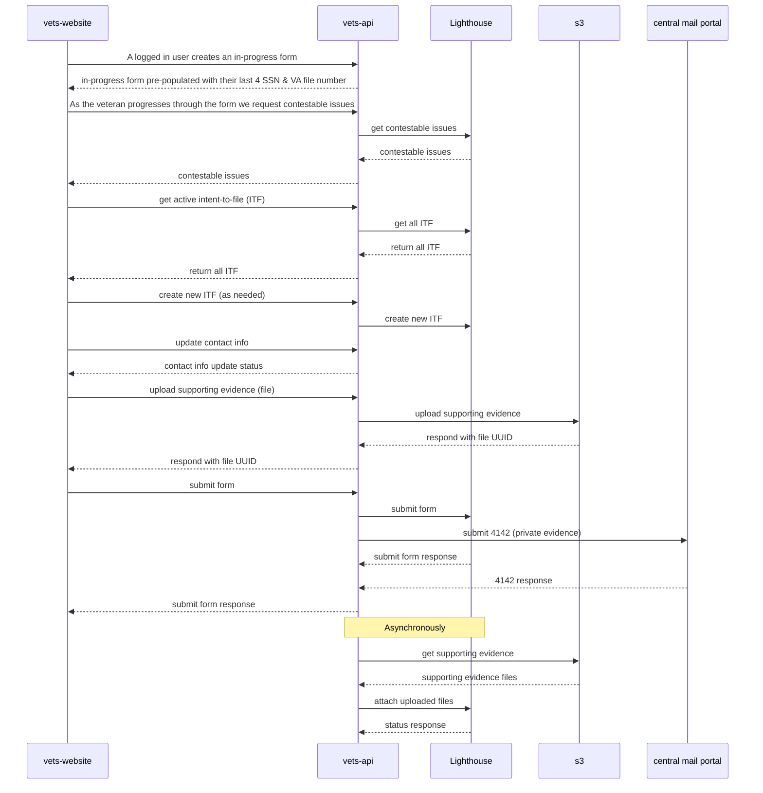

# Supplemental Claim sequence diagram

```mermaid
sequenceDiagram

vets-website ->> vets-api: A logged in user creates an in-progress form

vets-api -->> vets-website: in-progress form pre-populated with their last 4 SSN & VA file number

vets-website ->> vets-api: As the veteran progresses through the form we request contestable issues
vets-api ->> Lighthouse: get contestable issues
Lighthouse -->> vets-api: contestable issues
vets-api -->> vets-website: contestable issues

vets-website ->> vets-api: get active intent-to-file (ITF)
vets-api ->> Lighthouse: get all ITF
Lighthouse -->> vets-api: return all ITF
vets-api -->> vets-website: return all ITF
vets-website ->> vets-api: create new ITF (as needed)
vets-api ->> Lighthouse: create new ITF

vets-website ->> vets-api: update contact info
vets-api -->> vets-website: contact info update status

vets-website ->> vets-api: upload supporting evidence (file)
vets-api ->> s3: upload supporting evidence

s3 -->> vets-api: respond with file UUID
vets-api -->> vets-website: respond with file UUID

vets-website ->> vets-api: submit form
vets-api ->> Lighthouse: submit form
vets-api ->> central mail portal: submit 4142 (private evidence)
Lighthouse -->> vets-api: submit form response
central mail portal -->> vets-api: 4142 response
vets-api -->> vets-website: submit form response

note over vets-api,Lighthouse: Asynchronously
vets-api ->> s3: get supporting evidence
s3 -->> vets-api: supporting evidence files
vets-api ->> Lighthouse: attach uploaded files
Lighthouse -->> vets-api: status response
```
