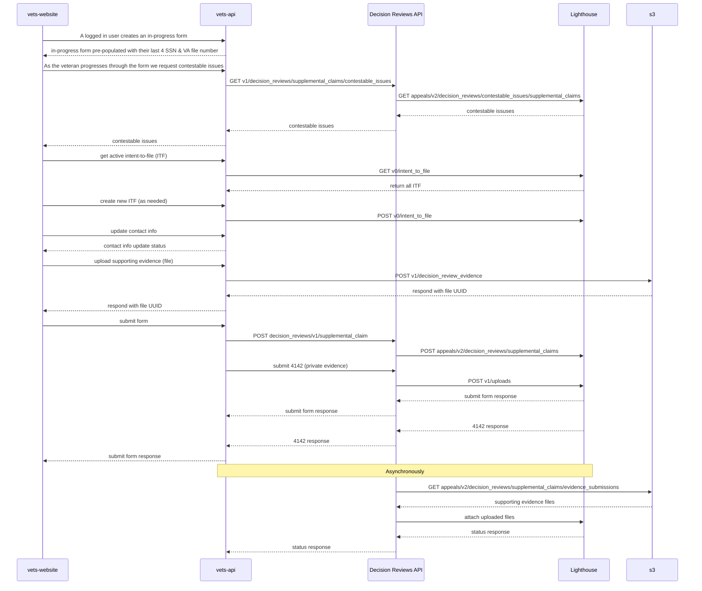

# Supplemental Claim sequence diagram

```mermaid
sequenceDiagram
  participant vets-website
  participant vets-api
  participant DecisionReviews as Decision Reviews API
  participant Lighthouse
  participant s3


  vets-website ->> vets-api: A logged in user creates an in-progress form
  vets-api -->> vets-website: in-progress form pre-populated with their last 4 SSN & VA file number

  vets-website ->> vets-api: As the veteran progresses through the form we request contestable issues
  vets-api ->> DecisionReviews: GET v1/decision_reviews/supplemental_claims/contestable_issues
  DecisionReviews ->> Lighthouse: GET appeals/v2/decision_reviews/contestable_issues/supplemental_claims


  Lighthouse -->> DecisionReviews: contestable issuses
  DecisionReviews -->> vets-api: contestable issues
  vets-api -->> vets-website: contestable issues

  vets-website ->> vets-api: get active intent-to-file (ITF)
  vets-api ->> Lighthouse: GET v0/intent_to_file
  Lighthouse -->> vets-api: return all ITF

  vets-website ->> vets-api: create new ITF (as needed)

  vets-api ->> Lighthouse: POST v0/intent_to_file

  vets-website ->> vets-api: update contact info
  vets-api -->> vets-website: contact info update status

  vets-website ->> vets-api: upload supporting evidence (file)
  vets-api ->> s3: POST v1/decision_review_evidence

  s3 -->> vets-api: respond with file UUID
  vets-api -->> vets-website: respond with file UUID

  vets-website ->> vets-api: submit form
  vets-api ->> DecisionReviews: POST decision_reviews/v1/supplemental_claim
  DecisionReviews ->> Lighthouse: POST appeals/v2/decision_reviews/supplemental_claims

  vets-api ->> DecisionReviews: submit 4142 (private evidence)
  DecisionReviews ->> Lighthouse: POST v1/uploads

  Lighthouse -->> DecisionReviews: submit form response
  DecisionReviews -->> vets-api: submit form response
  Lighthouse -->> DecisionReviews: 4142 response
  DecisionReviews -->> vets-api: 4142 response
  vets-api -->> vets-website: submit form response

  note over vets-api,Lighthouse: Asynchronously

  DecisionReviews ->> s3: GET appeals/v2/decision_reviews/supplemental_claims/evidence_submissions
  s3 -->> DecisionReviews: supporting evidence files

  DecisionReviews ->> Lighthouse: attach uploaded files
  Lighthouse -->> DecisionReviews: status response
  DecisionReviews -->> vets-api: status response
```
