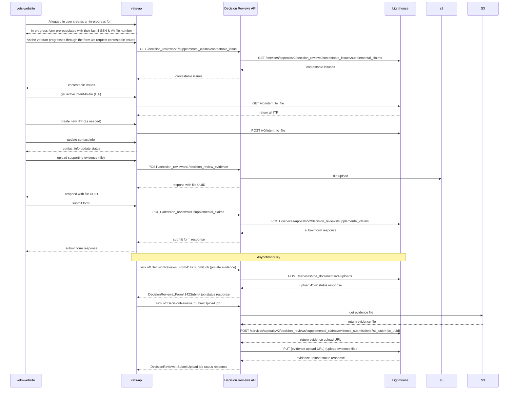

# Supplemental Claim sequence diagram

```mermaid
sequenceDiagram
  participant vets-website
  participant vets-api
  participant DecisionReviews as Decision Reviews API
  participant Lighthouse
  participant s3

  vets-website ->> vets-api: A logged in user creates an in-progress form
  vets-api -->> vets-website: in-progress form pre-populated with their last 4 SSN & VA file number

  vets-website ->> vets-api: As the veteran progresses through the form we request contestable issues
  vets-api ->> DecisionReviews: GET /decision_reviews/v1/supplemental_claims/contestable_issue
  DecisionReviews ->> Lighthouse: GET /services/appeals/v2/decision_reviews/contestable_issues/supplemental_claims

  Lighthouse -->> DecisionReviews: contestable issuses
  DecisionReviews -->> vets-api: contestable issues
  vets-api -->> vets-website: contestable issues

  vets-website ->> vets-api: get active intent-to-file (ITF)
  vets-api ->> Lighthouse: GET /v0/intent_to_file
  Lighthouse -->> vets-api: return all ITF

  vets-website ->> vets-api: create new ITF (as needed)

  vets-api ->> Lighthouse: POST /v0/intent_to_file

  vets-website ->> vets-api: update contact info
  vets-api -->> vets-website: contact info update status

  vets-website ->> vets-api: upload supporting evidence (file)
  vets-api ->> DecisionReviews: POST /decision_reviews/v1/decision_review_evidence
  DecisionReviews ->> s3: file upload
  DecisionReviews -->> vets-api: respond with file UUID
  vets-api -->> vets-website: respond with file UUID

  vets-website ->> vets-api: submit form
  vets-api ->> DecisionReviews: POST /decision_reviews/v1/supplemental_claims
  DecisionReviews ->> Lighthouse: POST /services/appeals/v2/decision_reviews/supplemental_claims

  Lighthouse -->> DecisionReviews: submit form response
  DecisionReviews -->> vets-api: submit form response

  vets-api -->> vets-website: submit form response

  note over vets-api,Lighthouse: Asynchronously

  vets-api ->> DecisionReviews: kick off DecisionReviews::Form4142Submit job (private evidence)
  DecisionReviews ->> Lighthouse: POST /services/vba_documents/v1/uploads

  Lighthouse -->> DecisionReviews: upload 4142 status             response
  DecisionReviews -->> vets-api: DecisionReviews::Form4142Submit job status response

  vets-api ->> DecisionReviews: kick off DecisionReviews::SubmitUpload job
  DecisionReviews ->> S3: get evidence file
  S3 -->> DecisionReviews: return evidence file
  DecisionReviews ->> Lighthouse: POST /services/appeals/v2/decision_reviews/supplemental_claims/evidence_submissions?sc_uuid={sc_uuid}
  Lighthouse -->> DecisionReviews: return evidence upload URL
  DecisionReviews ->> Lighthouse: PUT {evidence upload URL} (upload evidence file)
  Lighthouse -->> DecisionReviews: evidence upload status response

  DecisionReviews -->> vets-api: DecisionReviews::SubmitUpload job status response
```
