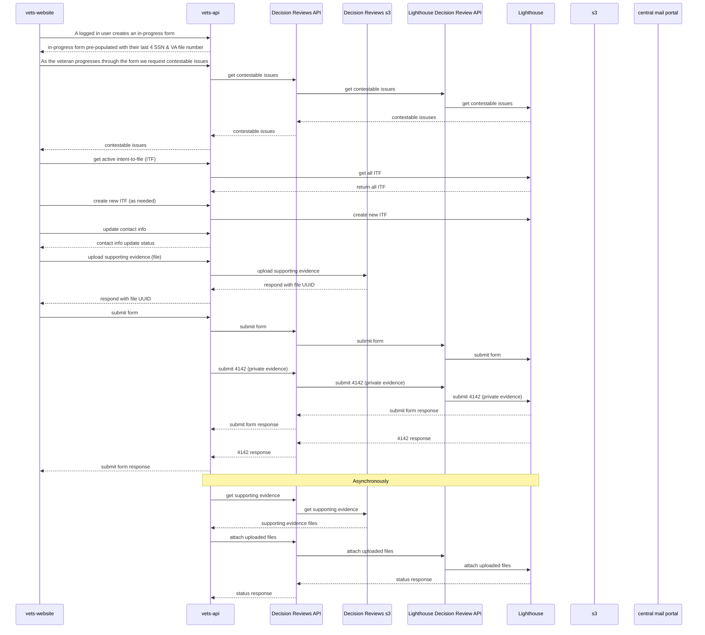

# Supplemental Claim sequence diagram

```mermaid
sequenceDiagram
  participant vets-website
  participant vets-api
  participant DecisionReviews as Decision Reviews API
  participant DecisionReviewsS3 as Decision Reviews s3
  participant LighthouseDr as Lighthouse Decision Review API
  participant Lighthouse
  participant s3
  participant centralmail as central mail portal

  vets-website ->> vets-api: A logged in user creates an in-progress form
  vets-api -->> vets-website: in-progress form pre-populated with their last 4 SSN & VA file number

  vets-website ->> vets-api: As the veteran progresses through the form we request contestable issues
  vets-api ->> DecisionReviews: get contestable issues
  DecisionReviews ->> LighthouseDr: get contestable issues
  LighthouseDr ->> Lighthouse: get contestable issues

  Lighthouse -->> DecisionReviews: contestable issuses
  DecisionReviews -->> vets-api: contestable issues
  vets-api -->> vets-website: contestable issues

  vets-website ->> vets-api: get active intent-to-file (ITF)
  vets-api ->> Lighthouse: get all ITF
  Lighthouse -->> vets-api: return all ITF

  vets-website ->> vets-api: create new ITF (as needed)

  vets-api ->> Lighthouse: create new ITF

  vets-website ->> vets-api: update contact info
  vets-api -->> vets-website: contact info update status

  vets-website ->> vets-api: upload supporting evidence (file)
  vets-api ->> DecisionReviewsS3: upload supporting evidence

  DecisionReviewsS3 -->> vets-api: respond with file UUID
  vets-api -->> vets-website: respond with file UUID

  vets-website ->> vets-api: submit form
  vets-api ->> DecisionReviews: submit form
  DecisionReviews ->> LighthouseDr: submit form
  LighthouseDr ->> Lighthouse: submit form
  vets-api ->> DecisionReviews: submit 4142 (private evidence)
  DecisionReviews ->> LighthouseDr: submit 4142 (private evidence)
  LighthouseDr ->> Lighthouse: submit 4142 (private evidence)

  Lighthouse -->> DecisionReviews: submit form response
  DecisionReviews -->> vets-api: submit form response
  Lighthouse -->> DecisionReviews: 4142 response
  DecisionReviews -->> vets-api: 4142 response
  vets-api -->> vets-website: submit form response

  note over vets-api,Lighthouse: Asynchronously
  vets-api ->> DecisionReviews: get supporting evidence
  DecisionReviews ->> DecisionReviewsS3: get supporting evidence
  DecisionReviewsS3 -->> vets-api: supporting evidence files
  vets-api ->> DecisionReviews: attach uploaded files
  DecisionReviews ->> LighthouseDr: attach uploaded files
  LighthouseDr ->> Lighthouse: attach uploaded files
  Lighthouse -->> DecisionReviews: status response
  DecisionReviews -->> vets-api: status response
```
