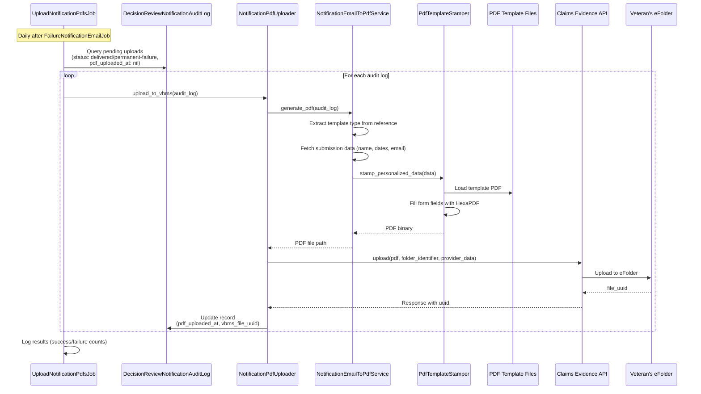

# Uploading Failure Notification Email PDFs to VBMS - Implementation Summary

## Table of Contents

- [Background](#background)
- [Implementation Overview](#implementation-overview)
- [Key Implementation Decisions](#key-implementation-decisions)
- [Architecture](#architecture)
- [Components](#components)
- [PDF Templates](#pdf-templates)
- [Database Schema Updates](#database-schema-updates)
- [Feature Flags](#feature-flags)
- [Testing](#testing)
- [Deployment & Monitoring](#deployment--monitoring)

## Background

This document summarizes the actual implementation of uploading PDF copies of failure notification emails to Veterans' eFolders in VBMS. For the original spike writeup and LOE estimates, see [the original spike writeup](https://github.com/department-of-veterans-affairs/va.gov-team/blob/master/products/decision-reviews/engineering/2025_09_05_va_notify_failure_notification_email_copies_to_efolder.md).

### Problem Summary

Claims processors, attorneys, judges, and other employees within VA don't have visibility into the details of failed form & evidence submission attempts made by Veterans. VBA and BVA requested that the team upload a PDF copy of failure notification email contents and critical metadata to a Veteran's eFolder.

### Volume Context

- Current monthly volume: ~276 failure notification emails
- Daily average: ~9 emails
- This low volume influenced our architecture decisions, prioritizing simplicity and reliability over high-performance batch processing

## Implementation Overview

The implementation consists of:

1. **Static PDF templates** with fillable form fields for each of the 6 email types
2. **PDF Template Stamper** that fills form fields with personalized veteran data
3. **Background job** that processes pending notification audit logs and uploads PDFs to VBMS
4. **Direct VBMS upload** via Claims Evidence API (instead of Lighthouse Benefits Intake API)

## Key Implementation Decisions

### Decision 1: Claims Evidence API vs. Benefits Intake API

**Original Plan:** Use Lighthouse Benefits Intake API for indirect upload to VBMS, requiring status polling.

**Actual Implementation:** Use Claims Evidence API for direct upload to VBMS eFolder.

| Aspect | Benefits Intake API (Original) | Claims Evidence API (Implemented) |
|--------|-------------------------------|-----------------------------------|
| **Upload Method** | Indirect - requires VBMS processing | Direct to veteran's eFolder |
| **Status Polling** | Required - 14-day polling window | Not required - synchronous response |
| **Complexity** | Higher - needed `StatusUpdaterJob` | Lower - single upload call |
| **Response** | Async - returns `benefits_intake_uuid` | Sync - returns `vbms_file_uuid` |
| **Additional Jobs** | `FailureNotificationEmailPdfStatusUpdaterJob` | None needed |

**Why we changed:**
- Eliminates need for status polling infrastructure
- Simpler error handling and retry logic
- Faster confirmation of successful upload
- Fewer moving parts to monitor and maintain

### Decision 2: Static PDF Templates vs. Dynamic PDF Generation

**Original Plan:** Generate PDFs dynamically from email content using HTML-to-PDF conversion.

**Actual Implementation:** Use pre-designed static PDF templates with fillable form fields, stamped with personalized data at runtime.

| Aspect | Dynamic Generation (Original) | Template Stamping (Implemented) |
|--------|------------------------------|--------------------------------|
| **PDF Content** | Regenerated entirely each time | Static template + dynamic fields |
| **Accessibility** | Unknown compliance | Pre-validated accessible templates |
| **Design Control** | Limited - depends on HTML rendering | Full control via PDF design tools |
| **Performance** | CPU-intensive rendering | Fast field stamping |
| **Consistency** | Varies by rendering engine | Pixel-perfect consistency |
| **Maintenance** | Code changes for design updates | Update PDF file only |

**Why we changed:**
- Pre-designed templates ensure consistent, professional appearance
- Accessibility can be validated once per template
- No HTML/CSS rendering engine dependencies
- Stakeholders can review and approve exact PDF appearance
- Simpler codebase - just stamp fields, don't generate complex layouts

### Decision 3: Email Content Storage

**Original Plan:** Store full email content from VA Notify response in audit log.

**Actual Implementation:** Store minimal data (notification_id, reference, status, payload) and reconstruct personalization from database lookups.

**Why:** 
- The static PDF templates already contain the email body text
- Only personalization fields (name, dates, email, filename) need to be looked up
- Reduces storage requirements
- Simplifies audit log schema

## Architecture

### Simplified Flow Diagram



### Component Interaction

```
┌─────────────────────────────────────────────────────────────────────────────┐
│                        UploadNotificationPdfsJob                            │
│  - Queries DecisionReviewNotificationAuditLog for pending uploads           │
│  - Filters by final status (delivered, permanent-failure)                   │
│  - Respects CUTOFF_DATE to avoid historical uploads                         │
│  - Max 3 retry attempts per record                                          │
└─────────────────────────────────────────────────────────────────────────────┘
                                     │
                                     ▼
┌─────────────────────────────────────────────────────────────────────────────┐
│                        NotificationPdfUploader                              │
│  - Orchestrates PDF generation and upload                                   │
│  - Builds folder identifier from veteran's ICN                              │
│  - Handles success/failure audit log updates                                │
│  - Cleans up temporary PDF files                                            │
└─────────────────────────────────────────────────────────────────────────────┘
                                     │
                    ┌────────────────┴────────────────┐
                    ▼                                 ▼
┌───────────────────────────────────┐   ┌───────────────────────────────────┐
│   NotificationEmailToPdfService   │   │    ClaimsEvidenceApi::Service     │
│  - Extracts template type         │   │  - Direct upload to VBMS          │
│  - Fetches submission data        │   │  - Returns vbms_file_uuid         │
│  - Validates final status         │   │  - Uses veteran's ICN for folder  │
│  - Invokes PdfTemplateStamper     │   │                                   │
└───────────────────────────────────┘   └───────────────────────────────────┘
                    │
                    ▼
┌───────────────────────────────────┐
│        PdfTemplateStamper         │
│  - Loads static PDF template      │
│  - Fills form fields via HexaPDF  │
│  - Sets fields to read-only       │
│  - Applies status color styling   │
└───────────────────────────────────┘
                    │
                    ▼
┌───────────────────────────────────┐
│       PDF Template Files          │
│  modules/decision_reviews/lib/    │
│  decision_reviews/email_templates/│
│  - hlr_form_failure.pdf           │
│  - sc_form_failure.pdf            │
│  - sc_evidence_failure.pdf        │
│  - sc_4142_failure.pdf            │
│  - nod_form_failure.pdf           │
│  - nod_evidence_failure.pdf       │
└───────────────────────────────────┘
```

## Components

### 1. UploadNotificationPdfsJob

**Location:** `modules/decision_reviews/app/sidekiq/decision_reviews/upload_notification_pdfs_job.rb`

**Purpose:** Background job that processes pending notification PDFs and uploads to VBMS.

**Key Features:**
- Runs daily after `FailureNotificationEmailJob`
- Queries for audit logs with final status (`delivered` or `permanent-failure`) that haven't been uploaded
- Respects `CUTOFF_DATE` (Dec 12, 2025) to avoid processing historical records
- Maximum 3 retry attempts per record
- Controlled by feature flag `:decision_review_upload_notification_pdfs_enabled`

```ruby
# Query criteria for pending uploads
DecisionReviewNotificationAuditLog
  .where(pdf_uploaded_at: nil)
  .where(status: %w[delivered permanent-failure])
  .where('pdf_upload_attempt_count IS NULL OR pdf_upload_attempt_count < ?', 3)
  .where('created_at >= ?', CUTOFF_DATE)
  .order(created_at: :asc)
```

### 2. NotificationPdfUploader

**Location:** `modules/decision_reviews/lib/decision_reviews/notification_pdf_uploader.rb`

**Purpose:** Orchestrates PDF generation and upload to VBMS via Claims Evidence API.

**Key Features:**
- Generates PDF using `NotificationEmailToPdfService`
- Uploads directly to veteran's eFolder via Claims Evidence API
- Uses veteran's ICN to identify the correct eFolder
- Updates audit log with success (vbms_file_uuid) or failure (error, attempt count)
- Cleans up temporary PDF files after upload

```ruby
def upload_to_vbms
  pdf_path = generate_pdf
  file_uuid = upload_pdf(pdf_path)
  update_audit_log_success(file_uuid)
  file_uuid
rescue => e
  update_audit_log_failure(e)
  raise UploadError, "Failed to upload notification PDF: #{e.message}"
ensure
  cleanup_pdf(pdf_path)
end
```

### 3. NotificationEmailToPdfService

**Location:** `modules/decision_reviews/lib/decision_reviews/notification_email_to_pdf_service.rb`

**Purpose:** Extracts data from audit log and generates PDF using template stamper.

**Key Features:**
- Determines template type from reference string (e.g., `HLR-form-uuid` → `hlr_form_failure`)
- Validates that email status is final before generating PDF
- Fetches veteran's first name via MPI profile lookup
- Extracts evidence filename for evidence failure templates
- Tracks email delivery failure status for styling

**Supported Template Types:**
| Reference Pattern | Template Type |
|------------------|---------------|
| `HLR-form-*` | `hlr_form_failure` |
| `SC-form-*` | `sc_form_failure` |
| `SC-evidence-*` | `sc_evidence_failure` |
| `SC-secondary_form-*` | `sc_4142_failure` |
| `NOD-form-*` | `nod_form_failure` |
| `NOD-evidence-*` | `nod_evidence_failure` |

### 4. PdfTemplateStamper

**Location:** `modules/decision_reviews/lib/decision_reviews/pdf_template_stamper.rb`

**Purpose:** Fills form fields in pre-designed PDF templates with personalized data.

**Key Features:**
- Uses HexaPDF gem for PDF manipulation
- Fills form fields by name (case-sensitive matching)
- Sets all fields to read-only after filling
- Applies conditional color styling (green ✓ Success / red ✗ Failure)
- Preserves accessibility features of original template

**Form Fields Filled:**
| Field Name | Data Source |
|------------|-------------|
| Recipient name | MPI profile first name |
| Original submission attempt timestamp | AppealSubmission created_at |
| Email delivered timestamp | Audit log payload completed_at |
| Recipient email address | AppealSubmission current_email_address |
| Original submission attempt date | AppealSubmission created_at (date only) |
| Email delivery status | Audit log status (delivered → Success, permanent-failure → Failure) |
| Evidence filename | AppealSubmissionUpload masked_attachment_filename (evidence templates only) |

## PDF Templates

### Template Files

Located in `vets-api/modules/decision_reviews/lib/decision_reviews/email_templates/`:

| Template | Email Type | Form Fields |
|----------|-----------|-------------|
| `hlr_form_failure.pdf` | Higher Level Review form submission failure | 6 fields |
| `sc_form_failure.pdf` | Supplemental Claim form submission failure | 6 fields |
| `sc_evidence_failure.pdf` | Supplemental Claim evidence upload failure | 7 fields (includes filename) |
| `sc_4142_failure.pdf` | Supplemental Claim 4142 form failure | 7 fields (includes filename) |
| `nod_form_failure.pdf` | Board Appeal (NOD) form submission failure | 6 fields |
| `nod_evidence_failure.pdf` | Board Appeal (NOD) evidence upload failure | 7 fields (includes filename) |

### Template Design Considerations

1. **Accessibility**: Templates are designed to be Section 508 compliant
2. **Form Fields**: Use standard PDF form fields for data stamping
3. **Read-Only**: Fields are set to read-only after stamping to prevent edits
4. **Static Content**: All standard email body text is pre-rendered in the template
5. **Visual Consistency**: Professional appearance matching VA design standards

## Database Schema Updates

### DecisionReviewNotificationAuditLog Table Updates

New columns added to track PDF upload status:

| Column | Type | Description |
|--------|------|-------------|
| `pdf_uploaded_at` | datetime | Timestamp when PDF was successfully uploaded |
| `vbms_file_uuid` | string | VBMS file UUID returned from Claims Evidence API |
| `pdf_upload_attempt_count` | integer | Number of upload attempts (max 3) |
| `pdf_upload_error` | text | Error message from most recent failed upload attempt |

## Feature Flags

### `:decision_review_upload_notification_pdfs_enabled`

Controls whether the `UploadNotificationPdfsJob` processes pending uploads.

```ruby
def enabled?
  Flipper.enabled?(:decision_review_upload_notification_pdfs_enabled)
end
```

## Testing

### Local Testing

See [va_notify_local_testing_readme.md](https://github.com/department-of-veterans-affairs/vets-api/blob/master/modules/decision_reviews/lib/decision_reviews/notification_callbacks/va_notify_local_testing_readme.md) for setting up local test data.

**Quick Local Demo:**

```ruby
# In rails console
upload_job = DecisionReviews::UploadNotificationPdfsJob.new
upload_job.perform
```

## Deployment & Monitoring

### StatsD Metrics

| Metric | Description |
|--------|-------------|
| `worker.decision_reviews.upload_notification_email_pdfs.started` | Job execution started |
| `worker.decision_reviews.upload_notification_email_pdfs.no_pending_uploads` | No records to process |
| `worker.decision_reviews.upload_notification_email_pdfs.upload_success` | Individual PDF uploaded successfully |
| `worker.decision_reviews.upload_notification_email_pdfs.upload_failure` | Individual PDF upload failed |
| `worker.decision_reviews.upload_notification_email_pdfs.error` | Job-level error |
| `worker.decision_reviews.upload_notification_email_pdfs.total_count` | Total records processed (gauge) |
| `worker.decision_reviews.upload_notification_email_pdfs.success_count` | Successful uploads (gauge) |
| `worker.decision_reviews.upload_notification_email_pdfs.failure_count` | Failed uploads (gauge) |
