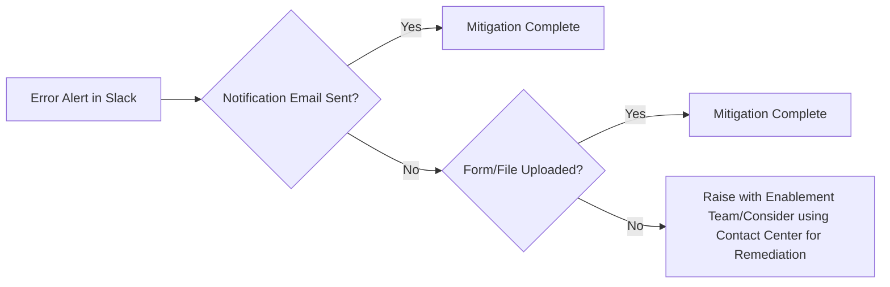

# Decision Reviews Monitoring Handbook
# Table of Contents
- [Background](#background)
- [Logging](#logging)
- [Monitoring](#monitoring)
    - [Tools and Access Required](#tools-and-access-required)
    - [Monitor Triage Duty [**Pending Process Changes**]](#monitor-triage-duty-pending-process-changes)
    - [Creating a Bug Ticket](#creating-a-bug-ticket)
    - [Types of Alerts](#types-of-alerts)
    - [How to Triage Alerts](#how-to-triage-alerts)
      - [Alert Priority Levels](#alert-priority-levels)
      - [General Approach](#general-approach)
      - [Traffic Anomaly Alert Investigation Tips](#traffic-anomaly-alert-investigation-tips)
      - [Error Investigation Tips](#error-investigation-tips)
      - [Finding Files in S3](#finding-files-in-s3)
- [Google Analytics](#google-analytics)
- [Real User Monitoring](#real-user-monitoring)
- [Useful Links](#useful-links)
- [Footnotes](#footnotes)

## Background

After discovering long-standing issues with the 526ez and 686c forms, we have endeavored to improve observability across our Decision Reviews Forms.  We started by setting up basic logging and monitoring for each of our forms (see “Dashboards” and “Monitors” sections below).  We then focused on building more comprehensive logging and monitoring for each form.  Meaning, for each form, we at minimum want the following:

* Backend KPI logging[^1]
* Dashboards to visualize those logs[^2]
* Monitors to trigger Slack alerts based on those logs[^3]
* Real User Monitoring[^4]

Though there is, and should always be, room for improvement, our logging and monitoring for all 3 forms is fairly comprehensive.

## Logging

While building more comprehensive logging and monitoring for the NOD form, we established a pattern for logging and monitoring [here](https://github.com/department-of-veterans-affairs/vets-api/commit/24d9d840e96b19af248cb11a553ed1b3cdac83f5), using a new [`logging_utils.rb` module](https://github.com/department-of-veterans-affairs/vets-api/blob/24d9d840e96b19af248cb11a553ed1b3cdac83f5/lib/decision_review_v1/utilities/logging_utils.rb).  As you can see from the module, most of our logs are, and should continue to be, searchable in DataDog by `form_id`, `action`, and `is_success`, among other things.  They should also contain whatever non-PII identifying information might be helpful for debugging and reporting purposes.

## Monitoring

The enumerated monitors below (see “Monitors” sections below) are configured to send alerts to #benefits-decision-reviews-notifications channel in VA’s Slack.  The channel contains alerts from our Decision Reviews apps only.  [TBD - Rotating Monitor Triage Duty role for monitoring this channel]

## Tools and Access Required
Refer to [VA Platform documentation](https://depo-platform-documentation.scrollhelp.site/getting-started/request-access-to-tools) for details. You will need access to:
- Slack
- SOCKS Proxy 
- Datadog
- ArgoCD (needed for vets-api terminal and Rails console access)
- Vets API Rails console
- AWS
- PagerDuty (currently only used to manage rotations)

### Monitor Triage Duty [\*\*Pending Process Changes\*\*]

Every sprint, at least one engineer is assigned to monitor the **#benefits-decision-reviews-notifications** channel and triage any alerts that pop up during the sprint.  That engineer’s monitor triage work is represented by a ticket like [this one](https://github.com/department-of-veterans-affairs/va.gov-team/issues/77054).  Please note the description in the linked ticket.  The goal of monitor triage is _not_ to immediately resolve any bugs that arise.  Rather, the goal is to conduct a preliminary investigation to determine whether no follow up is necessary, or if follow up is necessary, to draft a ticket to be discussed and prioritized at the next standup (see “Creating a Bug Ticket” below).  Traditionally, we have assigned 2 points to this ticket.

During that duty, it is important to respond promptly to any alerts and keep VA stakeholders informed of our investigations.  To indicate that you are looking into an alert, react to the alert with an 👀 emoji.  If the alert was a false alarm, or otherwise resolved, react to the alert with an ✅ emoji, and leave an explanatory comment.  Here is [an example](https://dsva.slack.com/archives/C05UPRR0HK3/p1710712459247059).  If you end up creating a follow-up ticket, post a link to the ticket in the alert’s thread, and leave any other notes you think our VA stakeholders may find helpful.

Towards the end of an engineer’s monitor triage duty, they should create a triage duty ticket for the next sprint if one hasn’t already been created.  Ideally, a different engineer should be assigned to the next triage duty.

### Creating a Bug Ticket

We add bug tickets to our Product Backlog using our [bug ticket template](https://github.com/department-of-veterans-affairs/va.gov-team/issues/new?assignees=&labels=Decision-Reviews-Team%2Cneeds-grooming%2Cneeds-refinement%2Cbug&projects=&template=Decision-Reviews-Bug-Template.md&title=).  When creating a bug ticket, don’t worry too much about creating “The Perfect Ticket.”  If you can, great; but if you can’t, you will be able to refine it later.  But please do make sure to indicate the following:

1. The date and time of the bug.
2. The severity of the bug (i.e. the extent of harm it causes to the Veteran), including whether it is a silent error.
3. The impact of the bug (i.e. the number of Veterans actually or potentially harmed).
4. A link to the Slack alert or any other Slack conversations relating to the bug.
5. Any helpful links (e.g. DataDog, Sentry, etc.).
6. Anything you learned during your preliminary investigation.
7. Anything else you think would be helpful.

Ideally, you would have gained a rough sense of the severity and impact of the bug during your preliminary investigation.  If you didn’t, consider extending it to learn these crucial details.  If doing so would be impracticable or otherwise unjustifiable during the current sprint, please indicate that the severity or impact are unknown.

Most bug tickets begin as spikes, since the root cause of a bug is often not immediately apparent.  For such spikes, you can assume that the bug ticket will be an 8 hour (1 point) spike ticket, and that the goal of the spike ticket will be to:

1. Understand the root cause well enough to draft a non-spike ticket to address it.  Or, push a bug fix if the root cause is _very_ easy to fix.
2. If necessary and possible, somehow resolve the Veteran(s)’s immediate issue.  And if necessary but not possible, draft a follow-up ticket to do the same.

Once you have created your bug ticket, please post a link to it in the Monitor Triage Duty ticket for the current sprint.  Then, at the next standup (or earlier), please bring up the ticket, explain its severity and impact, and work with the team to determine whether it should be worked on during the current sprint, or in a later sprint.

### Types of Alerts

We have two types of alerts:  traffic anomaly alerts and error alerts.  

There are two types of traffic anomaly alerts:  low traffic alerts, and anomaly alerts.  Low traffic alerts are based on a lower threshold.  That lower threshold was originally estimated by looking at historical expected traffic over weekends and other periods of expectedly low traffic.  The anomaly alerts are a bit more complicated, but basically, they ask whether a certain percentage of traffic within a set time period is two standard deviations above or below the volume of traffic during that same time period, on that same day, in previous weeks.

We started out with low traffic alerts and then began trialing anomaly alerts some time ago.  I’ve kept the low traffic alerts around as a check against the anomaly alerts.  There may come a time in the future where we feel confident enough with the anomaly alerts to formally deprecate the low traffic alerts.

Error alerts are triggered when the number of errors related to some kind of action are above a certain threshold.  Usually, that threshold is one.

### How to Triage Alerts

#### Alert Priority Levels
Alerts will typically have a priority rating, from P1 being the most critical to P5 being the least. You can view the full list of our monitors and their corresponding priorities in Datadog [here](https://vagov.ddog-gov.com/monitors/manage?q=benefits-decision-reviews-notifications). The team should follow typical guidelines based on the severity of the alert:
- **P1**: Critical - Immediate response (minutes); complete service outage affecting all users; 24/7 continuous work until resolved
- **P2**: High - Response within 30-60 minutes; major functionality broken affecting many users; business hours plus extended coverage
- **P3**: Medium - Same-day response during business hours; non-critical functionality affected; expected resolution within 1-2 business days
- **P4**: Low - Scheduled response during normal business hours; minor issues with minimal user impact; expected resolution within 1-2 weeks (current sprint)
- **P5**: Informational - Backlog response with no specific timeframe; no current impact; preventative or improvement opportunities 
Our current alerts range from P3-P5 and should be addressed accordingly.

#### General Approach
When monitoring alerts, our primary concern is identifying permanent failure states in form submissions or evidence uploads. In these critical scenarios, our mitigation protocol centers around email notification delivery through [VANotify](https://github.com/department-of-veterans-affairs/va.gov-team/tree/master/products/va-notify).

Generally speaking, for form or evidence submission errors, we want to first verify that notification emails have been successfully delivered. In the case of email delivery failure, we can then check if the form or file still made it to Lighthouse/downstream systems despite the initial failure (this has previously been known to happen occasionally). Very rarely, when both the email failed to send and the submission failed to upload, you may need to reach out to the enablement team and Contact Center for further remediation.


#### Traffic Anomaly Alert Investigation Tips

When investigating a traffic anomaly, you should consider the following factors: the time of day, the day of the week, whether it was a holiday or otherwise special day, whether traffic was anomalously high or low,[^5] what traffic has looked like on that same day at that same time in previous weeks and months, whether there were any known outages or maintenance windows during that time, whether we recently pushed any code, whether the drop in traffic corresponded with the daily deploy, and the length of the anomaly.  This is a non-exhaustive list.

#### Error Investigation Tips
1. **Isolate the Time Frame**
   - Use click and drag on the timeseries or the time field to highlight the narrow time range where the error occurred
   - Use the "Pin" option for that time in DataDog for consistent reference
     

2. **Review Dashboard Data**
   - Navigate to the dashboard corresponding to the alert
   - Use relevant charts and log widgets as a jumping off point for further investigation

3. **Locate Error Backtraces**
   - Click on a log's "Trace" tab  
    
       - Click "View Trace in APM"  
        
       - Click "Errors" or "Logs" in the **Span** section at the bottom of the screen for related details  
        
   - Alternatively, click on the "View in Context" button on a log to see other related logs from around the same time
    

4. **User-Specific Errors**
   - Many logs contain a `user_uuid` for tracking related errors. Note that due to a broader VA.gov [refactoring effort](https://github.com/department-of-veterans-affairs/va.gov-team/blob/master/products/identity/Products/user_uuid%20Refactor/user_uuid_refactor_faq.md) to move away from using `user_uuid`, you may need to look for and start logging `user_account_id` instead. 
   - Previously, Sentry could be searched for the `user.id` parameter when DataDog has insufficient details. However, Sentry has since been sunset and tickets like [this one](https://github.com/department-of-veterans-affairs/va.gov-team/issues/90265) were created for fleshing out missing DataDog logging.

5. **Job-Related Errors**
   - Job logs contain `@named_tags.jid` that you can use to find other logs associated with the job
   - Useful for things like determining if failed jobs succeeded on retry
   - Find logs using class and jid, e.g.:
     ```
     @named_tags.class:"DecisionReview::SubmitUpload" @named_tags.jid:12345
     ```

6. **Inspecting InProgressForm Data and Using Rails Console**  
   When debugging a submission blocking error, it can be helpful to inspect the user’s `InProgressForm` data. The `InProgressForm` data shows what information the Veteran indicated, and the metadata shows, among other things, error messages the Veteran has experienced. In addition to the user's unique identifier, you will need **ArgoCD** and **vets-api terminal access** in order to do this. See [Script](https://github.com/department-of-veterans-affairs/va.gov-team/blob/master/products/decision-reviews/engineering/scripts.md#get-inprogressform-data). As a general rule of thumb, it's good practice to run the Rails console for querying user information with the `--sandbox` flag, e.g. `bundle exec rails console --sandbox` in case any accidental updates are made.

   Here are a few Slack channels here where you can find updates about maintenance windows, software upgrades, CI updates, API outages, etc.:
   - #vfs-platform-support
   - #vfs-all-teams
   - #vfs-backend
   - #vfs-frontend
   - #platform-cop-frontend

#### Finding Files in S3

Sometimes, you will need to inspect a file in S3.

The relevant S3 bucket is `dsva-vagov-prod-notice-of-disagreement` which contains the decision_review folder. Inside the decision_review folder are many folders named with UUIDs which match decision_review_evidence_attachment_guid values. These guid values are associated in a 1-to-1 relationship with lighthouse_upload_id values in the AppealSubmissionUpload table. See [Script](https://github.com/department-of-veterans-affairs/va.gov-team/blob/master/products/decision-reviews/engineering/scripts.md#get-s3-decision-review-uuid-from-lighthouse-upload-uuid) for searching for an evidence uuid using a production terminal.

### Google Analytics

We haven’t really used Google analytics for much. Product and research use it more for page views & funnel analysis, but we feel that DataDog is much more useful as a monitoring tool.

### Real User Monitoring

Real User Monitoring (RUM) is used to monitor performance, track errors, collect analytics and provide the team with session replay. We aren’t fully  utilizing the performance monitoring yet, but we are using the other benefits of RUM.

Using a session replay allows us to follow the Veteran’s progress through the form to determine if any JavaScript errors are blocking their progress. Within a session replay, the page is rendered so that user PHI/PII is hidden (see [privacy options](https://docs.datadoghq.com/real_user_monitoring/session_replay/browser/privacy_options/)).

RUM error management allows us to collect JavaScript errors and display them in the dashboard. There is a table of filtered front end errors in each dashboard used to track errors. When new errors appear that could potentially block form progress, we need to investigate the source - use RUM sessions to track them down.

A make-shift funnel graph is also included in each dashboard. They can show significant drop offs between pages because DataDog funnels only work in a linear flow. Any branches in the flow would need to be added into a new flow diagram. We’ve discussed this with DataDog support, and they don’t seem very interested in changing this behavior. So maybe remove these funnels if they prove too distracting.

In our daily routine, we check the dashboards for problems. Errors usually include a session replay button (replay sessions is set to 10% for Supplemental Claims due to cost), if you need to trace the source of an error.

All 3 decision review forms are initialized behind a feature toggle:

* `hlr_browser_monitoring_enabled`
* `nod_browser_monitoring_enabled`
* `sc_browser_monitoring_enabled`

And all 3 [decision review forms have the same settings](https://github.com/department-of-veterans-affairs/vets-website/blob/main/src/applications/appeals/shared/utils/useBrowserMonitoring.js#L17-L27) except for the 10% RUM session rate for Supplemental Claims:

```
    site: 'ddog-gov.com',
    // see src/site/constants/vsp-environments.js for defaults
    env: environment.vspEnvironment(), // 'production'
    sessionSampleRate: 100,
    sessionReplaySampleRate: 100, // 10 for Supplemental Claim
    trackInteractions: true,
    trackUserInteractions: true,
    trackFrustrations: true,
    trackResources: true,
    trackLongTasks: true,
    defaultPrivacyLevel: 'mask-user-input',
```

We also have [browser monitoring enabled](https://github.com/department-of-veterans-affairs/vets-website/blob/main/src/applications/appeals/shared/utils/useBrowserMonitoring.js#L80) (set up based on RUM initialization code) which records the validation errors which helped us discover the source of validation problems on the review & submit page. Users were getting blocked due to an unexpected validation error - this is why the Supplemental Claims dashboard includes a “Review & Submit Page Validation Errors” & “Top List”. We caught a issue due to partial evidence data within the form data causing schema validation to block form submission.

# Useful Links
## Notice of Disagreement

### Dashboards

* [Benefits - Notice of Disagreement](https://vagov.ddog-gov.com/dashboard/tvp-imf-tb7/benefits---notice-of-disagreement?fromUser=false&refresh_mode=sliding&view=spans&from_ts=1710179962604&to_ts=1710784762604&live=true)

### Real User Monitoring

* [Benefits - Notice of Disagreement](https://vagov.ddog-gov.com/rum/sessions?query=%40type%3Asession%20%40application.id%3Acabce133-7a68-46ba-ac9b-68c57e8375eb&cols=&fromUser=false&from_ts=1711379762626&to_ts=1711466162626&live=true)

### Monitors

* [NOD - Get Contestable Issues API traffic anomaly check](https://vagov.ddog-gov.com/monitors/172710)
* [NOD - Get Contestable Issues - Error rate](https://vagov.ddog-gov.com/monitors/202306)
* [NOD - Evidence Upload to S3 API traffic anomaly check](https://vagov.ddog-gov.com/monitors/172998?view=spans)
* [NOD - Overall Claim Submission traffic is low](https://vagov.ddog-gov.com/monitors/168196?view=spans)
* [NOD - Overall Claim Submission API traffic anomaly check](https://vagov.ddog-gov.com/monitors/172997?view=spans)
* [NOD - Overall Claim Submission - Errors](https://vagov.ddog-gov.com/monitors/165264?view=spans)
* [NOD and SC Evidence traffic is low](https://vagov.ddog-gov.com/monitors/159450?view=spans)
* [NOD and SC Evidence traffic anomaly check](https://vagov.ddog-gov.com/monitors/169739?view=spans)
* [NOD - Evidence Uploads to Lighthouse API traffic anomaly check](https://vagov.ddog-gov.com/monitors/173040?view=spans)
* [NOD/SC - Evidence Upload to Lighthouse - Permanent Errors](https://vagov.ddog-gov.com/monitors/168064?view=spans)

### Google Analytics

* [Successful submissions](https://analytics.google.com/analytics/web/#/report/content-event-events/a50123418w177519031p176188361/_u.dateOption=last7days&_r.drilldown=analytics.eventLabel:10182-board-appeal--submission/)

## Supplemental Claims

### Dashboards

* [Benefits - Supplemental Claims](https://vagov.ddog-gov.com/dashboard/uc7-8ai-6c3/benefits---supplemental-claims?fromUser=false&refresh_mode=sliding&view=spans&from_ts=1710179856476&to_ts=1710784656476&live=true)

### Real User Monitoring

* [Benefits - Supplemental Claims](https://vagov.ddog-gov.com/rum/sessions?query=%40type%3Asession%20%40application.id%3A2779ccc3-be87-4b2d-a757-9ff54b58761b&cols=&fromUser=false&from_ts=1711379634052&to_ts=1711466034052&live=true)

### Monitors

* [SC - Overall Claim Submission traffic is low](https://vagov.ddog-gov.com/monitors/215137)
* [SC - Overall Claim Submission - Errors]([https://vagov.ddog-gov.com/monitors/159197?view=spans](https://vagov.ddog-gov.com/monitors/215138))
* [SC - Overall Claim Submission API traffic anomaly check](https://vagov.ddog-gov.com/monitors/215144)
* [SC - Get Contestable Issues - Error rate](https://vagov.ddog-gov.com/monitors/215140)
* [NOD/SC - Evidence Upload to Lighthouse - Permanent Errors](https://vagov.ddog-gov.com/monitors/168064?view=spans)
* [NOD and SC Evidence traffic is low](https://vagov.ddog-gov.com/monitors/159450?view=spans)
* [NOD and SC Evidence traffic anomaly check](https://vagov.ddog-gov.com/monitors/169739?view=spans)
* [Form 4142 errors (Ancillary Form)](https://vagov.ddog-gov.com/monitors/160408)
* [Form 4142 submissions anomaly check](https://vagov.ddog-gov.com/monitors/175149)

### Google Analytics

* [Successful submissions](https://analytics.google.com/analytics/web/#/report/content-event-events/a50123418w177519031p176188361/_u.dateOption=last30days&explorer-segmentExplorer.segmentId=analytics.eventLabel&_r.drilldown=analytics.eventLabel:995-supplemental-claim--submission/)

## Higher-Level Reviews

### Dashboards

* [Benefits - Higher Level Reviews](https://vagov.ddog-gov.com/dashboard/kiy-k3e-5ta/benefits---higher-level-reviews?fromUser=false&refresh_mode=sliding&view=spans&from_ts=1710611857067&to_ts=1710784657067&live=true)

### Real User Monitoring

* [Benefits - Higher Level Review](https://vagov.ddog-gov.com/rum/sessions?query=%40application.id%3A321995f8-5fed-4b4f-907b-e3f5ec34c28f%20%40type%3Asession&cols=&fromUser=false&from_ts=1711379762626&to_ts=1711466162626&live=true)

### Monitors

* [HLR - Overall Claim Submission traffic is low](https://vagov.ddog-gov.com/monitors/216092)
* [HLR - Overall Claim Submission API traffic anomaly check](https://vagov.ddog-gov.com/monitors/216093)
* [HLR - Overall Claim Submission - Errors](https://vagov.ddog-gov.com/monitors/216091)
* [HLR - Get Contestable Issues - Error rate](https://vagov.ddog-gov.com/monitors/216094)

### Google Analytics

* [Successful submissions](https://analytics.google.com/analytics/web/#/report/content-event-events/a50123418w177519031p176188361/_u.dateOption=last7days&explorer-table.plotKeys=%5B%5D&_r.drilldown=analytics.eventLabel:decision-reviews-va20-0996--submission-successful/)

## Footnotes

[^1]:

     For NOD, see [https://github.com/department-of-veterans-affairs/va.gov-team/blob/master/products/decision-reviews/Notice-of-Disagreement/engineering/backend_KPIs.md](https://github.com/department-of-veterans-affairs/va.gov-team/blob/master/products/decision-reviews/Notice-of-Disagreement/engineering/backend_KPIs.md), [https://github.com/department-of-veterans-affairs/va.gov-team/issues/65543](https://github.com/department-of-veterans-affairs/va.gov-team/issues/65543).  For HLR and SC, see analogous tickets in [https://github.com/department-of-veterans-affairs/va.gov-team/issues/57473](https://github.com/department-of-veterans-affairs/va.gov-team/issues/57473).

[^2]:

     See [https://github.com/department-of-veterans-affairs/va.gov-team/issues/65549](https://github.com/department-of-veterans-affairs/va.gov-team/issues/65549) and analogous tickets in [https://github.com/department-of-veterans-affairs/va.gov-team/issues/57473](https://github.com/department-of-veterans-affairs/va.gov-team/issues/57473).  See also “Dashboards” sections below.

[^3]:

     See [https://github.com/department-of-veterans-affairs/va.gov-team/issues/65554](https://github.com/department-of-veterans-affairs/va.gov-team/issues/65554) and analogous tickets in [https://github.com/department-of-veterans-affairs/va.gov-team/issues/57473](https://github.com/department-of-veterans-affairs/va.gov-team/issues/57473).  See also “Monitoring” below and “Monitors” sections below.

[^4]:

     See [https://github.com/department-of-veterans-affairs/va.gov-team/issues/61817](https://github.com/department-of-veterans-affairs/va.gov-team/issues/61817) and analogous tickets in [https://github.com/department-of-veterans-affairs/va.gov-team/issues/57473](https://github.com/department-of-veterans-affairs/va.gov-team/issues/57473).  See also “Real User Monitoring” below.

[^5]:

     Currently, our anomaly monitors are configured to detect anomalously low _and high_ traffic.  For context, we originally set up traffic monitors to detect abrupt and extended drops in traffic potentially indicating a blocking error on our forms.  I’ve decided to also track anomalously high traffic because doing so may catch unexpected peaks of traffic indicating a bug in our code or upcoming deadline that could cause scaling issues.  Perhaps there are other examples that could be of interest.  

     To date, however, such alerts have only been triggered when we receive a small number of requests in the early morning when we don’t usually receive requests.  In the future, we may decide to detect only anomalously _low_ traffic.
