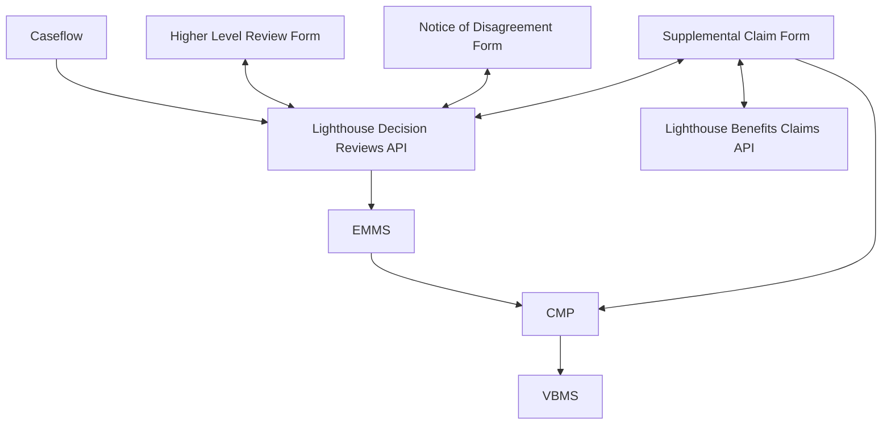

# Infrastructure Map

| Service                         | Slack Channel          | Contacts                                 |
|---------------------------------|------------------------|------------------------------------------|
| Lighthouse Decision Reviews API | #appeals-api           |                                          |
| EMMS (CMP)                      |                        | Jacob Shephard, Tim Wagner, Rashmi Pires |
| VBMS / BVA                      |                        | John Gosnell, William (Bo) Rollins       |
| Lighthouse Benefits Claims API  |                        |                                          |
| Caseflow                        | #caseflow-support-team |                                          |