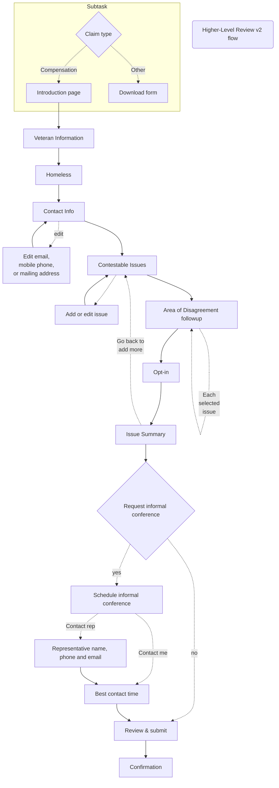

```mermaid
flowchart TB
    Title(Higher-Level Review v2 flow)

    subgraph one [Subtask]
    ClaimType{Claim type}
    ClaimType -. Compensation .-> Intro[Introduction page]
    ClaimType -. Other .-> DownloadForm[Download form]
    end

    Intro --> VetInfo[Veteran Information]
    VetInfo --> Homeless[Homeless]
    Homeless --> ContactInfo[Contact Info]

    ContactInfo -. edit .-> EditContactInfo
    EditContactInfo[Edit email,<br>mobile phone,<br>or mailing address] --> ContactInfo

    ContactInfo --> ContestableIssues[Contestable Issues]

    ContestableIssues -.-> AddOrEditIssue[Add or edit issue] --> ContestableIssues

    ContestableIssues --> AreaOfDisagreement[Area of Disagreement followup]
    AreaOfDisagreement -. Each <br> selected <br> issue .-> AreaOfDisagreement
    AreaOfDisagreement --> OptIn[Opt-in]
    OptIn --> IssueSummary[Issue Summary]
    IssueSummary -. Go back to <br> add more .-> ContestableIssues

    IssueSummary --> RequestInformalConference{Request informal conference}

    RequestInformalConference -. yes .-> ScheduleInformalConference[Schedule informal conference]
    RequestInformalConference -. no .-> ReviewAndSubmit[Review & submit]

    ScheduleInformalConference -. Contact me .-> BestTime[Best contact time]
    ScheduleInformalConference -. Contact rep .-> RepInfo[Representative name, phone and email]
    RepInfo --> BestTime
    BestTime --> ReviewAndSubmit
    ReviewAndSubmit --> Confirmation
```

Updated: 3/17/2025