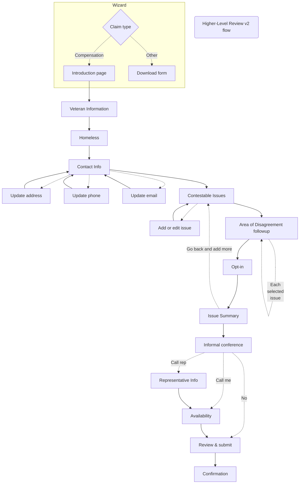

```mermaid
flowchart TB
    Title(Higher-Level Review v2 flow)

    subgraph one [Wizard]
    ClaimType{Claim type}
    ClaimType -. Compensation .-> Intro[Introduction page]
    ClaimType -. Other .-> DownloadForm[Download form]
    end

    Intro --> VetInfo[Veteran Information]
    VetInfo --> Homeless[Homeless]
    Homeless --> ContactInfo[Contact Info]

    ContactInfo -.-> UpdateAddress[Update address] --> ContactInfo
    ContactInfo -.-> UpdatePhone[Update phone] --> ContactInfo
    ContactInfo -.-> UpdateEmail[Update email] --> ContactInfo

    ContactInfo --> ContestableIssues[Contestable Issues]

    ContestableIssues -.-> AddOrEditIssue[Add or edit issue] --> ContestableIssues

    ContestableIssues --> AreaOfDisagreement[Area of Disagreement followup]
    AreaOfDisagreement -. Each \n selected \n issue .-> AreaOfDisagreement
    AreaOfDisagreement --> OptIn[Opt-in]
    OptIn --> IssueSummary[Issue Summary]
    IssueSummary -. Go back and add more .-> ContestableIssues

    IssueSummary --> InformalConference[Informal conference]
    InformalConference -. No .-> ReviewAndSubmit[Review & submit]
    InformalConference -. Call me .-> Availability[Availability]
    InformalConference -. Call rep .-> RepInfo[Representative Info]
    RepInfo --> Availability
    Availability --> ReviewAndSubmit
    ReviewAndSubmit --> Confirmation
```
