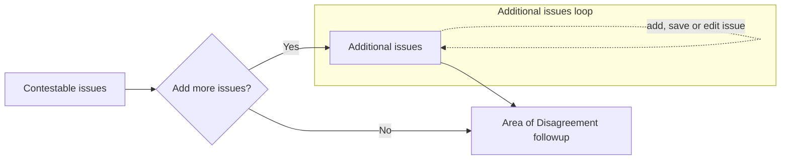
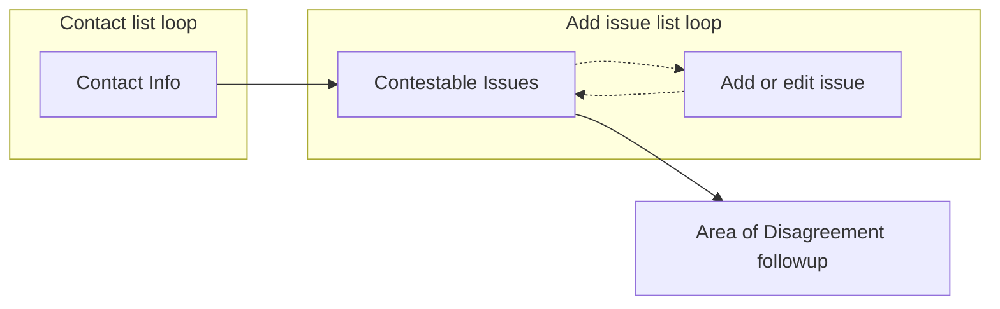
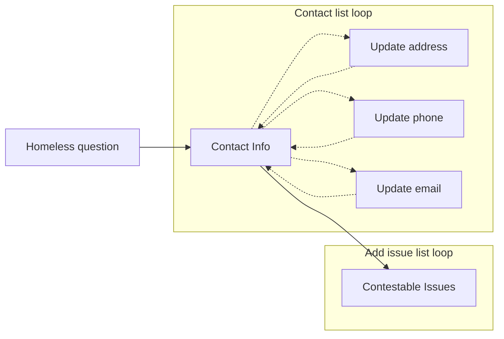

# Higher-Level Review details

## Frontend Code

Folder: https://github.com/department-of-veterans-affairs/vets-website/tree/main/src/applications/disability-benefits/996

## Decisions of note

Almost all of these sections match the Notice of Disagreement (NOD) tech docs because the two forms have a lot of similarity

### Subtask

In order to ask questions before starting the form, we needed to add a wizard; but the [wizard pattern](https://design.va.gov/patterns/wizards) was deprecated, and had no replacement. So, a new [subtask pattern](https://design.va.gov/patterns/help-users-to/complete-a-sub-task) was developed to ask one question per page.

The [subtask component](https://depo-platform-documentation.scrollhelp.site/developer-docs/va-forms-library-sub-tasks) was built based on the wizard code, and modified to show one question, or task, per page.

### Verify identity and missing info alerts

When a Veteran has not verified their account (Level of Assurance, LOA 1), the prefill (SSN & VA file number) and contestable issues will not load. This leads to a sub-optimal experience and likely a rejected submission. For unverified (LOA 1) users, we show an alert with a link pointing to the `/verify` page instead of the start button. Once verified (LOA 3), a Veteran can start the form normally.

Even with a verified identity (LOA 3), the Veteran may not have their date of birth (DoB) or Social Security Number (SSN) associated with their account. In this case, we show another alert letting the Veteran know that we couldn't find their DoB or SSN and that they must contact the help center. This data can't be modified online, and we can not submit the form if either is missing.

Note: The SSN isn't available on the introduction page (save-in-progress data loads on form start), so we check the [appeals policy](https://github.com/department-of-veterans-affairs/vets-api/blob/master/app/policies/appeals_policy.rb) Redux state in `user.profile.claims.appeals` which when `true`, lets us know that the policy has been satisfied (checks for LOA 3 and SSN). After the Veteran starts the form, we get the prefill last four of their SSN.

### Prefill

The backend is set up to provide:
- Veteran's mailing address; **but** we're not using it on the front end because it's available in Redux profile data, and it needs to be checked dynamically for updates. Prefill only happens upon starting a form the first time.
- Two additional pieces of prefill data are used:
  - Veteran's last 4 of their SSN
  - Veteran's last 4 of their VA File number (no longer used)

Returned within the `nonPrefill` part of the data

```js
{
  "formData": {
    // Only HLR & NOD have this "nonPrefill" wrapper
    "nonPrefill": {
      // Data for Veteran info page
      "veteranSsnLastFour": "7865",
      "veteranVaFileNumberLastFour": "7865"
    }
  },
  "metadata": {
    "version": 0,
    "prefill": true,
    "returnUrl": "/veteran-information"
  }
}
```

### Homelessness

HLR has a "I am experiencing homelessness or am at risk of homelessness" checkbox in the PDF (expires Mar 31, 2027) and similar question appears in the online form; but, it is not following the recommended [housing status design pattern](https://design.va.gov/patterns/ask-users-for/housing-status). See collaboration cycle ticket [#95176](https://github.com/department-of-veterans-affairs/va.gov-team/issues/95176). We'll likely have to wait until these fields are available in the PDF before updating the online form, or when Lighthouse can auto-establish the HLR form instead of filling out a PDF and sending it to the Central Mail Portal.

### Contact information

Our Decision Review forms display and allow editing profile contact information (address, email, home & mobile phone). The ["Hub and spoke" documentation](https://depo-platform-documentation.scrollhelp.site/developer-docs/va-forms-library-how-to-create-the-contact-info-ar) which is out-of-date (as of 3/2025); refer to the [updated contact info documentation in this ticket](https://github.com/department-of-veterans-affairs/vets-design-system-documentation/issues/2262).

There has also been a design update following the [updatable prefilled information pattern](https://design.va.gov/patterns/help-users-to/update-prefilled-information#prefilled-information-the-user-can-update). Which is being worked on by the profile team.

Note: If the Veteran indicates that they are homeless, or at risk, the mailing address on the contact information page is made optional.

### Primary phone

For HLR & NOD, the contact information page only asks the user to edit their mobile phone; but after some discussion (no research) we decided to include both the home and mobile number on the contact info page since some Veteran's may not have a mobile phone, or even a home phone. The contact info page uses profile components which requires both a mobile and home phone to be filled in. Then immediately after the contact page would be a page asking the Veteran about their primary phone number. See [implementation ticket #68870](https://github.com/department-of-veterans-affairs/va.gov-team/issues/68870).

### Contestable issues

We get a list of contestable issues after the form has started from within the main form application file. The call is in the wrapper to ensure that if the Veteran returns to the form at a later date, only the latest list of contestable issues is shown.

The frontend makes an api call to [`/decision_reviews/v1/supplemental_claims/contestable_issues/compensation`](https://department-of-veterans-affairs.github.io/va-digital-services-platform-docs/api-reference/?url=https://dev-api.va.gov/v1/apidocs#/supplemental_claims/getContestableIssues3) (we're only supporting "compensation" benefits types currently). Our backend uses this Lighthouse endpoint ([`/contestable_issues/higher_level_reviews?benefit_type=compensation`](https://developer.va.gov/explore/api/decision-reviews/docs?version=current)). The result is:

<details><summary>Example JSON of contestable issues with legacy data</summary>

```js
{
  "data": [
    {
      // contestable issue
      "id": null,
      "type": "contestableIssue",
      "attributes": {
        "ratingIssueReferenceId": "142894",
        "ratingIssueProfileDate": "2021-03-12",
        "ratingIssueDiagnosticCode": "5260",
        "ratingIssueSubjectText": "Ankylosis of knee",
        "ratingIssuePercentNumber": "10",
        "description": "Service connection for Ankylosis of knee is granted with an evaluation of 10 percent effective December 2, 2020.",
        "isRating": true,
        "latestIssuesInChain": [{
          "id": null,
          "approxDecisionDate": "2021-03-12"
        }],
        "decisionIssueId": null,
        "ratingDecisionReferenceId": null,
        "approxDecisionDate": "2021-03-12",
        "rampClaimId": null,
        "titleOfActiveReview": null,
        "sourceReviewType": null,
        "timely": true
      }
    },
    // any additional contestable issues
    {
      // Legacy appeals appended to this list
      "id": "35",
      "type": "legacyAppeal",
      "attributes": {
        // 3 legacy appeals shown here, this array will be empty if the
        // Veteran has no legacy appeals
        "issues": [{
          "summary": "Service connection, benign ear neoplasm"
        }, {
          "summary": "New and material evidence to reopen claim for service connection, impairment of knee"
        }, {
          "summary": "Service connection, migraines"
        }],
        // Mock user 233
        "veteranFullName": "Cara Bartlett",
        "decisionDate": "2021-10-17T00:00:00.000Z",
        "latestSocSsocDate": "2021-09-18T00:00:00.000Z"
      }
    }
  ]
}
```
</details>
<br />

Legacy appeals are all combined into one entry (the last entry) with a different `"type"`, but only the `"summary"` is provided and the wording may or may not match the contestable issue's `ratingIssueSubjectText` or `description`. So we have no sure method to coorelate legacy appeals with eligible issues.

Additionally, the issues provided by Lighthouse need additional processing. In the [`getEligibleContestableIssues` function](https://github.com/department-of-veterans-affairs/vets-website/blob/main/src/applications/appeals/shared/utils/issues.jsx#L222), contestable issues loaded from the API are filtered out:
- If the `ratingIssueSubjectText` or `description` contains any of the following words, the issues are no longer considered to be eligible:
  - `deferred`
  - `apportionment`
  - `attorney fees`
- Have a `approxDecisionDate` greater than one year in the past (HLR only).

Before being added to the form data, the [`processContestableIssues` function](https://github.com/department-of-veterans-affairs/vets-website/blob/main/src/applications/appeals/shared/utils/issues.jsx#L101):
- Filters out issues with no `ratingIssueSubjectText`
- Sorts the list by newest date first, then by title if the dates are equal

A collaboration cycle for the new SC flow (3/2025) included a ticket to update the contestable issue cards. We should be using a [va-checkbox tile with custom content](https://design.va.gov/storybook/?path=/docs/uswds-va-checkbox--docs#tile-with-custom-content) (see [#102160](https://github.com/department-of-veterans-affairs/va.gov-team/issues/102160)). The code is located in the appeals shared folder, so changing it will effect all Decision Review forms. Partial implementation can be found in the [`102160-imposter-checkbox` branch](https://github.com/department-of-veterans-affairs/vets-website/tree/102160-imposter-checkbox) - updating of keyboard-only end-to-end tests remain.

### Use of `appStateSelector`

In the `config/form.js` file, use of `appStateSelector` is necessary to provide the form data for both the `contestableIssues` and `additionalIssues` because of a bug in the form system that does not provide the correct `formData` value on the review & submit page. Instead of `formData`, the `fieldData` (data only for that page) is provided and breaks validation.

### Opt-in page

The Higher-Level Review (HLR) v2 update made it very similar to the Notice of Disagreement form, except for this page. This opt-in page is optional and includes a checkbox (unlike NOD's page). It is only shown when 1) the contestable issues endpoint includes legacy appeals, or 2) if an issue is manually entered.

### List loop pattern

When the HLR form was created, list loops were done in-line (see [Arrays example](https://rjsf-team.github.io/react-jsonschema-form/)) and [list loop tech notes](https://depo-platform-documentation.scrollhelp.site/developer-docs/va-forms-library-how-to-work-with-array-data-aka-l).

For v2, there were originally 3 pages:

1. Contestable issues loaded from the API - this page allowed Veteran to select, via checkbox, issues to include in the submitted HLR
2. Gating page asking a yes/no question to the Veteran about adding more issues.
3. Add issue list loop page with checkboxes for each.



<details><summary>Additional issues list loop appearance</summary>


</details>

<p></p>

In an NOD<sup>*</sup> design review, we were directed to simplify this process by showing all the issues (API-loaded and user entered) on one page. The page would include a link to edit or add an issue on a separate page. The Veteran would no longer have to remember what API loaded issues were included.

Luckily, the form system team had just implemented a [custom page method](https://department-of-veterans-affairs.github.io/veteran-facing-services-tools/forms/bypassing-schemaform) which allowed bypassing the form-systems linear flow.



<details><summary>New combined issue page appearance</summary>


</details>

<p></p>

**\* Note:** The design review with the new list loop pattern was for the NOD form, but since HLR was so similar, all that work was copied over to HLR.

See the [list loop tech notes v2](https://depo-platform-documentation.scrollhelp.site/developer-docs/va-forms-library-how-to-use-add-item-link-in-array) for details on how this is set up.

---

A similar list-loop pattern is also used on the contact info page. In place originally was a link directing the Veteran to their profile page in a new tab, but it was not an ideal method since we shifted the Veteran out of the form flow. So we implemented code from the profile team which opened up an editor within a modal. At the design review, this was considered confusing. The profile team, again luckily, had just implemented code that allowed inline editing of profile data, but we instead followed the review recommendation of creating a new page for each bit of contact info that was to be edited: mailing address, mobile phone and email - see [hub and spoke pattern documentation](https://depo-platform-documentation.scrollhelp.site/developer-docs/va-forms-library-how-to-create-the-contact-info-ar).



See the [list loop tech notes v2](https://depo-platform-documentation.scrollhelp.site/developer-docs/va-forms-library-how-to-create-the-contact-info-ar) for details on how this is set up.

## What are some things we'd make better if we had more time?

### Contact loop testing

The `hlr-contact-loop.cypress.spec.js` file tests the loop from the contact info page to each of the subpages:
- First cancelling the change, and return to the contact info page.
- Secondly changing and updating the info and returning to the contact info page

The problem is with the address change intermediate step. If an entered address isn't 100% accurate, it should show a page asking to verify or choose another address. The problem may be with the code in [`ProfileInformationFieldController.jsx`](https://github.com/department-of-veterans-affairs/vets-website/blob/main/src/platform/user/profile/vap-svc/components/ProfileInformationFieldController.jsx) (around line 160).
