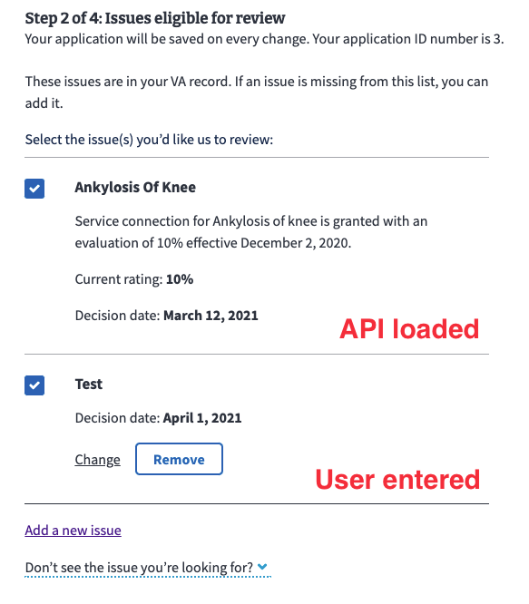

# Higher-Level Review details

## Frontend Code

Folder: https://github.com/department-of-veterans-affairs/vets-website/tree/main/src/applications/disability-benefits/996

## Decisions of note

Almost all of these sections match the Notice of Disagreement (NOD) tech docs because the two forms have a lot of similarity

### Verify identity

When a Veteran has not verified their account (LOA 1), the prefill (SSN & VA file number) and contestable issues will not load. This leads to a sub-optimal experience and possibly rejected submission. We are now showing an alert with a link pointing to the `/verify` page instead of the start button. Once verified (LOA 3), the Veteran can start the form normally.

### Prefill

The backend is set up to provide:
- Veteran's mailing address; **but** we're not using it on the front end because it's available in Redux profile data, and it needs to be checked dynamically for updates. Prefill only happens upon starting a form the first time.
- Two additional pieces of prefill data are used:
  - Veteran's last 4 of their SSN
  - Veteran's last 4 of their VA File number

Returned within the `nonPrefill` part of the data

```js
{
  "formData": {
    "data": {
      "attributes": {
        "veteran": {
          "address": {
            // HLR v1 required submitting only the zipCode, v2 needs the
            // entire address
            "zipCode5": "12345"
          }
        }
      }
    },
    "nonPrefill": {
      // Address is not used, because it's added in prefill, but never updated
      "veteranAddress": {
        "street": "123 Main",
        "city": "Big City",
        "state": "VA",
        "postalCode": "12345"
      },
      // Data for Veteran info page
      "veteranSsnLastFour": "7865",
      "veteranVaFileNumberLastFour": "7865"
    }
  },
  "metadata": {
    "version": 0,
    "prefill": true,
    "returnUrl": "/veteran-information"
  }
}
```

### Contestable and legacy issues

As of HLR v2, the only supported `benefit_type` on the front-end is "compensation". Lighthouse has recently completed work that will include additional types, but it has yet to be supported by the front-end.

Lighthouse provides two separate endpoints:
- Contestable issues (`/v2/contestable_issues/{benefit_type}`, but this may go away as Lighthouse is planning on combining HLR & NOD contestable issues.
- Legacy issues (`/legacy_appeals`).

Our backend combines the data from both to reduce the number of API calls. The result is:

```js
{
  "data": [
    {
      // contestable issue
      "id": null,
      "type": "contestableIssue",
      "attributes": {
        "ratingIssueReferenceId": "142894",
        "ratingIssueProfileDate": "2021-03-12",
        "ratingIssueDiagnosticCode": "5260",
        "ratingIssueSubjectText": "Ankylosis of knee",
        "ratingIssuePercentNumber": "10",
        "description": "Service connection for Ankylosis of knee is granted with an evaluation of 10 percent effective December 2, 2020.",
        "isRating": true,
        "latestIssuesInChain": [{
          "id": null,
          "approxDecisionDate": "2021-03-12"
        }],
        "decisionIssueId": null,
        "ratingDecisionReferenceId": null,
        "approxDecisionDate": "2021-03-12",
        "rampClaimId": null,
        "titleOfActiveReview": null,
        "sourceReviewType": null,
        "timely": true
      }
    },
    // any additional contestable issues
    {
      // Legacy appeals appended to this list
      "id": "35",
      "type": "legacyAppeal",
      "attributes": {
        // 3 legacy appeals shown here, this array will be empty if the
        // Veteran has no legacy appeals
        "issues": [{
          "summary": "Service connection, benign ear neoplasm"
        }, {
          "summary": "New and material evidence to reopen claim for service connection, impairment of knee"
        }, {
          "summary": "Service connection, migraines"
        }],
        // Mock user 233
        "veteranFullName": "Cara Bartlett",
        "decisionDate": "2021-10-17T00:00:00.000Z",
        "latestSocSsocDate": "2021-09-18T00:00:00.000Z"
      }
    }
  ]
}
```

Legacy appeals are all combined into one entry (the last entry) with a different `"type"`, but only the `"summary"` is provided and the wording may or may not match the contestable issue's `ratingIssueSubjectText` or `description`. So we have no sure method to coorelate legacy appeals with eligible issues.

Additionally, the issues provided by Lighthouse need additional processing. In the [`getEligibleContestableIssues` function](https://github.com/department-of-veterans-affairs/vets-website/blob/main/src/applications/appeals/996/utils/helpers.js#L55), contestable issues loaded from the API are filtered out:
- If they contain the word `deferred` in either the `ratingIssueSubjectText` or `description` as these issues are no longer eligible.
- Have a `approxDecisionDate` greater than one year in the past.

Before being added to the form data, the [`processContestableIssues` function](https://github.com/department-of-veterans-affairs/vets-website/blob/main/src/applications/appeals/996/utils/helpers.js#L187):
- Filters out issues with no `ratingIssueSubjectText`
- Sorts the list by newest date first, then by title if the dates are equal

These two functions may be more clean/dry if combined in the future.

### Use of `appStateSelector`

In the `config/form.js` file, use of `appStateSelector` is necessary to provide the form data for both the `contestableIssues` and `additionalIssues` because of a bug in the form system that does not provide the correct `formData` value on the review & submit page. Instead of `formData`, the `fieldData` (data only for that page) is provided and breaks validation.

### List loop pattern

When the HLR form was created, list loops were done in-line (see [Arrays example](https://rjsf-team.github.io/react-jsonschema-form/)) and [list loop tech notes](https://github.com/department-of-veterans-affairs/va.gov-team/blob/master/teams/vsa/engineering/forms-system/list_loop.md).

For v2, there were originally 3 pages:

1. Contestable issues loaded from the API - this page allowed Veteran to select, via checkbox, issues to include in the submitted HLR
2. Gating page asking a yes/no question to the Veteran about adding more issues.
3. Add issue list loop page with checkboxes for each.


<details><summary>Additional issues list loop appearance</summary>


</details>

<p></p>

In an NOD<sup>*</sup> design review, we were directed to simplify this process by showing all the issues (API-loaded and user entered) on one page. The page would include a link to edit or add an issue on a separate page. The Veteran would no longer have to remember what API loaded issues were included.

Luckily, the form system team had just implemented a [custom page method](https://department-of-veterans-affairs.github.io/veteran-facing-services-tools/forms/bypassing-schemaform) which allowed bypassing the form-systems linear flow.


<details><summary>New combined issue page appearance</summary>


</details>

<p></p>

**\* Note:** The design review with the new list loop pattern was for the NOD form, but since HLR was so similar, all that work was copied over to HLR.

See the [list loop tech notes v2](https://github.com/department-of-veterans-affairs/va.gov-team/blob/master/teams/vsa/engineering/forms-system/list_loop_v2.md) for details on how this is set up.

---

A similar list-loop pattern is also used on the contact info page. In place originally was a link directing the Veteran to their profile page in a new tab, but it was not an ideal method since we shifted the Veteran out of the form flow. So we implemented code from the profile team which opened up an editor within a modal. At the design review, this was considered confusing. The profile team, again luckily, had just implemented code that allowed inline editing of profile data, but we instead followed the review recommendation of creating a new page for each bit of contact info that was to be edited: mailing address, mobile phone and email.


See the [list loop tech notes v2](https://github.com/department-of-veterans-affairs/va.gov-team/blob/master/teams/vsa/engineering/forms-system/list_loop_v2.md) for details on how this is set up.

### Opt-in page

The Higher-Level Review (HLR) v2 update made it very similar to the Notice of Disagreement form, except for this page. This opt-in page is optional and includes a checkbox (unlike NOD's page). It is only shown when 1) the contestable issues endpoint includes legacy appeals, or 2) if an issue is manually entered.


## What are some things we'd make better if we had more time?

### Replace wizard with subtask

The wizard on the `/start` page is deprecated

### Contact loop testing

The `hlr-contact-loop.cypress.spec.js` file tests the loop from the contact info page to each of the subpages:
- First cancelling the change, and return to the contact info page.
- Secondly changing and updating the info and returning to the contact info page

The problem is with the address change intermediate step. If an entered address isn't 100% accurate, it should show a page asking to verify or choose another address. The problem may be with the code in [`ProfileInformationFieldController.jsx`](https://github.com/department-of-veterans-affairs/vets-website/blob/main/src/platform/user/profile/vap-svc/components/ProfileInformationFieldController.jsx) (around line 160).
