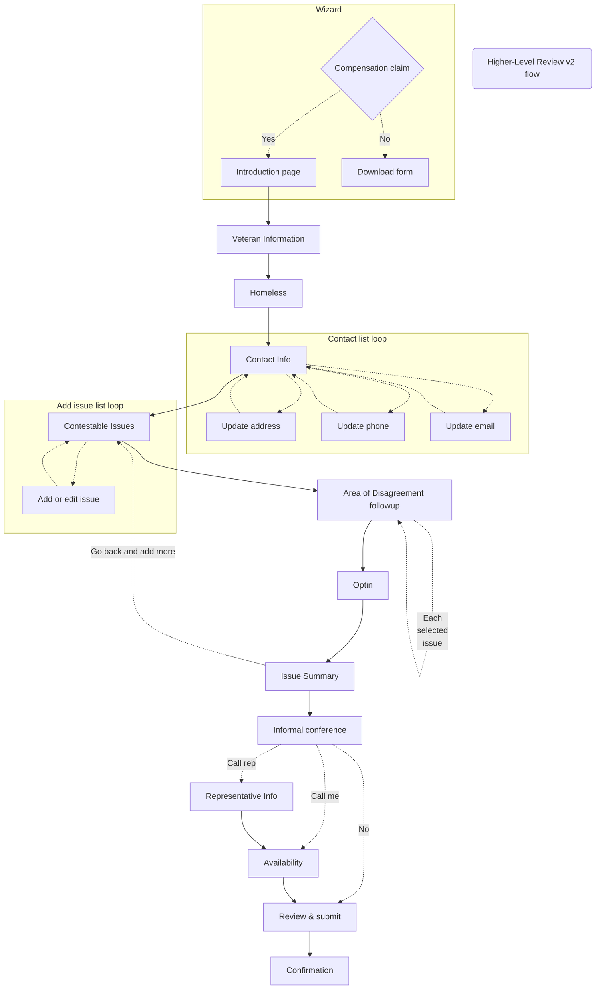

# Engineering

## Front-end

- [Overview](HLR_frontend_overview.md)
- [Details](HLR_frontend_details.md)

```mermaid
flowchart TB
    Title(Higher-Level Review v2 flow)

    subgraph one [Wizard]
    A{Compensation claim}
    A -. Yes .-> B[Introduction page]
    A -. No .-> C[Download form]
    end

    B --> D[Veteran Information]
    D --> E[Homeless]
    E --> F[Contact Info]

    subgraph two [Contact list loop]
    F -.-> G[Update address] -.-> F
    F -.-> H[Update phone] -.-> F
    F -.-> I[Update email] -.-> F
    end

    F --> J[Contestable Issues]

    subgraph three [Add issue list loop]
    J -.-> K[Add or edit issue] -.-> J
    end

    J --> L[Area of Disagreement followup]
    L -. Each \n selected \n issue .-> L
    L --> M[Optin]
    M --> N[Issue Summary] -. Go back and add more .-> J

    N --> O[Informal conference]
    O -. No .-> T[Review & submit]
    O -. Call me .-> S[Availability]
    O -. Call rep .-> R[Representative Info]
    R --> S
    S --> T
    T --> U[Confirmation]
```
