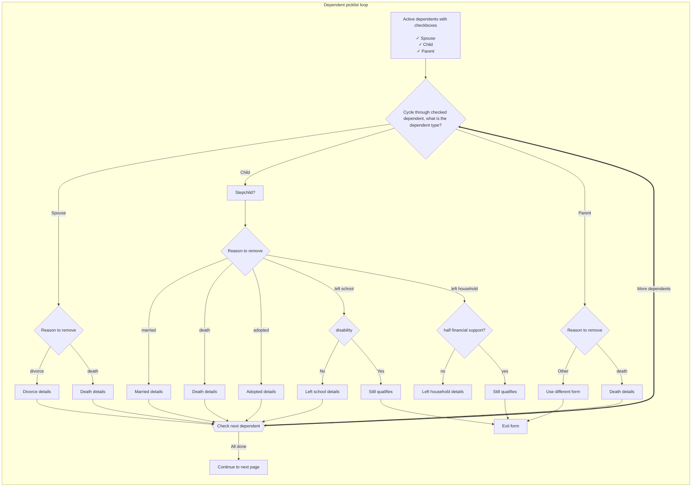

Picklist flow overview within Form 686C

```mermaid
flowchart TD
  Start[Active dependents with checkboxes<br><br>✓ Spouse<br>✓ Child<br>✓ Parent]

  subgraph DepLoop[Dependent picklist loop]
    direction TB
    DepType{Cycle through checked dependent, what is the dependent type?}
    Start --> DepType
    DepType -- "Spouse" --> SpouseQ0{Reason to remove}
    SpouseQ0 -- "divorce" --> SpouseQ1[Divorce details]
    SpouseQ1 --> NextDep
    SpouseQ0 -- "death" --> SpouseQ2[Death details]
    SpouseQ2 --> NextDep@{ shape: hex, label: "Check next dependent" }

    DepType -- "Child" --> ChildQ0[Stepchild?]
    ChildQ0 --> ChildQ1{Reason to remove}
    ChildQ2a -- "No" --> ChildQ2b[Left school details]
    ChildQ2b --> NextDep
    ChildQ1 -- "married" --> ChildQ3[Married details]
    ChildQ3 --> NextDep
    ChildQ1 -- "death" --> ChildQ4[Death details]
    ChildQ4 --> NextDep
    ChildQ1 -- "adopted" --> ChildQ5[Adopted details]
    ChildQ5 --> NextDep
    ChildQ1 -- "left school" --> ChildQ2a{disability}
    ChildQ2a -- "Yes" --> ChildQ2x[Still qualifies]
    ChildQ2x --> exit[Exit form]
    ChildQ1 -- "left household" --> ChildQ7{half financial support?}
    ChildQ7 -- "no" --> ChildQ7b[Left household details]
    ChildQ7 -- "yes" --> ChildQ7x[Still qualifies]
    ChildQ7x --> exit[Exit form]


    DepType -- "Parent" --> ParentQ0{Reason to remove}
    ParentQ0 -- "Other" --> ParentQx[Use different form]
    ParentQx --> exit
    ParentQ0 -- "death" --> ParentQ1[Death details]
    ParentQ1 --> NextDep

    NextDep == "More dependents" ==> DepType
    NextDep -- "All done" --> Done[Continue to next page]
  end
```
