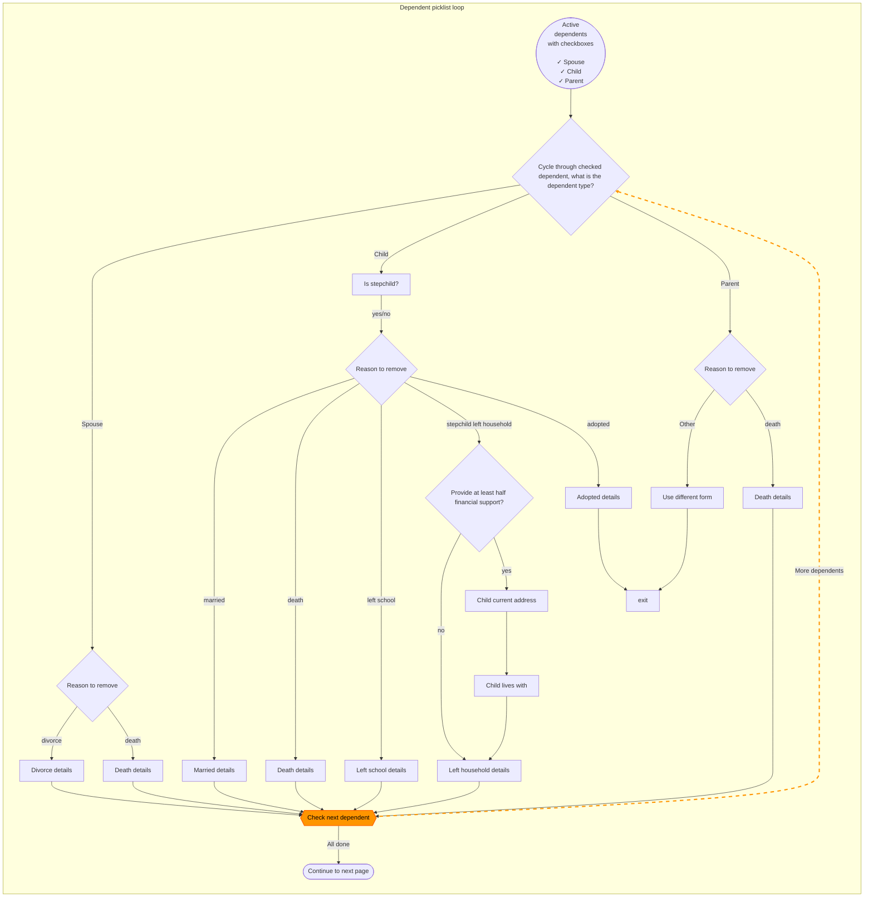

Picklist flow overview within Form 686C

```mermaid
flowchart TD
  Start([Active<br>dependents<br>with checkboxes<br><br>✓ Spouse<br>✓ Child<br>✓ Parent])

  subgraph DepLoop[Dependent picklist loop]
    direction TB
    DepType{Cycle through checked dependent, what is the dependent type?}
    Start --> DepType
    DepType -- "Spouse" --> SpouseReasonToRemove{Reason to remove}
    SpouseReasonToRemove -- "divorce" --> SpouseDetails[Divorce details]
    SpouseDetails --> NextDep
    SpouseReasonToRemove -- "death" --> SpouseDeathDetails[Death details]
    SpouseDeathDetails --> NextDep

    DepType -- "Child" --> ChildIsStepchild[Is stepchild?]
    ChildIsStepchild -- yes/no --> ChildReasonToRemove{Reason to remove}
    ChildLeftSchoolDetails --> NextDep
    ChildReasonToRemove -- "married" --> ChildMarriedDetails[Married details]
    ChildMarriedDetails --> NextDep
    ChildReasonToRemove -- "death" --> ChildDeathDetails[Death details]
    ChildDeathDetails --> NextDep
    ChildReasonToRemove -- "left school" --> ChildLeftSchoolDetails[Left school details]
    ChildReasonToRemove -- "stepchild left household" --> ChildHalfFinancialSupport{Provide at least half financial support?}
    ChildHalfFinancialSupport -- "no" --> ChildLeftHouseholdDetails[Left household details]
    ChildLeftHouseholdDetails --> NextDep
    ChildHalfFinancialSupport -- "yes" --> ChildAddress[Child current address]
    ChildAddress --> ChildLivesWith[Child lives with]
    ChildLivesWith --> ChildLeftHouseholdDetails
    ChildReasonToRemove -- "adopted" --> ChildAdoptedDetails[Adopted details]
    ChildAdoptedDetails --> exit

    DepType -- "Parent" --> ParentReasonToRemove{Reason to remove}
    ParentReasonToRemove -- "Other" --> ParentExit[Use different form]
    ParentExit --> exit
    ParentReasonToRemove -- "death" --> ParentDeathDetails[Death details]
    ParentDeathDetails --> NextDep

    NextDep@{ shape: hex, label: "Check next dependent" }
    NextDep l1@-- "More dependents" --> DepType
    NextDep -- "All done" --> Done([Continue to next page])
  end

  classDef animate stroke-dasharray: 9,5,stroke-dashoffset: 1200,animation: dash 25s linear infinite, stroke:#ff9500, stroke-width:3px;
  class l1 animate

  %% Styling
  style NextDep fill:#ff9500,stroke:#ff6600,stroke-width:2px,color:#000000

```

updated: 1/26/2026
