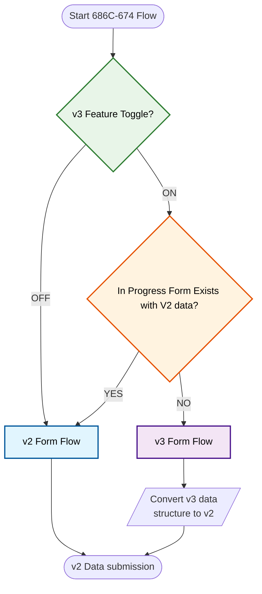

# Transition 686C-674 v2 to v3 (picklist) strategy

## Slack discussion

Sanja Bajovic [Oct 22, 2025 at 11:30 AM ET](https://dsva.slack.com/archives/C0547Q0K0LF/p1761147054864329)
AI meeting notes from V2/V3 discussion between @Alan Werner @Robin Garrison and I. It does decent job.
Generated by AI. Be sure to check for accuracy.
Meeting notes:
- *V2 to V3 Form Transition Strategy*: Sanja and Robin discussed the approach for transitioning users from the V2 to V3 form flow, agreeing that users should complete their current V2 forms before being moved to V3, with Alan and Emily also involved in related planning for V1 users.
  - *Transition Criteria*: Robin explained that users already in the V2 flow should be allowed to finish their forms, and only upon restarting or completing the form would they be moved to the V3 flow, ensuring a clear separation between the two processes.
  - *Handling In-Progress Forms*: Robin clarified that users with a save in progress in V2 would not be switched to V3 mid-process; only new forms would use the V3 flow, maintaining data integrity and minimizing confusion.
  - *V1 User Options*: Sanja mentioned an upcoming meeting with Emily to discuss options for V1 users, including when to transition them out of the legacy flow, with Alan providing current user counts to inform the decision.
- *V3 Data Structure and Transformation Process*: Robin presented the new V3 data structure for dependent management and explained the technical process for converting V3 data to the V2 format upon submission, with Sanja confirming understanding and raising questions about long-term backend changes.
  - *V3 Data Structure Overview*: Robin described the new V3 data structure, which includes a 'view, remove dependents pick list' that organizes active dependents and allows for dynamic addition and removal, streamlining the form process.
  - *Conversion on Submission*: Robin explained that when a V3 form is submitted, the front end converts the V3 data structure into the V2 format, which the backend uses to generate PDFs, ensuring compatibility and minimizing backend changes.
  - *Long-Term Backend Strategy*: Sanja asked whether the V3-to-V2 conversion should be maintained indefinitely or if the backend should eventually adopt the V3 format; Robin suggested a gradual transition, allowing the backend to process both formats until ready to fully switch.
  - *Testing Conversion Logic*: Sanja emphasized the importance of thoroughly testing the V3-to-V2 conversion on submission, noting that previous transitions (V1 to V2) caused backend issues, and Robin agreed on the need for robust testing.
- *Release Planning and Staging Review Timeline*: Alan outlined the timeline for the upcoming staging review, noting that all work and testing must be completed by the end of November, with Robin and Sanja discussing the need for thorough testing and coordination with Hui and other team members.
  - *Staging Review Scheduling*: Alan scheduled the staging review appointment for December 5th, explaining that all artifacts and testing must be finalized four days prior, effectively setting a deadline at the end of November.
  - *Testing Responsibilities*: Robin and Sanja discussed the need for Hui and possibly other engineers and designers to test all pathways in the new flow, ensuring readiness for the staging review and minimizing the risk of issues.
  - *Release Coordination*: Sanja and Alan reviewed the release plan, acknowledging the tight timeline and the importance of being prepared for any issues that might arise during the review process.
- *User Metrics and Progress Tracking*: Alan provided updates on the number of active V1 users, showing a significant decrease over the past week, with Sanja noting the trend and planning to use this data in future transition decisions.
  - *V1 User Count Update*: Alan reported that the number of V1 users dropped from 480 to 328 over six days, indicating rapid progress in user migration and informing the team's planning for future transitions.
- *Documentation and Communication Plans*: Sanja suggested creating a decision flow diagram to document the transition logic for internal and stakeholder reference, with Robin agreeing to take on this task.
  - *Decision Flow Diagram*: Sanja requested a visual diagram of the transition logic between V2 and V3 flows to aid in communication and record-keeping, and Robin agreed to prepare the documentation.

Follow-up tasks:
- *Decision Flow Documentation*: Create a decision flow diagram to document the V2/V3 form logic for future reference and explanation to stakeholders. (Robin)
- *Event Count Analysis*: Check and report the current number of V1 events/users to inform decisions about transitioning V1 users. (Sanja)
- *V1 User Transition Planning*: Meet with Emily to discuss options and timing for transitioning V1 users and determine at what point to remove them from the system. (Sanja)
- *V3 to V2 Data Conversion Testing*: Thoroughly test the V3 to V2 data conversion process on submission to ensure reliability and minimize risks. (the team)
- *Staging Review Preparation*: Ensure all features and artifacts for the pick list are ready and tested by the end of November in preparation for the December 5th staging review appointment. (the team)

----

## Decision flow diagram

