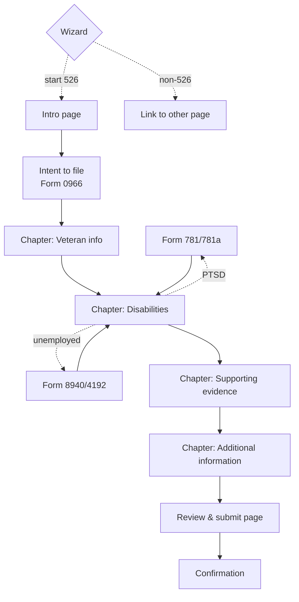
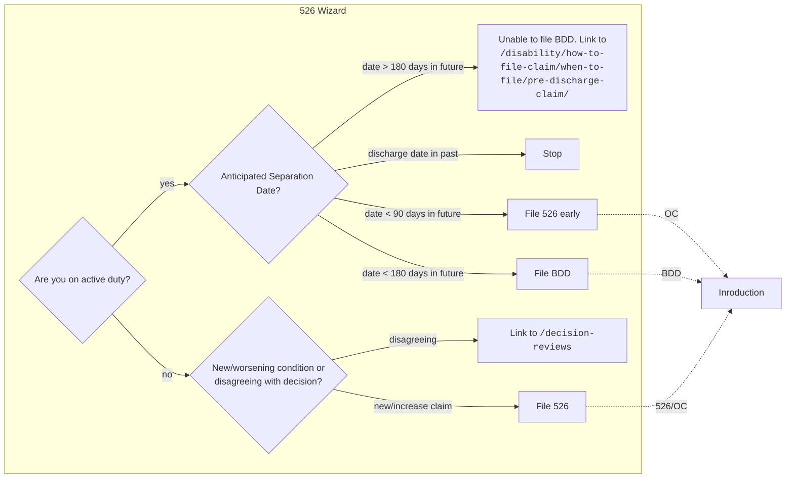
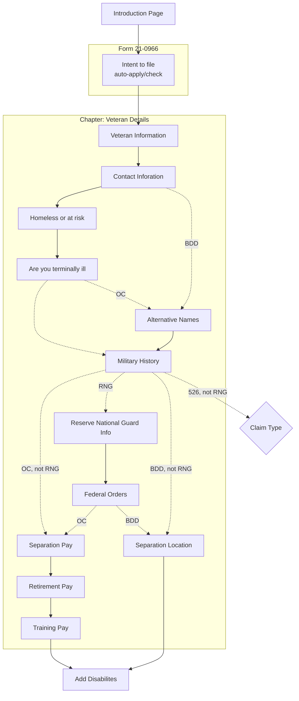
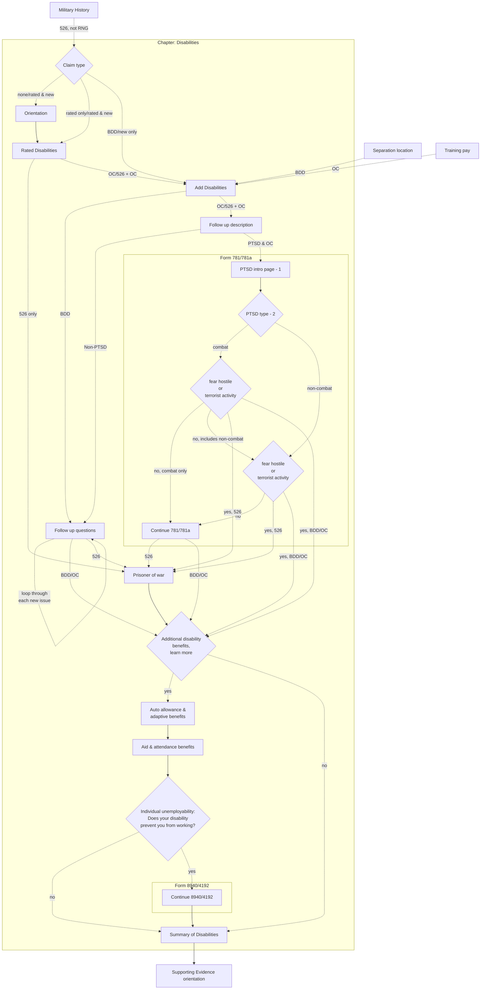
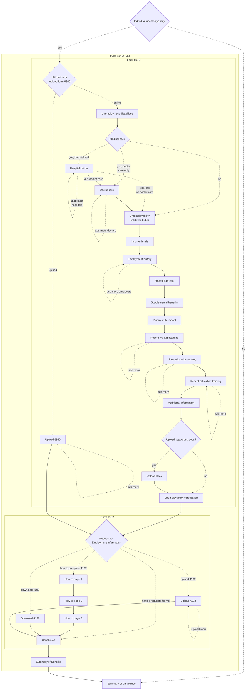
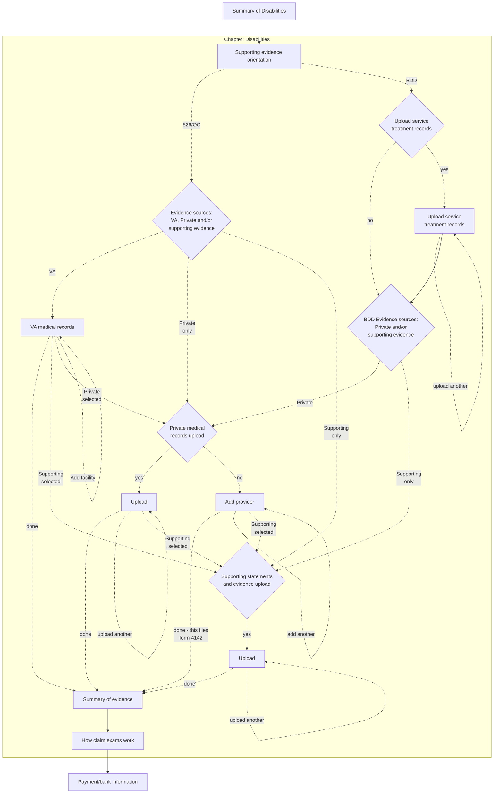
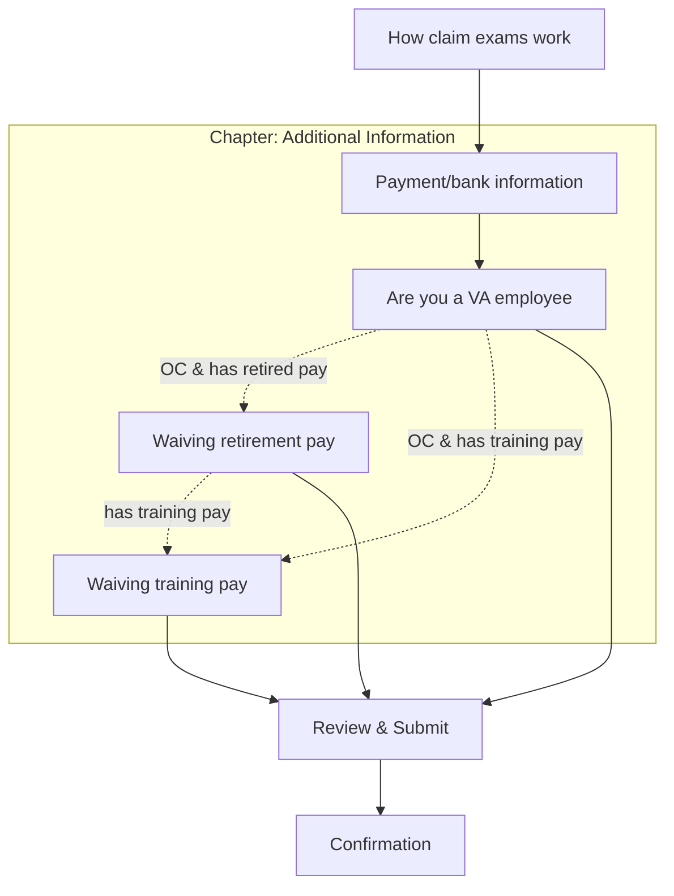

## Additional documentation can be viewed in the [526 Form Flow Mural](https://app.mural.co/t/departmentofveteransaffairs9999/m/departmentofveteransaffairs9999/1686768383603/3f4415dd2ddb71bbd104ebefd92a2c7b553ad792?invited=true&sender=u2905941a69b3083a009c9997).

## Legend

- `526` = has Rated Disabilities
- `OC` = Original claim - no rated disabilities
- `BDD` = Benefits Delivery at Discharge - separating in 90-180 days & no rated disabilities
- `RNG` = History in Reserves or National Guard
- `PTSD` = new PTSD claim

\* NOTE Forms 8940 and 4192 are not visible in production (3/2022)

## Overall workflow (3/2022)



## Wizard

Only seen when logged in. Or, go directly to the start page:

https://www.va.gov/disability/file-disability-claim-form-21-526ez/start
https://staging.va.gov/disability/file-disability-claim-form-21-526ez/start



## Veteran Details
Step 1 of 5



## Disabilities
Step 2 of 5

### Main flow



### PTSD

781/781a flow

```mermaid
graph TD

    FollowUpDescription -. PTSD & OC .-> NewPTSDFollowup

    subgraph Form781 [Form 781/781a]

    PTSDType{PTSD type} %% 2
    NewPTSDFollowup[PTSD intro page - 1] --> PTSDType
    PTSDType -. sexual/personal .-> 781aOnlineOrUpload{Fill online or<br>Upload Form 781a} %% 2
    PTSDType -. combat .-> CombatBypass{fear hostile<br>or<br>terrorist activity}
    PTSDType -. non-combat .-> NonCombatBypass{fear hostile<br>or<br>terrorist activity}


    CombatBypass -. no, combat only .-> OnlineOrUpload781
    CombatBypass -. no, include non-combat .-> NonCombatBypass
    NonCombatBypass -. no .-> OnlineOrUpload781{Fill online or<br>Upload Form 781}

    OnlineOrUpload781 -. upload .-> 781Upload[Upload Completed Form 781]
    OnlineOrUpload781 -. online .-> 781StartLoop

    %% ============================= Form 781
    subgraph Form781Loop [Form 781 loop]

    781StartLoop[Medals or Citations] %% 3
    781StartLoop --> 781EventDate[Event date] %% 4
    781EventDate --> 781UnitAssignment[Unit assignment] %% 5
    781UnitAssignment --> 781EventLocation[Event Location] %% 6
    781EventLocation --> 781IndividualsInvolved{Individuals involved} %% 7
    781IndividualsInvolved --> 781Break8[Take a break] %% 8

    781Break8 -. no individuals .-> 781EventDescription
    781IndividualDetail[Add individual details] %% 9
    781Break8 -. is adding individuals .-> 781IndividualDetail
    781IndividualDetail -. add more loop .-> 781IndividualDetail
    781IndividualDetail --> 781IndividualBreak[Take a break] %% 10
    781IndividualBreak --> 781EventDescription

    781EventDescription[Event description] %% 11
    781AddAnotherEvent{Add another event} %% 12
    781FinalIncident[Additional events<br>summation] %% 13
    781AdditionalRemarks[Additional remarks] %% 14

    781EventDescription --> 781AddAnotherEvent
    781AddAnotherEvent -. yes, max 4 .-> 781StartLoop
    781AddAnotherEvent -. no .-> 781AdditionalRemarks
    781AddAnotherEvent -. on 4th loop .-> 781FinalIncident
    781FinalIncident --> 781AdditionalRemarks

    end

    781AdditionalRemarks --> 781aOnlineOrUpload

    781AddAnotherEvent -. no, sexual/personal .-> 781aOnlineOrUpload

    781aOnlineOrUpload -. upload .-> 781aUpload[Upload Form 781a]
    781aOnlineOrUpload -. online .-> 781aIncidentDate

    %% ============================= Form 781a
    subgraph Form781a

    subgraph Form781aLoop

    781aIncidentDate[Incident date] %% 3
    781aIncidentDate --> 781aUnitAssignment[Unit assignment] %% 4
    781aUnitAssignment --> 781aIncidentLocation[Incident location] %% 5
    781aIncidentLocation --> 781aBreak[Take a break] %% 6
    781aBreak --> 781aDescription[Incident description] %% 7
    781aDescription --> 781aOtherSources{Other sources of information} %% 8

    781aOtherSources -. no .-> 781aUploadDocs
    781aOtherSources -. yes .-> 781aOtherSourcesHelp[Other sources help]

    781aPmrInfo[Notice about private<br>medical records] %% 8a
    781aOtherSourcesHelp -. private records .-> 781aPmrInfo
    781aPmrInfo --> 781aUploadDocs

    781aReportsAuthorities[Reports from authorities] %% 8b
    781aOtherSourcesHelp -. request statements .-> 781aReportsAuthorities
    781aReportsAuthorities -. add more .-> 781aReportsAuthorities

    781aUploadDocsNow{Upload supporting<br>documents} %% 9
    781aReportsAuthorities --> 781aUploadDocsNow

    781aUploadDocsNow -. yes .-> 781aUploadDocs[Upload files]
    781aUploadDocsNow -. no .-> 781aAddAnother

    781aAddAnother{Add another event}
    781aAddAnother -. yes, max 4 .-> 781aIncidentDate
    781aAddAnother -. on 4th loop .-> 781aFinalIncident[Additional events summation]

    end

    781aAddAnother -. no .-> 781ChangesIntro[PTSD changes intro]
    781aFinalIncident --> 781ChangesIntro


    781ChangesIntro --> 781PhysicalChanges[Physical changes] %% 12
    781PhysicalChanges --> 781MentalChanges[Mental changes/<br>substance abuse] %% 13
    781MentalChanges --> 781WorkChanges[Work changes] %% 14
    781WorkChanges --> 781SocialChanges[Social changes] %% 15
    781SocialChanges --> 781aAdditionalChanges[Additional Changes] %% 16

    end

    end

    %% =============================
    Exit((Exit 781/781a:<br>526 goes to Prisoner of war<br>BDD/OC goes to Anicillary<br>Form Intro))

    781Upload -. combat/non-combat .-> Exit
    781Upload -. sexual/personal .-> 781aOnlineOrUpload
    781aUpload --> Exit
    781AddAnotherEvent -. no, not sexual/personal .-> Exit

    781aAdditionalChanges --> Exit

    CombatBypass -. yes .-> Exit
    NonCombatBypass -. yes .-> Exit
```

### Unemployability
Form 8940/4192



## Supporting evidence
Step 3 of 5



## Additional Information
Step 4 of 5



## Review & submit
Step 5 of 5

Automatically generated page based on the form
